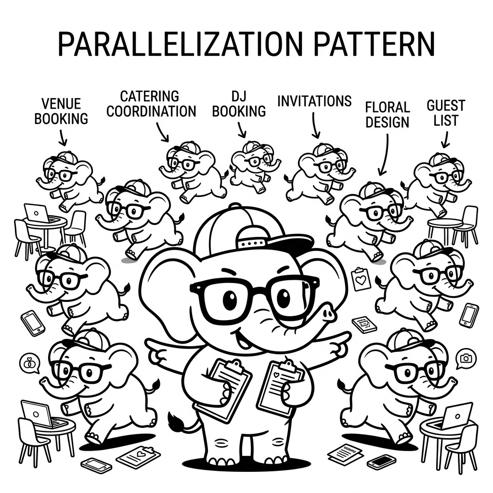

import LearningFlow from '@site/src/components/LearningFlow';

# Parallelization Pattern

## 1. Quick Summary

| Area | Details |
|---|---|
| **Topic** | Parallelization (Fan-Out/Fan-In) Architecture |
| **Difficulty** | Intermediate |
| **Used For** | Processing multiple independent tasks simultaneously to reduce overall latency |
| **Common Mistake** | Trying to parallelize sequential steps where Task B depends on Task A's output |
| **Performance** | Drastically reduces wall-clock latency, but spikes API rate limits temporarily |

## 2. Engineering Story

A team of engineers recently faced a critical challenge related to this concept. Their existing processes were failing under the load of thousands of concurrent users, and manual workarounds were causing major delays in deployment. By deeply understanding and correctly implementing this concept, the lead engineer was able to architect a solution that not only resolved the immediate bottleneck but also paved the way for massive scalability. This transformation turned a chaotic, error-prone system into a resilient, automated powerhouse.

## 3. Real-World Analogy

Bro, imagine you are a Wedding Planner (the orchestrator) and you have exactly 3 days to prepare.

Do you first book the venue, and *only after* it is booked, tell someone to go find a caterer, and *only after* that, tell someone to find a DJ? No. You would fail.

Instead, you use **Parallelization**. You call three different assistants at the same time:
1. "You, go find the venue."
2. "You, go find the caterer."
3. "You, go book the DJ."

They all run off and do their jobs at the exact same time (Fan-Out). When they are all finished, they return to you with their results, and you synthesize it into the final Wedding Plan (Fan-In).



| Wedding Role | Agent Equivalent |
|---|---|
| The Wedding Planner | The Orchestrator / Main Graph Node |
| Calling the three assistants | Fan-Out (dispatching parallel LLM/Tool calls) |
| Assistants working simultaneously | Asynchronous parallel execution |
| Synthesizing the final plan | Fan-In (gathering results and reducing state) |

## 4. Concept Explanation

The Parallelization pattern (often called Map-Reduce or Fan-Out/Fan-In) is crucial for agent performance. LLM calls are slow. If you need to evaluate 5 different documents, doing it sequentially (5 seconds per call) takes 25 seconds. Doing it in parallel takes ~5 seconds.

This pattern involves splitting a single objective into independent sub-tasks, dispatching them to multiple workers (agents or LLM calls) simultaneously, and then waiting for all of them to complete before moving to the next step.

Use this pattern when tasks are **independent**. If Task B needs the output of Task A, you cannot parallelize them.

## 5. Syntax Table

In modern frameworks like LangGraph, parallelization is handled by the `Send` API or by executing multiple edges from a single node.

| Framework/Component | Syntax / Method | Purpose |
|---|---|---|
| `asyncio` (Python) | `await asyncio.gather(*tasks)` | The core Python way to run async I/O concurrently. |
| `LangChain` | `chain.abatch([input1, input2])` | Runs a standard LangChain runnable in parallel over a list. |
| `LangGraph` | `[Send("node_name", arg) for arg in data]` | The Map-Reduce pattern in a stateful graph. |

## 6. Beginner Example

Here is a basic `asyncio` parallelization loop in Python. Notice we don't wait for the first LLM call to finish before starting the second.

```python
import asyncio

async def evaluate_document(doc: str) -> str:
    """A slow LLM call."""
    return await llm.ainvoke(f"Summarize: {doc}")

async def parallel_execution(docs: list[str]):
    # We create a list of coroutines (they don't run yet)
    tasks = [evaluate_document(doc) for doc in docs]

    # asyncio.gather fires them all at exactly the same time!
    # It waits until the slowest one finishes, then returns the list of results.
    summaries = await asyncio.gather(*tasks)

    return summaries
```

## 7. Real-World Engineering Example

Bro, let's look at a LangGraph Map-Reduce pattern. We have an agent that needs to review code. Instead of reading 10 files sequentially, it spawns a dedicated "Review Node" for each file simultaneously, then gathers the results.

```python
import operator
from typing import Annotated, TypedDict, List
from langgraph.graph import StateGraph, START, END
from langgraph.constants import Send

# 1. State needs a 'reducer' (operator.add) to combine parallel results into a list
class OverallState(TypedDict):
    files_to_review: List[str]
    reviews: Annotated[List[str], operator.add]

class FileState(TypedDict):
    file_content: str

def get_files_node(state: OverallState):
    """Fetches the list of files to review."""
    return {"files_to_review": ["file1.py", "file2.py", "file3.py"]}

def map_to_reviews(state: OverallState):
    """
    FAN-OUT: Instead of returning state, we return a list of 'Send' objects.
    This tells LangGraph to spin up parallel instances of 'review_node'.
    """
    files = state["files_to_review"]
    # Spawn a separate review_node for every file concurrently
    return [Send("review_node", {"file_content": f}) for f in files]

def review_node(state: FileState):
    """The Worker: Runs in parallel."""
    review = llm.invoke(f"Review this code: {state['file_content']}")
    # The reducer in OverallState automatically appends this to the 'reviews' list
    return {"reviews": [review]}

def synthesize_node(state: OverallState):
    """FAN-IN: Runs only after ALL review_nodes finish."""
    all_reviews = "\n".join(state["reviews"])
    final_report = llm.invoke(f"Synthesize these reviews into one report: {all_reviews}")
    return {"final_report": final_report}

# Build the graph
builder = StateGraph(OverallState)
builder.add_node("get_files", get_files_node)
builder.add_node("review_node", review_node)
builder.add_node("synthesize", synthesize_node)

builder.add_edge(START, "get_files")
# The conditional edge executes the Send objects
builder.add_conditional_edges("get_files", map_to_reviews, ["review_node"])
builder.add_edge("review_node", "synthesize")
builder.add_edge("synthesize", END)

graph = builder.compile()
```

## 8. Internal Working

When a graph hits a Fan-Out point, it essentially forks its execution thread. It spins up N independent instances of the target node.

The graph execution engine must block at the Fan-In point until all N instances have returned their state. The state reducer (like `operator.add`) concatenates the independent results back into the global state array. Only when the array length matches the initial job count does the Orchestrator proceed.

<LearningFlow
  elements={[
    { id: '1', type: 'core', data: { label: 'Start Task' }, position: { x: 250, y: 0 } },
    { id: '2', type: 'process', data: { label: 'Orchestrator (Split Data)' }, position: { x: 250, y: 100 } },
    { id: '3a', type: 'process', data: { label: 'Worker 1 (Doc A)' }, position: { x: 50, y: 250 } },
    { id: '3b', type: 'process', data: { label: 'Worker 2 (Doc B)' }, position: { x: 250, y: 250 } },
    { id: '3c', type: 'process', data: { label: 'Worker 3 (Doc C)' }, position: { x: 450, y: 250 } },
    { id: '4', type: 'warning', data: { label: 'Wait for All (Fan-In)' }, position: { x: 250, y: 400 } },
    { id: '5', type: 'output', data: { label: 'Synthesizer Node' }, position: { x: 250, y: 500 } }
  ]}
  edges={[
    { id: 'e1-2', source: '1', target: '2', label: 'trigger' },
    { id: 'e2-3a', source: '2', target: '3a', label: 'Send()', animated: true },
    { id: 'e2-3b', source: '2', target: '3b', label: 'Send()', animated: true },
    { id: 'e2-3c', source: '2', target: '3c', label: 'Send()', animated: true },
    { id: 'e3a-4', source: '3a', target: '4', label: 'done' },
    { id: 'e3b-4', source: '3b', target: '4', label: 'done' },
    { id: 'e3c-4', source: '3c', target: '4', label: 'done' },
    { id: 'e4-5', source: '4', target: '5', label: 'reduces array' }
  ]}
/>

## 9. Performance Table

| Metric | Characteristic | Why |
|---|---|---|
| **Wall-Clock Latency** | Low | N tasks take the time of the single slowest task. |
| **API Rate Limits** | High Risk | Firing 50 parallel LLM calls will trigger OpenAI 429 Too Many Requests errors. |
| **Token Usage** | Same as Sequential | You process the same amount of data, just faster. (Plus synthesizer overhead). |

## 10. Top Interview Questions

| Question | Answer |
|---|---|
| **What is the difference between Parallelization and Plan-and-Execute?** | Plan-and-Execute generates a sequence of steps that usually run one after another (because step 2 relies on step 1). Parallelization runs steps at the exact same time because they are independent. |
| **How does LangGraph handle Fan-In state management?** | Through "Reducers". In your `TypedDict` state, you annotate a list with `operator.add`. When 5 parallel nodes return a string, the reducer automatically adds them to the master list. |
| **What happens if one of the parallel workers fails or times out?** | By default in most `asyncio` setups, the whole `gather` fails. In production, you must use `return_exceptions=True` (in Python) or node-level fallback edges so one failure doesn't kill the other 99 successful tasks. |
| **How do you prevent 429 Rate Limit errors when using Map-Reduce?** | You implement a Semaphore or use a queue/batching system (`asyncio.Semaphore(5)`) to limit the maximum number of concurrent requests to the LLM provider. |
| **What is a "Synthesizer" node?** | It is the node that runs immediately after the Fan-In. It takes the messy array of parallel outputs and uses a final LLM call to write a clean, cohesive summary. |

## 11. Tricky Questions & Edge Cases

Bro, what if you are evaluating 100 documents in parallel, and the Synthesizer node has an 8k context window?

If each of the 100 parallel workers returns a 200-word summary, that's 20,000 words. When they Fan-In, the Synthesizer node will crash with a `TokenLimitExceeded` error!

The edge case is **Fan-In Context Bloat**. The fix is Hierarchical Map-Reduce. Instead of fanning in 100 results at once, you Fan-In batches of 10, summarize them into 10 intermediate summaries, and then do a final Fan-In on those 10.

## 12. Real-World Usage

- **Legal Document Review Agents (Harvey AI)**: A user uploads a 500-page contract. The system chunks it into 50 pieces, spawns 50 parallel agents to look for "indemnity clauses," and then synthesizes the results in 10 seconds.
- **Competitor Analysis Bots**: When asked "Compare Apple, Microsoft, and Google," the orchestrator spawns 3 parallel research agents. One researches Apple, one Microsoft, one Google.
- **Code Audit Tools**: Scans 20 Python files simultaneously for security vulnerabilities.

## 13. Best Practices

| DO | DON'T |
|---|---|
| **DO** use concurrency controls (`asyncio.Semaphore`) to respect API rate limits. | **DON'T** try to parallelize tasks that require sequential logic (e.g., "Write the code, then run the code"). |
| **DO** handle exceptions gracefully inside the parallel worker node so it returns an error string, not a hard crash. | **DON'T** fan-in massive raw texts directly into a Synthesizer node without checking token limits. |
| **DO** use the `Send` API in LangGraph to pass specific scoped state to workers. | **DON'T** pass the entire global state to every parallel worker, as it wastes tokens and causes merge conflicts. |

## 14. Production Notes

> ⚠️ **State Overwrites in Parallel Execution**
> If your parallel workers try to update the exact same dictionary key in global state (e.g., `state["status"] = "done"`), you will get race conditions or overwrite errors.
> **Production Fix**: Parallel nodes should only ever return data to **Reducer** keys (like `Annotated[list, operator.add]`). Never mutate a static key from a parallel node.

## 15. Common Mistakes

| Mistake | Impact | The Fix (Code) |
|---|---|---|
| Forgetting `asyncio.gather` | The code runs sequentially anyway, defeating the purpose | `await asyncio.gather(*tasks)` |
| Unhandled worker crash | One broken URL kills the other 99 successful document reads | Use `try/except` in the worker, or `return_exceptions=True` |
| Overwriting state | Worker 2 overwrites Worker 1's data | Define state as: `reviews: Annotated[list, operator.add]` |

## 16. Related Topics
- [Routing Pattern](./routing-pattern.mdx)
- [Plan and Execute](./plan-and-execute.mdx)
- [Multi-Agent Patterns Overview](#)

## 16. Top GitHub Repos

| Repository | Stars | Description | Why It Matters |
|---|---|---|---|
| [langchain-ai/langgraph](https://github.com/langchain-ai/langgraph) | ⭐ 8k+ | Build resilient language agents as graphs. | The `Send` API is currently the cleanest way to implement Map-Reduce in agent architectures. |
| [run-llama/llama_index](https://github.com/run-llama/llama_index) | ⭐ 35k+ | Data framework for LLM applications. | heavily utilizes parallelization for document ingestion and parallel node execution in Property Graphs. |
| [bclavie/RAGatouille](https://github.com/bclavie/RAGatouille) | ⭐ 2k+ | Fast RAG pipelines. | Shows how parallel processing of embeddings massively speeds up document indexing. |
| [ray-project/ray](https://github.com/ray-project/ray) | ⭐ 31k+ | Framework for scaling AI applications. | When standard async isn't enough, Ray is used to parallelize agent workers across multiple physical machines. |
| [celery/celery](https://github.com/celery/celery) | ⭐ 24k+ | Distributed task queue. | Often used as the backend for fanning out heavy agentic tasks in production Django/FastAPI environments. |
