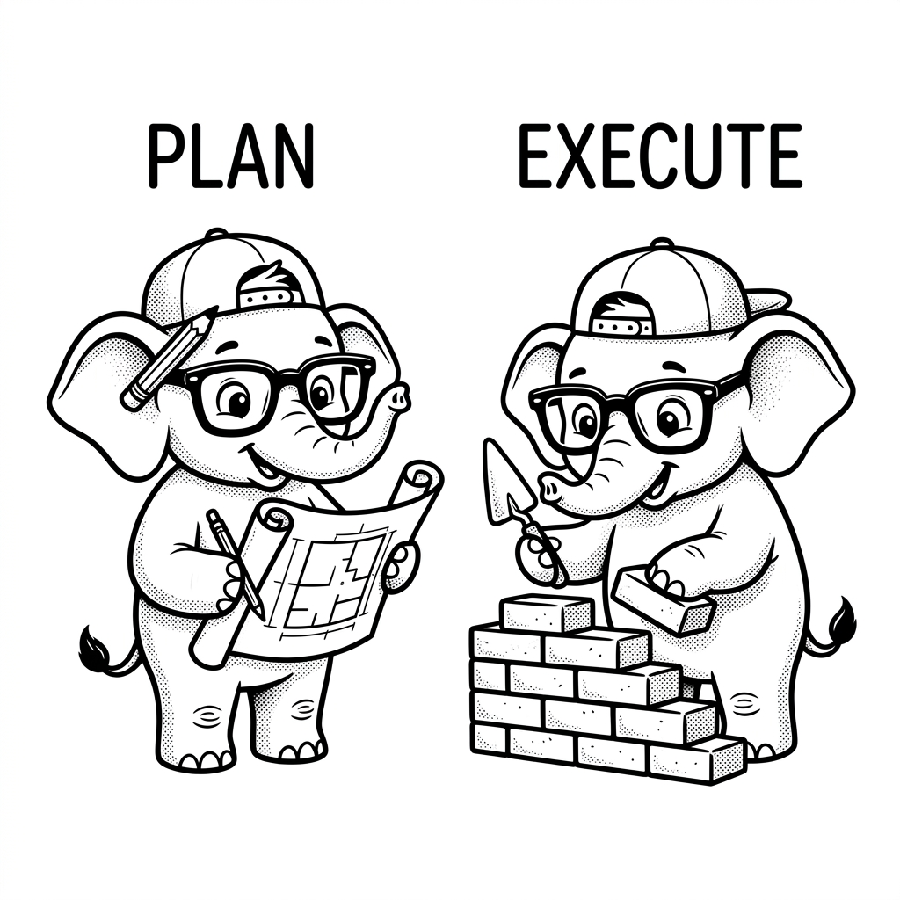

import LearningFlow from '@site/src/components/LearningFlow';

# Plan and Execute Pattern

## 1. Quick Summary

| Area | Details |
|---|---|
| **Topic** | Plan-and-Execute Architecture Pattern |
| **Difficulty** | Intermediate |
| **Used For** | Multi-step complex reasoning, long-horizon tasks, reducing context drift |
| **Common Mistake** | Trying to plan and execute in the same LLM call, leading to forgotten steps |
| **Performance** | High latency (multiple calls), but significantly higher reliability for complex goals |

## 2. Engineering Story

A logistics company built an agent to handle complex supply chain disruptions, like rerouting shipments when a port closed. Initially, the agent used a simple reactionary loop, triggering APIs one by one as it figured out the problem. This led to catastrophic edge cases: the agent would cancel a shipping container without first ensuring an alternative truck was available. The engineering team ripped out the reactionary loop and implemented a Plan-and-Execute architecture. Now, a Planner model first generates a deterministic DAG of steps. An Executor model then runs these steps sequentially, reporting back. By separating the strategic planning from the tactical execution, they eliminated race conditions and ensured the agent never made irreversible real-world decisions without a complete strategy.

## 3. Real-World Analogy

Bro, imagine building a house. Do you just hand a worker a brick and say, "Build me a house" and hope they figure out every step on the fly? No way.

You first hire an **Architect (Planner)** who draws the blueprints and lists out the phases: 1. Foundation, 2. Framing, 3. Plumbing, 4. Electrical, 5. Finishing.

Then, you hand those specific phases one by one to a **Construction Team (Executor)**. The Executor doesn't need to know how to design the whole house; they just need to know how to pour concrete when told to. The Planner checks off each step as the Executor finishes it.

That is exactly what the Plan-and-Execute pattern is for your AI agents.



| Construction Role | Agent Equivalent |
|---|---|
| Architect drawing blueprints | Planner Agent breaking down the user prompt |
| The numbered construction phases | A generated list of concrete sub-tasks |
| The construction workers | Executor Agent(s) running tools to solve one task at a time |
| Crossing off finished phases | State management tracking completed steps |

## 4. Concept Explanation

The Plan-and-Execute pattern explicitly separates the "thinking/planning" phase from the "doing" phase.

In standard ReAct, the agent is stuck in a loop of thinking about what to do next *while* it's doing things. Over a long task, the agent's context window gets cluttered with tool outputs, and it "forgets" the original goal.

Plan-and-Execute solves this by first having an LLM act as a Planner. It takes the main objective and breaks it down into a list of atomic, sequential steps. Then, it passes that list to an Executor (which could be a ReAct agent, or just a simple function-calling loop). The Executor takes one step, completes it, and updates the state. If things change, the Planner can optionally be called again to *re-plan*.

Use this when the task requires strict sequential steps or has a long time horizon where a standard agent would drift off-topic. Don't use this for simple, single-step lookups because the extra planning overhead adds unnecessary latency and token cost.

## 5. Syntax Table

Here is a conceptual breakdown of the state components required for Plan-and-Execute using LangGraph state types.

| Component | Type Definition | Purpose |
|---|---|---|
| `plan` | `list[str]` | The ordered sequence of remaining steps to execute. |
| `past_steps` | `list[tuple[str, str]]` | A log of completed steps and their results `(step_name, result)`. |
| `response` | `str` | The final synthesized answer provided to the user. |
| `objective` | `str` | The original user request that must be fulfilled. |

## 6. Beginner Example

Let's look at the basic conceptual loop in standard Python.

```python
def planner_node(state):
    """Generates a list of steps based on the objective."""
    objective = state["objective"]
    # LLM call asking to break 'objective' into steps
    plan = llm.invoke(f"Break this into steps: {objective}")
    return {"plan": plan, "past_steps": []}

def executor_node(state):
    """Executes the very first step in the plan."""
    current_step = state["plan"][0]
    # LLM or tool call to execute 'current_step'
    result = execute_tool(current_step)
    return {"completed_step": (current_step, result)}

def replanner_node(state):
    """Updates the plan based on what was just completed."""
    # Remove the completed step, maybe add new ones if needed
    new_plan = state["plan"][1:]
    return {"plan": new_plan}
```

## 7. Real-World Engineering Example

Bro, let's look at a production scenario: A Data Research Agent that needs to find a company's SEC filings, extract their Q3 revenue, and compare it to their competitors.

A ReAct agent might get lost reading a 100-page PDF. A Plan-and-Execute architecture handles this cleanly. Here is how you structure the State and the Planner prompt in a LangGraph-style application.

```python
from typing import TypedDict, List, Tuple
from pydantic import BaseModel, Field

# 1. Define the exact State
class PlanExecuteState(TypedDict):
    input: str
    plan: List[str]
    past_steps: List[Tuple[str, str]]
    response: str

# 2. Force the Planner to output structured data
class Plan(BaseModel):
    """Plan to follow in future"""
    steps: List[str] = Field(
        description="different steps to follow, should be in sorted order"
    )

def plan_step(state: PlanExecuteState):
    """The Architect: Creates the blueprint."""
    planner_prompt = (
        "For the given objective, come up with a simple step-by-step plan. \n"
        "This plan should involve individual tasks, that if executed correctly "
        "will yield the correct answer. Do not add any superfluous steps. \n"
        "The result of the final step should be the final answer. Make sure that "
        "each step has all the information needed - do not skip steps."
    )

    # We bind the Pydantic model to force structured output
    planner = llm.with_structured_output(Plan)
    plan = planner.invoke([
        ("system", planner_prompt),
        ("user", state["input"])
    ])

    return {"plan": plan.steps}

def execute_step(state: PlanExecuteState):
    """The Worker: Executes the top task."""
    plan = state["plan"]
    task = plan[0] # Grab the first task

    print(f"Bro, currently executing: {task}")

    # We use a dedicated tool-calling agent to handle this specific task
    # It has access to search tools, PDF readers, etc.
    agent_response = worker_agent.invoke({"messages": [("user", task)]})

    return {
        "past_steps": [(task, agent_response["output"])]
    }
```

## 8. Internal Working

Under the hood, the framework manages a tight graph where the state dictates the flow. The Planner generates an array of strings. The system routes to the Executor as long as the array is not empty. The Executor runs a tool, appends the result to `past_steps`, and pops the step off the `plan` array. Then it hits the Replanner, which decides if the remaining steps are still valid or if the goal is met.

Here is how that flow looks:

<LearningFlow
  elements={[
    { id: '1', type: 'core', data: { label: 'User Request' }, position: { x: 250, y: 0 } },
    { id: '2', type: 'process', data: { label: 'Planner Agent' }, position: { x: 250, y: 100 } },
    { id: '3', type: 'data', data: { label: 'List of Steps (The Plan)' }, position: { x: 250, y: 200 } },
    { id: '4', type: 'process', data: { label: 'Executor Agent (Runs Step 1)' }, position: { x: 250, y: 300 } },
    { id: '5', type: 'tool', data: { label: 'Tools (Search, Math, etc.)' }, position: { x: 500, y: 300 } },
    { id: '6', type: 'process', data: { label: 'Replanner Agent' }, position: { x: 250, y: 400 } },
    { id: '7', type: 'warning', data: { label: 'Are steps remaining?' }, position: { x: 250, y: 500 } },
    { id: '8', type: 'output', data: { label: 'Final Response' }, position: { x: 250, y: 650 } }
  ]}
  edges={[
    { id: 'e1-2', source: '1', target: '2', label: 'analyzes goal' },
    { id: 'e2-3', source: '2', target: '3', label: 'generates' },
    { id: 'e3-4', source: '3', target: '4', label: 'pops first step' },
    { id: 'e4-5', source: '4', target: '5', label: 'uses', animated: true },
    { id: 'e5-4', source: '5', target: '4', label: 'returns result' },
    { id: 'e4-6', source: '4', target: '6', label: 'updates state' },
    { id: 'e6-7', source: '6', target: '7', label: 'checks plan' },
    { id: 'e7-4', source: '7', target: '4', label: 'Yes', type: 'smoothstep', targetHandle: 'left', sourceHandle: 'left' },
    { id: 'e7-8', source: '7', target: '8', label: 'No' }
  ]}
/>

## 9. Performance Table

| Metric | Characteristic | Why |
|---|---|---|
| **Latency** | Very High | Requires an initial heavy LLM call to plan, plus individual calls per step. |
| **Token Usage** | High | The prompt context grows as `past_steps` accumulates history. |
| **Reliability** | Very High | Breaking tasks down mathematically reduces LLM hallucination and context loss. |
| **Recovery** | Excellent | If a step fails, the Replanner can catch the error and generate a new path without restarting. |

## 10. Top Interview Questions

| Question | Answer |
|---|---|
| **What is the primary difference between ReAct and Plan-and-Execute?** | ReAct intertwines planning and execution in a single loop (think, act, observe). Plan-and-Execute separates them: it generates a complete list of steps upfront, then executes them sequentially. |
| **Why is Plan-and-Execute better for long-horizon tasks?** | It prevents context drift. An Executor agent only needs to focus on the immediate step and the relevant context for that step, rather than holding the entire 20-step history in its active reasoning window. |
| **What is the role of the "Replanner"?** | The Replanner runs after an Executor finishes a step. It reviews the `past_steps` and the remaining `plan`. It can check off the completed step, modify upcoming steps if conditions changed, or declare the objective complete. |
| **How do you force the Planner to output a usable plan?** | Use Structured Outputs (like Pydantic models). Bind the LLM to a schema that requires returning a `List[str]` of steps. Parsing raw text for bullet points is fragile and breaks in production. |
| **What are the cost implications of this pattern?** | It is expensive. Every sub-task requires a separate LLM invocation, and the Replanner must process the accumulated history on every cycle. |

## 11. Tricky Questions & Edge Cases

Bro, what happens if the Executor completely fails a step? Let's say step 3 is "Download the PDF", but the URL returns a 404.

If you don't have a Replanner, your graph just blindly moves to step 4 ("Extract text from PDF"), which will hallucinate or crash because the PDF doesn't exist.

The edge case is handling **Execution Failures**. The Replanner must be explicitly prompted to recognize failures. It needs logic that says: "If `past_step` result indicates an error, DO NOT proceed to the next step. Instead, generate a new plan to find the document elsewhere."

Another tricky scenario is **Infinite Replanning Loops**. If a tool consistently fails, the Replanner might just keep scheduling retries forever. You must implement a `max_steps` or `recursion_limit` in your graph execution to hard-stop the agent.

## 12. Real-World Usage

Top tier companies use Plan-and-Execute for heavy asynchronous workloads.
- **Devin / Auto-coding Agents**: They don't just start typing code. They generate a plan: 1. Read README, 2. Run tests to see failures, 3. Edit file X, 4. Re-run tests.
- **Financial Research Bots (Bloomberg/Morgan Stanley)**: When asked to compare three companies, the bot first plans to fetch 10-K filings for company A, then B, then C, then extract the revenue table from each, before finally synthesizing the data.

## 13. Best Practices

| DO | DON'T |
|---|---|
| **DO** use Structured Outputs (Pydantic/JSON) for the Planner so you reliably get an array of steps. | **DON'T** rely on regex parsing to extract bullet points from the Planner's text output. |
| **DO** keep the Executor's system prompt narrowly focused on solving the immediate task. | **DON'T** pass the entire 10-page objective to the Executor; only pass the specific step it needs to run. |
| **DO** implement a Replanner to handle unexpected tool failures or dynamic environment changes. | **DON'T** use Plan-and-Execute for simple Q&A or single-tool queries; the latency overhead is unjustified. |

## 14. Production Notes

> ⚠️ **State Bloat Warning**
> In long-running Plan-and-Execute graphs, the `past_steps` array can grow massive. If an executor retrieves a 5,000-token webpage and appends it to `past_steps`, your next Replanner call might exceed the context window or cost a fortune.
> **Production Fix**: Implement a summarization step. Before appending to `past_steps`, have a cheap model summarize the execution result down to 200 tokens.

## 15. Common Mistakes

| Mistake | Impact | The Fix (Code) |
|---|---|---|
| Passing massive state to the Executor | High latency, token limits exceeded, Executor gets confused by irrelevant steps | `agent.invoke({"messages": [("user", current_step_only)]})` |
| Forgetting to remove completed steps | The system loops infinitely, repeating step 1 forever | `new_plan = state["plan"][1:]` (Pop the step off the array) |
| Assuming the Planner is perfect | If the environment changes, the rigid plan becomes useless | Add a Replanner node that evaluates `past_steps` and modifies `plan` dynamically. |

## 16. Related Topics
- [ReAct Pattern](./react-pattern.mdx)
- [LangGraph State Machines](../langchain-langgraph/langgraph-state-machines.mdx)
- [Function Calling Deep Dive](#)

## 16. Top GitHub Repos

| Repository | Stars | Description | Why It Matters |
|---|---|---|---|
| [langchain-ai/langgraph](https://github.com/langchain-ai/langgraph) | ⭐ 8k+ | Build resilient language agents as graphs. | The industry standard for implementing Plan-and-Execute via StateGraphs. |
| [langchain-ai/plan-and-execute](https://github.com/langchain-ai/langchain/tree/master/libs/experimental/langchain_experimental/plan_and_execute) | ⭐ 90k+ | LangChain's experimental implementation. | Reference code for the original BabyAGI-style planning loops. |
| [yoheinakajima/babyagi](https://github.com/yoheinakajima/babyagi) | ⭐ 19k+ | Early framework for AI task management. | The pioneer of the task-creation, task-prioritization, task-execution loop concept. |
| [microsoft/autogen](https://github.com/microsoft/autogen) | ⭐ 35k+ | Programming framework for agentic AI. | Can be configured to use a Planner agent coordinating multiple worker agents. |
| [Significant-Gravitas/AutoGPT](https://github.com/Significant-Gravitas/AutoGPT) | ⭐ 165k+ | An experimental open-source attempt to make GPT-4 fully autonomous. | Relies heavily on continuous planning and execution to reach overarching goals. |
