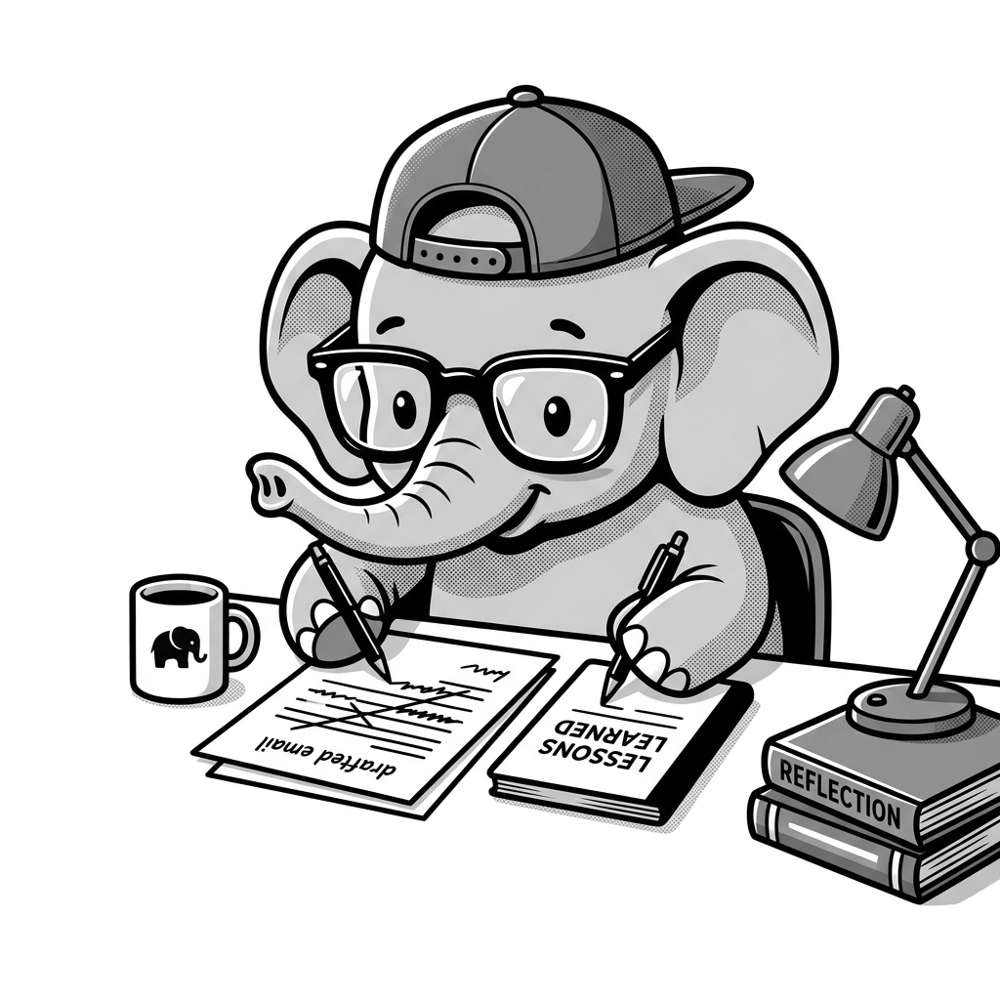

import LearningFlow from '@site/src/components/LearningFlow';

# Reflection & Reflexion Patterns

## 1. Quick Summary

| Area | Details |
|---|---|
| **Topic** | Reflection and Reflexion Agent Patterns |
| **Difficulty** | Intermediate |
| **Used For** | Code generation, writing tasks, self-correcting logic |
| **Common Mistake** | Missing a strict stopping condition, leading to infinite critique loops |
| **Performance** | High token usage due to appending critiques and retries into the context window |

## 2. Engineering Story

An enterprise SaaS company introduced an AI coding assistant to automatically migrate legacy Python 2 scripts to Python 3. The first iteration was a disaster: the agent generated code that looked correct but failed silently during execution because it misunderstood internal library dependencies. Engineers spent more time fixing the agent's code than migrating it themselves. To fix this, the team implemented a Reflexion architecture. The agent was given access to a secure sandbox where it could run the code it just generated. If the test failed, a secondary Critic agent analyzed the stack trace, generated feedback, and prompted the primary agent to try again with the new context. This self-correction loop boosted the success rate of complex migrations from 35% to 88%.

## 3. Real-World Analogy

Bro, think about writing an important email to the CEO. You don't just type it out and instantly hit send.

First, you write a rough draft (**Initial Generation**). Then, you read it over and think, "Wait, this sounds too aggressive, and I forgot to attach the report" (**Reflection/Critique**). Finally, you rewrite the email fixing those issues before hitting send (**Refinement/Correction**).

**Reflexion** takes it one step further. It's like writing down in a notebook, "Note to self: Next time I email the CEO, keep it under 3 sentences." You store that rule to perform better *next* time.



| Office Role | Agent Equivalent |
|---|---|
| Writing the initial email draft | Generator Agent outputting a first pass |
| Reviewing your own draft | Reflection Agent (or Critique Prompt) analyzing the output |
| Rewriting based on your review | Generator Agent applying the critique |
| Saving the lesson for next time | Reflexion Agent saving episodic memory |

## 4. Concept Explanation

**Reflection** is a pattern where an LLM is prompted to evaluate its own output (or the output of another agent) to find flaws, errors, or areas for improvement, and then uses that critique to generate a better version. It turns a single-shot prompt into an iterative improvement loop.

**Reflexion** (with an 'x') is an advanced variant. While Reflection only improves the *current* task, Reflexion creates a persistent "lesson learned" (verbal reinforcement) and stores it in memory. When the agent faces a similar task in the future, it retrieves that lesson to avoid making the same mistake twice.

Use Reflection when you have an objective way to measure success (like compiling code or running unit tests) or when the quality of a single-shot generation is simply too low (like complex creative writing). Do not use Reflection for simple, deterministic data retrieval—it wastes tokens.

## 5. Syntax Table

Here are the common node types in a Reflection graph.

| Node/Component | Input State | Output State |
|---|---|---|
| `generate` | User prompt, previous critiques | `generation` (the drafted output) |
| `evaluate/critique` | `generation` | `critique` (list of flaws), `score` |
| `condition` | `score`, `iteration_count` | Boolean: route back to `generate` OR `end` |
| `reflexion_memory` | `critique`, `final_generation` | `learned_rule` (saved to DB) |

## 6. Beginner Example

Here is a simplified Python loop showing basic Reflection.

```python
def reflection_loop(user_prompt, max_retries=3):
    current_draft = llm.invoke(f"Write this: {user_prompt}")

    for i in range(max_retries):
        # 1. Reflect on the draft
        critique = llm.invoke(f"Find flaws in this text based on {user_prompt}. Text: {current_draft}")

        if "No flaws found" in critique:
            break

        # 2. Generate a new draft using the critique
        current_draft = llm.invoke(
            f"Rewrite this to fix the flaws.\nDraft: {current_draft}\nFlaws: {critique}"
        )

    return current_draft
```

## 7. Real-World Engineering Example

Bro, let's look at a production Code Generation Agent. If the agent just writes code and returns it, it will often fail to run. A Reflection pattern executes the code, catches the traceback, and asks the LLM to fix it.

```python
from typing import TypedDict, List
from pydantic import BaseModel

class CodeState(TypedDict):
    task: str
    code: str
    error: str
    iterations: int

def generate_code(state: CodeState):
    """Writes or rewrites the code."""
    messages = [("system", "You are an expert Python developer.")]
    messages.append(("user", f"Task: {state['task']}"))

    # If we have a previous error, append it to the context
    if state.get("error"):
        messages.append(("assistant", state["code"]))
        messages.append(("user", f"That code failed with error:\n{state['error']}\nFix it."))

    new_code = llm.invoke(messages)
    return {"code": new_code, "iterations": state.get("iterations", 0) + 1}

def execute_and_reflect(state: CodeState):
    """Runs the code in a sandbox (Reflection by environment)."""
    code = state["code"]
    try:
        # Imagine a safe sandbox environment here
        sandbox.run(code)
        return {"error": None} # Success!
    except Exception as e:
        print(f"Bro, the code failed: {str(e)}")
        return {"error": str(e)}

def route_next(state: CodeState):
    """Decides whether to retry or stop."""
    if state["error"] is None:
        return "end"
    if state["iterations"] >= 3:
        return "end" # Hard stop to prevent infinite loops
    return "generate_code"
```

## 8. Internal Working

In a Reflection architecture, the state is passed back and forth between a Generator and an Evaluator. The Evaluator can be the LLM itself (Self-Reflection), a different, smarter LLM (e.g., using Claude 3 Opus to review Haiku's work), or an external environment (like a Python compiler or a linter).

Here is the flow:

<LearningFlow
  elements={[
    { id: '1', type: 'core', data: { label: 'User Task' }, position: { x: 250, y: 0 } },
    { id: '2', type: 'process', data: { label: 'Generator Agent' }, position: { x: 250, y: 100 } },
    { id: '3', type: 'data', data: { label: 'Draft Output' }, position: { x: 250, y: 200 } },
    { id: '4', type: 'process', data: { label: 'Evaluator / Sandbox' }, position: { x: 250, y: 300 } },
    { id: '5', type: 'warning', data: { label: 'Is it correct? (Score/Errors)' }, position: { x: 250, y: 400 } },
    { id: '6', type: 'data', data: { label: 'Critique & Feedback' }, position: { x: 500, y: 250 } },
    { id: '7', type: 'output', data: { label: 'Final Output' }, position: { x: 250, y: 550 } },
    { id: '8', type: 'data', data: { label: 'Reflexion Memory (Optional)' }, position: { x: 0, y: 550 } }
  ]}
  edges={[
    { id: 'e1-2', source: '1', target: '2', label: 'starts' },
    { id: 'e2-3', source: '2', target: '3', label: 'creates' },
    { id: 'e3-4', source: '3', target: '4', label: 'analyzes' },
    { id: 'e4-5', source: '4', target: '5', label: 'scores' },
    { id: 'e5-6', source: '5', target: '6', label: 'No (Fails)' },
    { id: 'e6-2', source: '6', target: '2', label: 'appends to context', type: 'step', animated: true },
    { id: 'e5-7', source: '5', target: '7', label: 'Yes (Passes)' },
    { id: 'e7-8', source: '7', target: '8', label: 'saves lesson', type: 'smoothstep', style: { strokeDasharray: '5,5' } }
  ]}
/>

## 9. Performance Table

| Metric | Characteristic | Why |
|---|---|---|
| **Latency** | High | Requires multiple sequential LLM calls. |
| **Token Cost** | Exponential | Each loop appends the previous draft and the critique to the context. |
| **Accuracy** | Significantly Higher | Models catch their own logic errors when explicitly asked to look for them. |

## 10. Top Interview Questions

| Question | Answer |
|---|---|
| **What is the difference between Reflection and Reflexion?** | Reflection improves the *current* response by looping over it. Reflexion improves *future* responses by extracting a learned rule and saving it to long-term memory. |
| **Why is an Actor-Evaluator setup better than self-reflection?** | Self-reflection can suffer from "confirmation bias" where the model fails to see its own mistakes. Using a different model (or specific critique persona) as the Evaluator catches more errors. |
| **How does environment feedback differ from LLM critique?** | Environment feedback is deterministic (e.g., a stack trace from a compiler or a 404 from a web request). LLM critique is subjective and heuristic-based. |
| **What is the biggest risk in a Reflection graph?** | Infinite loops. If the Generator cannot fix the flaw the Evaluator is complaining about, they will bounce back and forth forever. |
| **How do you manage context window bloat in Reflection?** | Instead of keeping every failed draft, only keep the *latest* failed draft and the specific critique for it, dropping older iterations from the state. |

## 11. Tricky Questions & Edge Cases

Bro, what happens if the critique is wrong?

If the Evaluator hallucinates a flaw that doesn't exist, the Generator will ruin a perfectly good draft trying to fix it. This is a common failure mode in LLM-to-LLM Reflection loops.

The fix is **Grounding the Evaluator**. You must provide the Evaluator with a strict rubric, passing unit tests, or reference documents. Do not just prompt it with "Is this good?". Prompt it with: "Does this code pass test cases A, B, and C?"

## 12. Real-World Usage

- **Devin / GitHub Copilot Workspace**: They heavily use Reflection via environment. They write code, run the unit tests, read the red console output, and rewrite the code automatically.
- **Automated Content QA**: A drafting agent writes an article, and a separate "Editor" agent (often a cheaper, faster model configured with strict rules) reviews it for brand voice and formatting before human review.

## 13. Best Practices

| DO | DON'T |
|---|---|
| **DO** set a hard iteration limit (e.g., `max_retries = 3`) to prevent infinite looping and burning cash. | **DON'T** keep the entire history of 5 bad drafts in the prompt context. It dilutes the instructions. |
| **DO** use an objective environment (compiler, API response) as the Evaluator whenever possible. | **DON'T** use Reflection for tasks that don't have a clear "correct" state, as the loop will thrash. |

## 14. Production Notes

> ⚠️ **Context Drift in Loops**
> By iteration 4, the LLM has seen so much failure text and critique that it sometimes forgets the original user instructions.
> **Production Fix**: Always inject the original `user_prompt` at the very bottom of the message array right before the newest generation request, reminding the model of the core goal.

## 15. Common Mistakes

| Mistake | Impact | The Fix (Code) |
|---|---|---|
| No exit condition | Infinite loop, massive API bills | `if iterations > 3: return "end"` |
| Evaluator is too vague | Generator makes random changes | Give the Evaluator a specific rubric (e.g., "Check for SQL injection only.") |
| Dropping the error message | Generator makes the exact same mistake again | Pass the `error_trace` back into the Generator's context. |

## 16. Related Topics
- [ReAct Pattern](./react-pattern.mdx)
- [Plan and Execute](./plan-and-execute.mdx)
- [Agent Memory Types](#)

## 16. Top GitHub Repos

| Repository | Stars | Description | Why It Matters |
|---|---|---|---|
| [noahshinn024/reflexion](https://github.com/noahshinn024/reflexion) | ⭐ 3k+ | Official implementation of the Reflexion paper. | The foundational repo for understanding how verbal reinforcement learning is applied to agents. |
| [langchain-ai/langgraph](https://github.com/langchain-ai/langgraph) | ⭐ 8k+ | State machine for building resilient agents. | Provides native examples for implementing Reflection loops using StateGraphs. |
| [magentic-one](https://github.com/microsoft/autogen/tree/main/python/packages/magentic-one) | ⭐ 35k+ | Microsoft AutoGen's multi-agent system. | Uses reflection between a coder and a reviewer agent to produce high-quality software. |
| [princeton-nlp/SWE-agent](https://github.com/princeton-nlp/SWE-agent) | ⭐ 12k+ | Agent that fixes GitHub issues. | Relies heavily on environment reflection (running bash commands and parsing output) to fix bugs. |
| [gpt-engineer-org/gpt-engineer](https://github.com/gpt-engineer-org/gpt-engineer) | ⭐ 50k+ | Specify what you want it to build, the AI asks for clarification, and then builds it. | Implements a form of reflection by asking the user clarifying questions before and during generation. |
