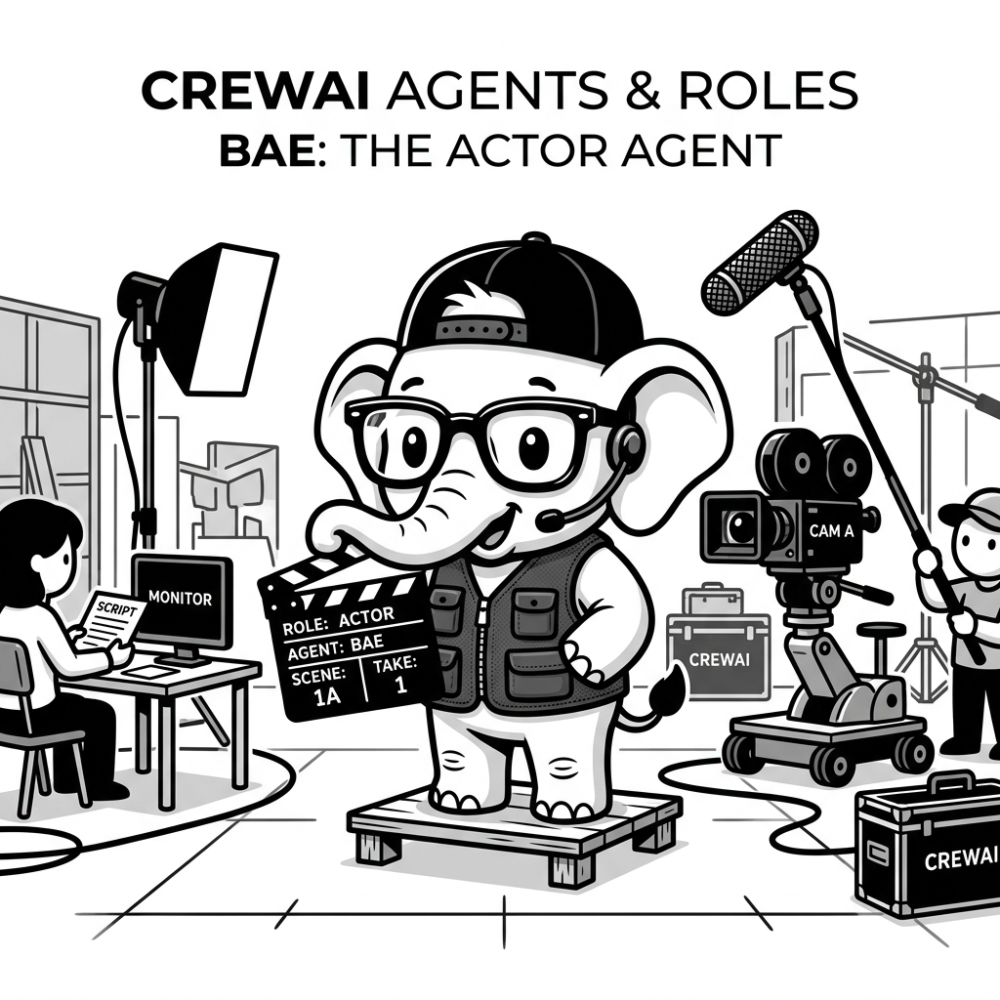

import LearningFlow from '@site/src/components/LearningFlow';

# CrewAI Agents and Roles

## 1. Quick Summary

| Area | Details |
|---|---|
| Topic | Defining Agents, Roles, and Backstories in CrewAI |
| Difficulty | Beginner |
| Used For | Creating specific personas that govern how an LLM behaves and uses tools |
| Common Mistake | Writing weak or generic backstories, causing the agent to act like a standard ChatGPT bot |
| Performance | Agents themselves are just configuration objects; latency depends on the LLM backend |

## 2. Engineering Story

A team of engineers recently faced a critical challenge related to this concept. Their existing processes were failing under the load of thousands of concurrent users, and manual workarounds were causing major delays in deployment. By deeply understanding and correctly implementing this concept, the lead engineer was able to architect a solution that not only resolved the immediate bottleneck but also paved the way for massive scalability. This transformation turned a chaotic, error-prone system into a resilient, automated powerhouse.

## 3. Real-World Analogy

| Movie Set | CrewAI Equivalent |
|---|---|
| The Actor | The LLM (e.g., GPT-4, Claude) |
| The Character Name | `role` |
| The Character's Motivation | `goal` |
| The Character's Script & History | `backstory` |
| The Props they use | `tools` |

Bro, setting up a CrewAI agent is exactly like casting a movie. If you just grab a random guy off the street (an un-prompted LLM) and say "Act like a doctor," he will do a terrible job. But if you give him a detailed backstory, a specific goal, and a stethoscope (a tool), he will stay in character and perform beautifully.



## 4. Concept Explanation

In CrewAI, the `Agent` is the core execution unit. It is a wrapper around an LLM that is heavily instructed via system prompting to act as a specific persona.

Every Agent requires three mandatory properties:
1. **Role**: Who they are (e.g., "Senior Python Developer").
2. **Goal**: What they are trying to achieve (e.g., "Write bug-free, optimized Python code").
3. **Backstory**: Why they exist and how they think (e.g., "You have 15 years of experience at Google and hate messy code").

Under the hood, CrewAI takes these three properties and compiles them into a massive System Prompt. This is why the `backstory` is so critical. A good backstory dictates the *quality and tone* of the agent's output.

## 5. Syntax Table

| Parameter | Syntax Example | Purpose |
|---|---|---|
| Role (Required) | `role='Data Scientist'` | The title of the agent |
| Goal (Required) | `goal='Analyze CSVs'` | The agent's primary objective |
| Backstory (Req) | `backstory='You love math'` | The persona context |
| LLM | `llm=ChatOpenAI()` | The brain of the agent (defaults to OpenAI) |
| Tools | `tools=[search_tool]` | List of functions the agent can call |
| Delegation | `allow_delegation=False` | Can this agent pass work to others? |
| Max Iters | `max_iter=10` | Hard stop to prevent infinite tool loops |

## 6. Beginner Example

Here is how you define a single, highly-opinionated agent.

```python
from crewai import Agent
from langchain_openai import ChatOpenAI

code_reviewer = Agent(
    role='Strict Senior Code Reviewer',
    goal='Ensure all code meets PEP8 standards and has zero bugs.',
    backstory=(
        "You are a grumpy but brilliant senior engineer. You have been coding "
        "since the 90s. You do not tolerate missing docstrings. You are direct "
        "and slightly sarcastic, but ultimately helpful."
    ),
    llm=ChatOpenAI(model="gpt-4o"),
    verbose=True,
    allow_delegation=False
)

# Note: An agent doesn't do anything until assigned a Task and put in a Crew.
```

## 7. Real-World Engineering Example

Bro, in a production system, you don't hardcode API keys or rely on defaults. You also need to configure agents to use specific, cheaper LLMs for easy tasks, and expensive LLMs for hard tasks.

```python
import os
from crewai import Agent
from langchain_openai import ChatOpenAI
from langchain_anthropic import ChatAnthropic
from tools.database import query_db_tool # Custom tool

# Cheaper model for basic data fetching
fetcher_llm = ChatOpenAI(model="gpt-4o-mini", api_key=os.getenv("OPENAI_KEY"))

# Expensive, smart model for complex analysis
analyst_llm = ChatAnthropic(model="claude-3-5-sonnet-20240620", api_key=os.getenv("ANTHROPIC_KEY"))

data_fetcher = Agent(
    role='Database Operator',
    goal='Execute SQL queries quickly and accurately without dropping tables.',
    backstory='You are a cautious DBA who only reads data.',
    tools=[query_db_tool],
    llm=fetcher_llm,
    verbose=True,
    max_iter=5 # Don't let the cheap model loop forever if SQL fails
)

senior_analyst = Agent(
    role='Lead Data Analyst',
    goal='Find anomalies in financial datasets.',
    backstory=(
        "You are a meticulous financial analyst. You double check all numbers. "
        "You only output clean markdown tables, never bullet points."
    ),
    llm=analyst_llm,
    verbose=True,
    allow_delegation=True # Allowed to ask the fetcher for more data
)
```

## 8. Internal Working

What does CrewAI actually do with the `Agent` object when execution starts?

<LearningFlow
  nodes={[
    { id: '1', type: 'data', position: { x: 250, y: 0 }, data: { label: 'Agent Config', description: 'Role, Goal, Backstory' } },
    { id: '2', type: 'process', position: { x: 250, y: 100 }, data: { label: 'Prompt Compiler', description: 'Combines config into one System Prompt' } },
    { id: '3', type: 'core', position: { x: 250, y: 200 }, data: { label: 'ReAct Agent', description: 'LangChain ReAct wrapper initialized' } },
    { id: '4', type: 'tool', position: { x: 50, y: 300 }, data: { label: 'Bind Tools', description: 'Tools converted to JSON schema' } },
    { id: '5', type: 'tool', position: { x: 450, y: 300 }, data: { label: 'Bind Delegation', description: 'Auto-injects "ask_coworker" tool' } },
    { id: '6', type: 'output', position: { x: 250, y: 400 }, data: { label: 'Ready for Task', description: 'Agent waits for kickoff' } }
  ]}
  edges={[
    { id: 'e1-2', source: '1', target: '2', label: 'Reads props' },
    { id: 'e2-3', source: '2', target: '3', label: 'Creates runtime agent' },
    { id: 'e3-4', source: '3', target: '4', label: 'Attaches logic' },
    { id: 'e3-5', source: '3', target: '5', label: 'If allow_delegation=True' },
    { id: 'e4-6', source: '4', target: '6', label: 'Finalizes' },
    { id: 'e5-6', source: '5', target: '6', label: 'Finalizes' }
  ]}
/>

CrewAI agents are essentially pre-configured LangChain `create_react_agent` instances. CrewAI takes your strings and builds a massive system prompt:
*"You are a \{role\}. Your goal is \{goal\}. Your backstory is \{backstory\}. You have access to the following tools..."*

If `allow_delegation` is True, CrewAI automatically injects special tools into the LLM's schema called `Delegate work to co-worker` and `Ask question to co-worker`.

## 9. Performance Table

| Configuration | Memory/Latency Impact | Note |
|---|---|---|
| Very long backstory | Minor latency increase | Eats up context window tokens on every turn |
| `max_iter=15` (Default) | High risk | If agent gets stuck, it will make 15 LLM calls before failing |
| `allow_delegation=True` | High risk | Agents can get into infinite loops talking to each other |

## 10. Top Interview Questions

| Question | Answer |
|---|---|
| What happens if you don't provide a `llm` to an Agent? | CrewAI defaults to using OpenAI's GPT-4. You must have `OPENAI_API_KEY` set in your environment variables, or the code will crash. |
| Why is the `backstory` so important? | The LLM uses the backstory to determine the "voice" and "reasoning style" of its output. A generic backstory leads to generic, ChatGPT-style output. |
| What does `max_iter` do? | It defines the maximum number of times the agent will loop (Think -> Act -> Observe) trying to solve a task. If it hits the limit, it returns its best guess. |
| How do you stop agents from infinitely delegating to each other? | Set `allow_delegation=False` on worker agents. Only allow manager or supervisor agents to delegate. |
| Can an agent use multiple tools? | Yes, you pass a list of tools: `tools=[tool1, tool2]`. The LLM will decide which one to use based on their descriptions. |

## 11. Tricky Questions & Edge Cases

Bro, what happens if an Agent's `goal` directly contradicts the instructions given in its `Task`?

**Answer:** The LLM will get confused and hallucinate. The `Agent` provides the persona, the `Task` provides the immediate instruction. If the Agent's goal is "Never write Python code" but the Task says "Write a Python script," the agent might refuse the task or write pseudocode. Always ensure Agent goals align with their assigned Tasks.

## 12. Real-World Usage

In production, teams use Agent configurations to enforce company standards:
- **Tone Enforcement:** A `Copywriter` agent's backstory will literally contain the company's brand guidelines (e.g., "We are a B2B SaaS company, we use professional but accessible language, we never use emojis").
- **Security:** A `Database Worker` agent's backstory will explicitly state: "You are read-only. If asked to UPDATE or DELETE, you must refuse." (Though this should also be enforced at the DB permission level!).

## 13. Best Practices

| DO | DON'T |
|---|---|
| Do write backstories in the second person ("You are...", "Your experience is..."). | Don't write 5-page backstories. Be concise. Long backstories dilute the LLM's attention. |
| Do mix LLM providers. Use fast/cheap models for researchers, and smart models for synthesizers/writers. | Don't leave `allow_delegation=True` on every single agent. It causes massive token burn. |

## 14. Production Notes

> **Production Warning:**
> Agent configuration is prompt engineering. If you upgrade from `gpt-4o` to a newer model version months later, your carefully tuned `grumpy reviewer` backstory might suddenly make the agent *too* aggressive, or cause it to ignore certain instructions. Always run Evals on your Agents when changing the underlying LLM.

## 15. Common Mistakes

| Mistake | Fix | Code Example |
|---|---|---|
| Forgetting to import ChatOpenAI | Import the specific LangChain chat model | `from langchain_openai import ChatOpenAI` |
| Using generic roles | Be hyper-specific | `role='Senior AWS Cloud Architect'` |
| Trying to pass inputs into the Agent | Inputs go into the *Task*, not the Agent | `crew.kickoff(inputs={"topic": "AI"})` |

## 16. Related Topics
- CrewAI Fundamentals
- CrewAI Tasks & Tools
- Prompt Engineering for Agents

## 16. Top GitHub Repos

| Repository | Stars | Description | Why It Matters |
|---|---|---|---|
| [joaomdmoura/crewAI](https://github.com/joaomdmoura/crewAI) | ⭐ 18k+ | Official CrewAI repo | Read the source code for the `Agent` class |
| [langchain-ai/langchain](https://github.com/langchain-ai/langchain) | ⭐ 90k+ | LangChain | CrewAI agents are wrappers around LangChain chat models |
| [f/awesome-chatgpt-prompts](https://github.com/f/awesome-chatgpt-prompts) | ⭐ 100k+ | Prompt Library | Great inspiration for writing `role` and `backstory` strings |
| [crewAIInc/crewAI-examples](https://github.com/crewAIInc/crewAI-examples) | ⭐ 4k+ | CrewAI Examples | Look at how professional teams write their agent backstories |
| [anthropics/anthropic-cookbook](https://github.com/anthropics/anthropic-cookbook) | ⭐ 5k+ | Anthropic Examples | Best practices for prompting Claude (often used in CrewAI) |
