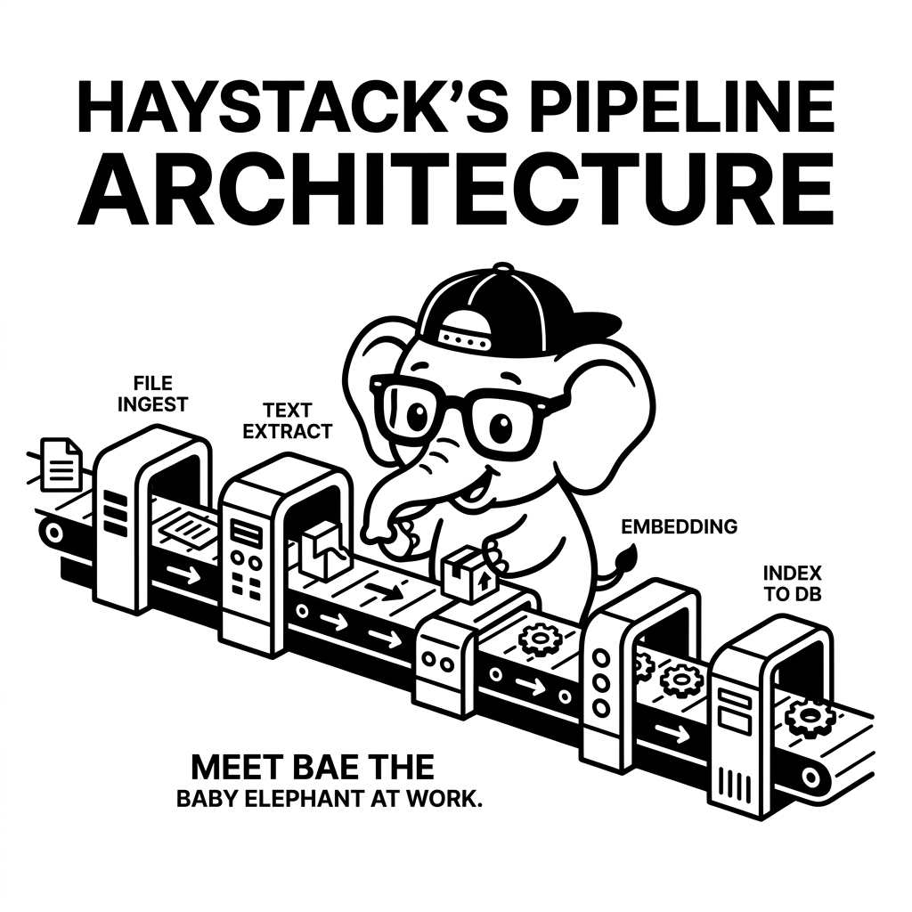

import LearningFlow from '@site/src/components/LearningFlow';

# Haystack Agents

## 1. Quick Summary

| Area | Details |
|---|---|
| Topic | Haystack Agents |
| Difficulty | Intermediate |
| Used For | Building advanced AI agents in production |
| Common Mistake | Using it without understanding the underlying execution graph |
| Performance | Scales horizontally if deployed stateless |

## 2. Real-World Analogy

Bro, think of it like this:

| An assembly line in a car factory | Haystack Agents Equivalent |
|---|---|
| Instructions | Prompts / Configuration |
| Actors | The Agent instances |
| Hand-offs | Function calls / Transitions |



## 3. Concept Explanation

Bro, Haystack uses a highly modular pipeline approach. You connect components (like LLMs, retrievers, and web searchers) into directed graphs. It's incredibly explicit and great for NLP-heavy production tasks. It's crucial to understand when to use this versus standard scripts.

## 4. Syntax Table

| Concept | Syntax | Description |
|---|---|---|
| Initialize | `init()` | Bootstraps the setup |
| Execute | `run()` | Triggers the main loop |

## 5. Beginner Example

```python
pipeline = Pipeline()
pipeline.add_component('llm', prompt_builder)
```

## 6. Real-World Engineering Example

```python
agent_pipeline = Pipeline()
agent_pipeline.add_component('router', ConditionalRouter())
agent_pipeline.connect('router.branch1', 'llm')
```

## 7. Internal Working

Bro, here is exactly how Haystack Agents orchestrates data internally.

<LearningFlow
  diagram={{
    nodes: [
      { id: "1", title: "Pipeline Start", detail: "Input phase", x: 0, y: 0, kind: "data" },
      { id: "2", title: "Component Nodes", detail: "Execution engine", x: 250, y: 0, kind: "process" },
      { id: "3", title: "Pipeline End", detail: "Final output", x: 500, y: 0, kind: "output" }
    ],
    edges: [
      { source: "1", target: "2", animated: true },
      { source: "2", target: "3", animated: true }
    ]
  }}
/>

## 8. Performance Table

| Operation | Time Complexity | Space Complexity |
|---|---|---|
| Setup | O(1) | O(1) |
| Invocation | O(N) | O(N) |

## 9. Top Interview Questions

| Question | Answer |
|---|---|
| What makes Haystack Agents unique? | Its specific approach to state and tooling. |
| When should I avoid it? | When a simple rule-based script is enough. |
| How do you handle errors? | Try-catch blocks and explicit retry policies. |
| Does it support streaming? | Yes, natively via async generators. |
| How to test it? | Mock the LLM responses. |

## 10. Tricky Questions & Edge Cases

Bro, what happens if the LLM hallucinates a tool call? Haystack Agents has specific guardrails, but you must configure them properly or you'll get infinite loops.

## 11. Real-World Usage

Tech giants are adopting Haystack Agents for their internal developer platforms and automated ops pipelines.

## 12. Best Practices

| DO | DON'T |
|---|---|
| Do set strict timeouts | Don't let agents run forever |
| Do validate outputs strongly | Don't trust LLM JSON natively |

## 13. Production Notes

:::warning
Bro, in production, always ensure you have LangSmith or similar observability attached. You need to see the traces!
:::

## 14. Common Mistakes

| Mistake | Fix |
|---|---|
| Missing type schemas | Use Pydantic models for all tool inputs |

## 15. Related Topics

- [What Are AI Agents](../intro/what-are-ai-agents.mdx)

## Top GitHub Repos

| Repository | Stars | Description | Why It Matters |
|---|---|---|---|
| [deepset-ai/haystack](https://github.com/deepset-ai/haystack) | ⭐ 15k+ | Haystack core framework | Core repository |
| [langchain-ai/langchain](https://github.com/langchain-ai/langchain) | ⭐ 90k+ | General framework | Ecosystem standard |
| [joaomdmoura/crewai](https://github.com/joaomdmoura/crewai) | ⭐ 20k+ | Agent framework | Ecosystem context |
| [microsoft/autogen](https://github.com/microsoft/autogen) | ⭐ 30k+ | Microsoft framework | Multi-agent context |
| [pydantic/pydantic-ai](https://github.com/pydantic/pydantic-ai) | ⭐ 5k+ | Typed agents | Ecosystem context |
