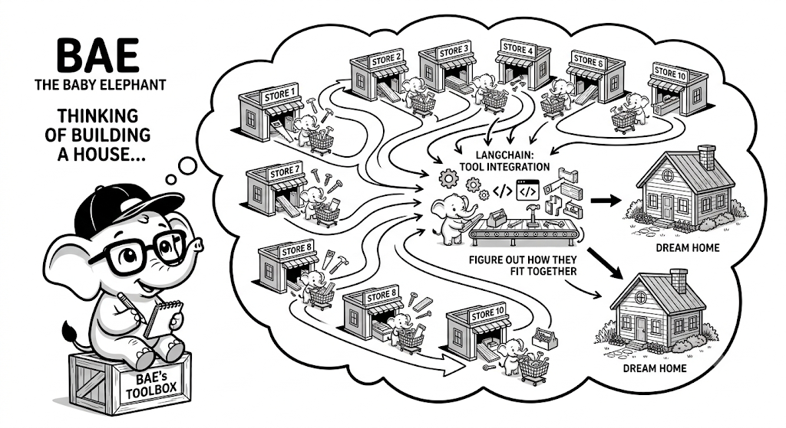

# Google Agent Development Kit (ADK) Fundamentals

## 1. Quick Summary
| Area | Details |
|---|---|
| Topic | Google ADK Fundamentals |
| Difficulty | Beginner |
| Used For | Building AI agents natively integrated with Google Cloud Platform (GCP) and Gemini models. |
| Common Mistake | Trying to force OpenAI models into it; it is optimized heavily for Vertex AI. |
| Performance | Highly scalable, backed by Google's enterprise infrastructure. |

## 2. Engineering Story

An enterprise bank had been running a LangChain-based agent in production for six months. It worked, but the operational overhead was brutal: they maintained a separate Python environment, managed API key rotation manually, had no native audit logging, and every Gemini API call was routed through a third-party wrapper. Their security team was uncomfortable with the lack of native GCP IAM controls.

Their platform team evaluated Google ADK as a replacement. The migration was not about adding features — it was about removing friction. With ADK, the agent ran natively on Vertex AI, authenticated via GCP service accounts (no more API keys in `.env` files), and every tool invocation was automatically captured in Cloud Audit Logs. The orchestration, memory, and tool-calling were all first-class Vertex AI constructs. Within two sprints the bank had an agent that was fully auditable, IAM-secured, and deployed via their standard Terraform pipelines. For enterprises on GCP, ADK is not just a convenience — it's the only sane choice.

## 3. Real-World Analogy



Bro, think of building a house. If you use LangChain, you're buying tools from 10 different hardware stores and figuring out how they fit together. If you use Google ADK, you're hiring a massive construction firm (Google Cloud). They bring their own specialized tools (Vertex AI, Gemini), their own safety inspectors (Google Guardrails), and their own concrete mixers. It's an enterprise package deal.

| House Construction | Agent Framework |
|---|---|
| DIY from multiple stores | LangChain / Custom Python |
| Enterprise Construction Firm | Google ADK |
| Firm's specialized tools | Vertex AI & Gemini |

## 4. Concept Explanation
The Google Agent Development Kit (ADK) is an opinionated framework designed to build enterprise-grade agents on Google Cloud. It provides strict abstractions for Agents, Tools, and Sessions.

You should use Google ADK when your company is already heavily invested in GCP, you want to use Gemini models, and you need enterprise security/compliance out of the box. You shouldn't use it if you are a scrappy startup trying to use Claude or open-source local models, bro.

## 5. Syntax Table
| Concept | Code | Description |
|---|---|---|
| Initialize Agent | `agent = BaseAgent(model="gemini-1.5-pro")` | Create the core agent. |
| Sessions | `session = agent.create_session()` | Manage state and history natively. |
| Run | `response = session.chat("Hello")` | Execute the interaction. |

## 6. Beginner Example
Here is the most basic way to spin up a Gemini agent using the ADK.

```python
# Pseudo-code for ADK structure
from google_adk import Agent, Session
from google_adk.models import GeminiModel

# Define the model backend
model = GeminiModel(version="gemini-1.5-pro")

# Create the agent
support_agent = Agent(
    name="SupportBot",
    model=model,
    system_instruction="You are a helpful GCP support engineer."
)

# Sessions automatically track history
session = support_agent.create_session()

response = session.chat("How do I spin up a VM?")
print(response.text)
```

## 7. Real-World Engineering Example
In an enterprise setting, you integrate the ADK directly with Vertex AI tools like Google Search grounding or BigQuery.

```python
from google_adk import Agent, Tool
from google_adk.tools import VertexSearchTool

# Google's enterprise search tool
enterprise_search = VertexSearchTool(
    datastore_id="my-company-docs-123",
    location="us-central1"
)

# The agent natively understands Vertex tools
hr_agent = Agent(
    name="HR Assistant",
    model="gemini-1.5-pro",
    system_instruction="Answer employee questions using the company handbook.",
    tools=[enterprise_search]
)

session = hr_agent.create_session(user_id="emp_992")

# The agent will query the datastore before answering
response = session.chat("What is the maternity leave policy?")
print(response.text)
```

## 8. Internal Working
The ADK abstracts away the complexity of the Vertex API. When you call `session.chat()`, it securely marshals your prompt, history, and IAM permissions to the Vertex endpoint, handles the tool execution loop, and returns the grounded response.

import LearningFlow from '@site/src/components/LearningFlow';

<LearningFlow
  elements={[
    { id: '1', type: 'core', data: { label: 'User Prompt' }, position: { x: 50, y: 100 } },
    { id: '2', type: 'process', data: { label: 'ADK Session Manager' }, position: { x: 250, y: 100 } },
    { id: '3', type: 'tool', data: { label: 'Vertex AI (Gemini)' }, position: { x: 450, y: 50 } },
    { id: '4', type: 'data', data: { label: 'GCP Datastore' }, position: { x: 450, y: 150 } },
    { id: '5', type: 'output', data: { label: 'Enterprise Response' }, position: { x: 650, y: 100 } },
    { id: 'e1', source: '1', target: '2', label: 'chat()' },
    { id: 'e2', source: '2', target: '3', label: 'API Call' },
    { id: 'e3', source: '3', target: '4', label: 'Grounding' },
    { id: 'e4', source: '3', target: '5', label: 'Returns' }
  ]}
/>

## 9. Performance Table
| Metric | Details |
|---|---|
| Integration Speed | Fast (if already on GCP). |
| Latency | Dependent on Gemini API (generally fast). |
| Ecosystem Lock-in | Very High (strictly tied to Google). |

## 10. Top Interview Questions
| Question | Answer |
|---|---|
| Why choose Google ADK over LangChain? | ADK provides native, secure integration with GCP services (IAM, Vertex, BigQuery) without relying on community-maintained wrappers. |
| What is Grounding in the context of Google ADK? | Grounding forces the Gemini model to base its answers on specific data sources (like Google Search or a Vertex datastore) to reduce hallucinations. |
| How does ADK handle memory? | It uses the `Session` abstraction to automatically track and inject conversation history into the LLM context. |
| Can I use OpenAI models with Google ADK? | While technically possible through custom wrappers, the framework is heavily optimized for Gemini. |

## 11. Tricky Questions & Edge Cases
Bro, what happens if your agent needs to query a database that isn't on GCP?
**The Fix:** You must create a custom Tool interface in Python that reaches out to the external DB (like AWS RDS). The ADK allows custom Python tools, but you lose the "zero-config" magic of native Vertex tools.

## 12. Real-World Usage
Massive corporations (like retail giants) use Google ADK to build inventory forecasting agents. The agent uses Vertex AI to write SQL, queries BigQuery natively, and returns formatted reports, all while staying within Google's strict enterprise security boundary.

## 13. Best Practices
| DO | DON'T |
|---|---|
| Use native Vertex tools for GCP resources. | Write custom HTTP wrappers for GCP services that already have ADK tools. |
| Utilize the `Session` object for state. | Try to manually append strings to manage conversation history. |
| Turn on Grounding for factual tasks. | Let the agent hallucinate company policies. |

## 14. Production Notes
:::warning
GCP IAM (Identity and Access Management) is notorious for being complex. Before deploying an ADK agent, ensure the Service Account running the code has the exact permissions required to invoke Vertex AI and access any Datastores. A missing permission will crash the agent loop silently.
:::

## 15. Common Mistakes
| Mistake | Fix |
|---|---|
| Ignoring GCP Quotas | Gemini API has quotas. If you hit `429 Quota Exceeded`, your agent dies. Request quota increases early. |
| Not using Grounding | Gemini is creative. If you want facts, you MUST use a Grounding tool (Search or Datastore). |
| Mixing frameworks | Don't wrap LangChain inside ADK. Pick one framework to avoid conflicting state management. |

## 16. Related Topics
- Google ADK Tools and Functions
- Agent Security Threats
- Memory Architecture Patterns

## 16. Top GitHub Repos
| Repository | Stars | Description | Why It Matters |
|---|---|---|---|
| [googleapis/google-cloud-python](https://github.com/googleapis/google-cloud-python) | ⭐ 4k+ | Google Cloud Python Client. | The foundational SDK for interacting with GCP services. |
| [GoogleCloudPlatform/generative-ai](https://github.com/GoogleCloudPlatform/generative-ai) | ⭐ 12k+ | Google's GenAI examples. | The best place to find reference architectures for Vertex AI agents. |
| [langchain-ai/langchain-google](https://github.com/langchain-ai/langchain-google) | ⭐ 500+ | LangChain's Google integration. | The alternative if you want to use Google models but not the ADK. |
| [firebase/firebase-admin-python](https://github.com/firebase/firebase-admin-python) | ⭐ 2k+ | Firebase admin SDK. | Often used alongside ADK for managing user sessions and realtime data. |
| [GoogleCloudPlatform/vertex-ai-samples](https://github.com/GoogleCloudPlatform/vertex-ai-samples) | ⭐ 3k+ | Vertex AI code samples. | Crucial for understanding how to set up the underlying tools the ADK uses. |
