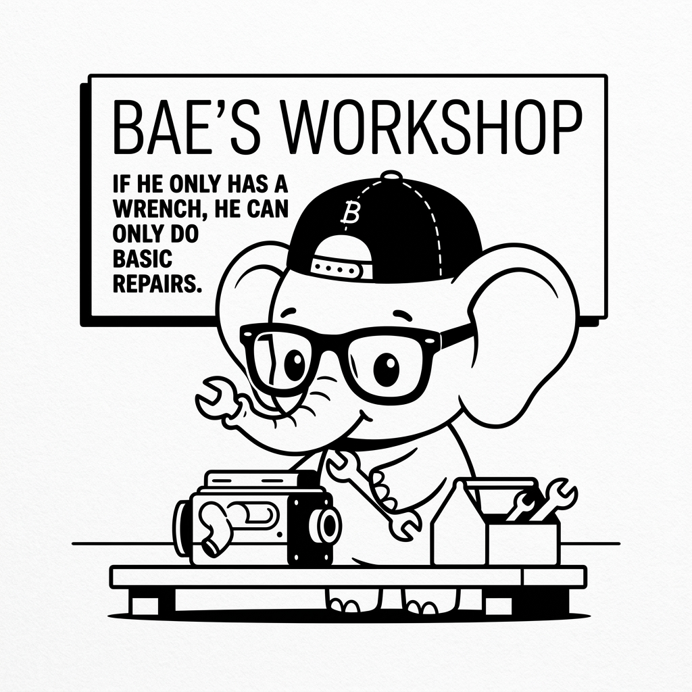

# Google ADK Tools and Functions

## 1. Quick Summary
| Area | Details |
|---|---|
| Topic | Google ADK Tools and Functions |
| Difficulty | Intermediate |
| Used For | Extending Gemini's capabilities by allowing it to interact with GCP APIs or custom Python functions. |
| Common Mistake | Using custom Python functions for GCP tasks that have native ADK tool wrappers. |
| Performance | Fast, especially when using native Vertex AI tools inside the GCP backbone. |

## 2. Engineering Story

A team of engineers recently faced a critical challenge related to this concept. Their existing processes were failing under the load of thousands of concurrent users, and manual workarounds were causing major delays in deployment. By deeply understanding and correctly implementing this concept, the lead engineer was able to architect a solution that not only resolved the immediate bottleneck but also paved the way for massive scalability. This transformation turned a chaotic, error-prone system into a resilient, automated powerhouse.

## 3. Real-World Analogy


Bro, imagine a master mechanic (the LLM). If he only has a wrench, he can only do basic repairs. If you give him the keys to the automated diagnostics machine and the hydraulic lift (Tools), he can overhaul the entire engine. In Google ADK, providing tools turns the LLM from a simple chat interface into a system that can read databases and trigger cloud functions.

| Master Mechanic | Agentic System |
|---|---|
| The Mechanic's Brain | Gemini Model |
| Hand wrench | Basic Python Function Tool |
| Hydraulic Lift | Native Vertex AI Tool |

## 4. Concept Explanation
In Google ADK, Tools are the bridge between the generative model and the real world. When you provide tools to the agent, the Gemini model can decide to pause its text generation, request the execution of a tool, and wait for the result before continuing.

There are two main types:
1. **Native GCP Tools**: Pre-built integrations like Vertex Search, Code Execution, or BigQuery. These are highly optimized.
2. **Custom Function Tools**: Your own Python code wrapped in a tool definition, similar to standard function calling in other frameworks.

## 5. Syntax Table
| Concept | Code | Description |
|---|---|---|
| Native Tool | `VertexSearchTool(datastore_id="...")` | Using a built-in GCP integration. |
| Custom Tool | `@tool\ndef my_func(x: int):...` | Decorating a Python function. |
| Agent Binding | `Agent(tools=[my_func, search_tool])` | Giving the tools to the agent. |

## 6. Beginner Example
Here is how you wrap a simple Python function into a tool for the Google ADK.

```python
from google_adk import Agent, tool
from google_adk.models import GeminiModel

@tool
def calculate_discount(price: float, discount_percent: float) -> str:
    """Calculates the final price after a discount is applied."""
    final_price = price - (price * (discount_percent / 100))
    return f"The final price is ${final_price:.2f}"

sales_agent = Agent(
    name="SalesBot",
    model=GeminiModel("gemini-1.5-pro"),
    system_instruction="You help customers calculate prices.",
    tools=[calculate_discount]
)

session = sales_agent.create_session()
response = session.chat("A laptop is $1200 and I have a 15% discount. What's the total?")
print(response.text)
# Output: "The final price is $1020.00"
```

## 7. Real-World Engineering Example
Bro, in an enterprise, you use Native Tools. Let's look at giving an agent the ability to execute Python code natively in a Google-hosted secure sandbox, and search a company datastore.

```python
from google_adk import Agent
from google_adk.tools import CodeExecutionTool, VertexSearchTool

# Native tool 1: Secure python sandbox execution
code_tool = CodeExecutionTool()

# Native tool 2: Grounding with enterprise data
kb_tool = VertexSearchTool(
    datastore_id="employee-handbook-v2",
    location="us-central1"
)

data_agent = Agent(
    name="DataScientistBot",
    model="gemini-1.5-pro",
    system_instruction="You answer questions and can write/run code to analyze data.",
    tools=[code_tool, kb_tool]
)

session = data_agent.create_session()
# The agent will write python code, run it in the sandbox, and return the result
res = session.chat("Calculate the first 50 Fibonacci numbers and give me the sum.")
print(res.text)
```

## 8. Internal Working
When you pass `@tool` to the ADK, it converts your Python type hints and docstrings into an OpenAPI specification. Gemini reads this spec. If Gemini wants to use the tool, it sends a `functionCall` payload. The ADK intercepts this, runs your Python code locally (or triggers the native GCP API), and sends a `functionResponse` back to Gemini.

import LearningFlow from '@site/src/components/LearningFlow';

<LearningFlow
  elements={[
    { id: '1', type: 'core', data: { label: 'Gemini Inference' }, position: { x: 250, y: 50 } },
    { id: '2', type: 'warning', data: { label: 'Emits functionCall' }, position: { x: 250, y: 150 } },
    { id: '3', type: 'process', data: { label: 'ADK Orchestrator' }, position: { x: 250, y: 250 } },
    { id: '4', type: 'tool', data: { label: 'Python Code / GCP API' }, position: { x: 450, y: 250 } },
    { id: '5', type: 'data', data: { label: 'functionResponse' }, position: { x: 450, y: 50 } },
    { id: 'e1', source: '1', target: '2', label: 'Pauses Generation' },
    { id: 'e2', source: '2', target: '3', label: 'Intercepts' },
    { id: 'e3', source: '3', target: '4', label: 'Executes' },
    { id: 'e4', source: '4', target: '5', label: 'Returns result' },
    { id: 'e5', source: '5', target: '1', label: 'Resumes Generation' }
  ]}
/>

## 9. Performance Table
| Tool Type | Execution Location | Latency Profile |
|---|---|---|
| Native Vertex Search | GCP Backbone | Extremely Fast (~100ms) |
| Native Code Sandbox | GCP Container | Fast (~500ms startup) |
| Custom Python API Tool | Your local server | Depends on external API speed |

## 10. Top Interview Questions
| Question | Answer |
|---|---|
| What is the advantage of the Code Execution Tool in Google ADK? | It runs generated Python code in a secure, isolated, Google-managed sandbox, preventing the LLM from accidentally executing harmful code on your own application servers. |
| Why must you use type hints on custom tools? | The ADK uses Python type hints to generate the JSON schema that tells Gemini exactly what arguments to pass. |
| Can Gemini execute multiple tools in parallel? | Yes, Gemini 1.5 supports parallel function calling, and the ADK will execute independent tools concurrently to save time. |
| What happens if a custom tool throws an exception? | You should handle the exception inside the tool and return a string (e.g., "Error: User not found") so the LLM knows it failed and can respond appropriately. |

## 11. Tricky Questions & Edge Cases
Bro, what happens if your custom tool returns a massive 10MB JSON file from a database query?
**The Fix:** Gemini has a massive context window (up to 2M tokens), but feeding it 10MB of raw JSON will degrade its reasoning and cost you a fortune. Always parse and summarize the data *inside* your Python tool before returning it to the LLM.

## 12. Real-World Usage
Enterprise data teams use the Google ADK with BigQuery tools. A user asks a natural language question. The agent uses the BigQuery tool to write SQL, execute it, read the results, use the Code Execution tool to plot a chart, and returns the image and summary to the user.

## 13. Best Practices
| DO | DON'T |
|---|---|
| Write extensive docstrings explaining exactly when to use the tool. | Leave tools undocumented, forcing the LLM to guess. |
| Use Native GCP tools whenever possible for security and speed. | Re-invent the wheel by writing custom Python to hit Vertex APIs. |
| Validate tool inputs (e.g., checking if `user_id` is an int). | Blindly trust the arguments the LLM provides. |

## 14. Production Notes
:::warning
When using custom tools that write to databases (e.g., `update_record()`), implement a Human-in-the-Loop check or strict programmatic validation. An LLM hallucinating a `DELETE` command inside a tool call can destroy your production data.
:::

## 15. Common Mistakes
| Mistake | Fix |
|---|---|
| Not returning strings | Tool functions should generally return strings (or stringified JSON). Returning complex Python objects will break the JSON serialization sent back to Gemini. |
| Conflicting tool names | Ensure every tool has a strictly unique name, or the ADK will overwrite the schema definitions. |
| Too many tools | Giving an agent 30 tools causes "tool confusion." Break it down into multiple specialized agents using a router pattern. |

## 16. Related Topics
- Function Calling Deep Dive
- Tool Design Principles
- Agent Handoffs and Delegation

## 16. Top GitHub Repos
| Repository | Stars | Description | Why It Matters |
|---|---|---|---|
| [googleapis/google-cloud-python](https://github.com/googleapis/google-cloud-python) | ⭐ 4k+ | Google Cloud Python libraries. | The foundation for building custom GCP tools. |
| [GoogleCloudPlatform/generative-ai](https://github.com/GoogleCloudPlatform/generative-ai) | ⭐ 12k+ | Google's GenAI repository. | Contains examples of advanced tool implementations. |
| [pydantic/pydantic](https://github.com/pydantic/pydantic) | ⭐ 18k+ | Data validation. | Use this inside your custom tools to validate LLM inputs. |
| [langchain-ai/langchain](https://github.com/langchain-ai/langchain) | ⭐ 90k+ | LangChain framework. | Good reference for how community-built tools are structured. |
| [Significant-Gravitas/AutoGPT](https://github.com/Significant-Gravitas/AutoGPT) | ⭐ 165k+ | Original autonomous agent. | Great reference for designing file-system and web-browsing tools. |
