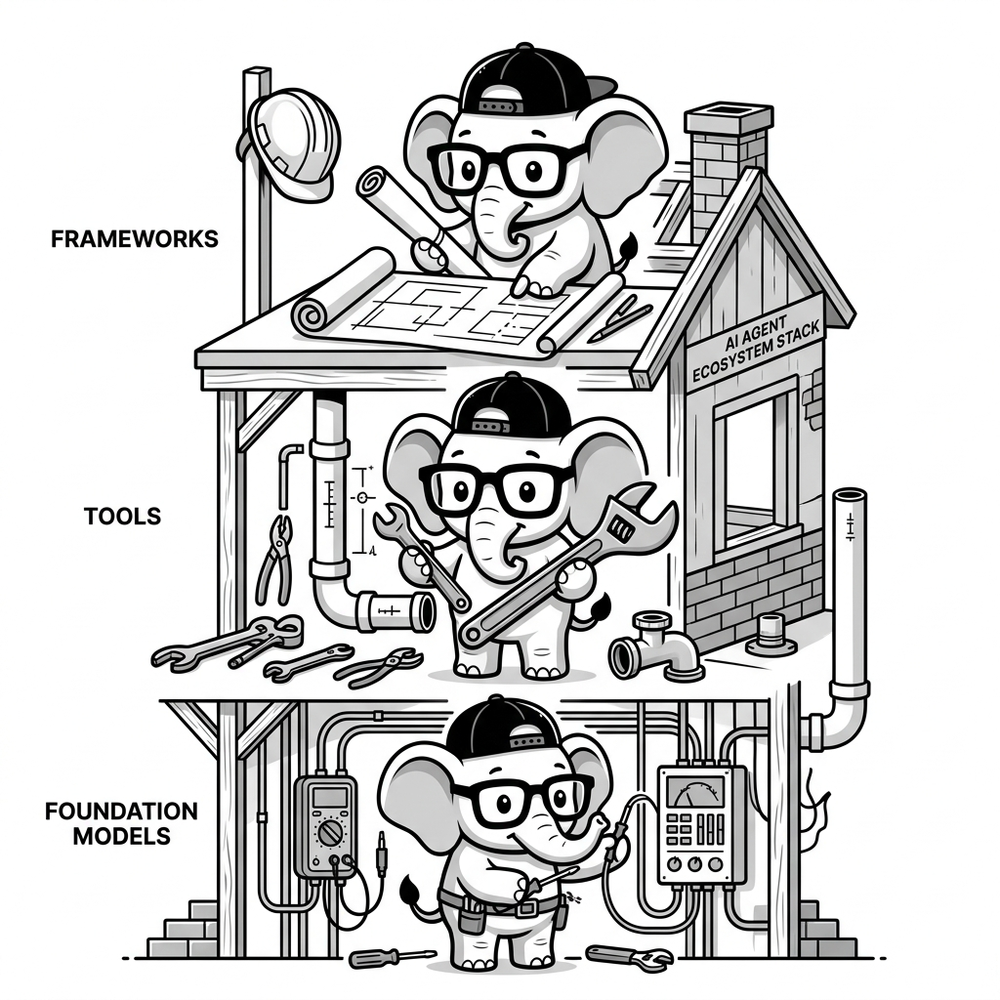

import LearningFlow from '@site/src/components/LearningFlow';

# Agent Ecosystem Landscape

## 1. Quick Summary

| Area | Details |
|---|---|
| Topic | Ecosystem Overview |
| Difficulty | Beginner |
| Used For | Understanding the layers of the AI Agent tech stack (Models, Frameworks, Tools, Infra) |
| Common Mistake | Treating "LangChain" as an LLM, or "OpenAI" as an agent framework |
| Performance | Choosing the right layer of abstraction dictates your system's overall latency and cost |

## 2. Engineering Story

A team of engineers recently faced a critical challenge related to this concept. Their existing processes were failing under the load of thousands of concurrent users, and manual workarounds were causing major delays in deployment. By deeply understanding and correctly implementing this concept, the lead engineer was able to architect a solution that not only resolved the immediate bottleneck but also paved the way for massive scalability. This transformation turned a chaotic, error-prone system into a resilient, automated powerhouse.

## 3. Real-World Analogy



| Human World (Building a House) | Agent Ecosystem Equivalent |
|---|---|
| The raw electricity and physics | **Foundation Models (GPT-4, Claude 3.5)** |
| The architect's blueprints | **Agent Frameworks (LangGraph, CrewAI)** |
| The plumbing, wiring, and lumber | **Memory & Tool Infra (Pinecone, E2B)** |
| The construction workers | **Hosting & Orchestration (AWS, Vercel AI)** |
| The finished, furnished house | **Agentic Apps (Devin, Cursor)** |

Bro, you can't build a house just by buying electricity. And you can't build an agent just by having an OpenAI API key. The ecosystem is a stack. You need the brain (Models), the skeleton (Frameworks), the hands (Tools), and the house to put it all in (Infrastructure).

## 4. Concept Explanation

The Agent Ecosystem is rapidly maturing into distinct layers. As an engineer, you need to know which tool solves which problem.

1. **The Model Layer:** The actual reasoning engines (OpenAI, Anthropic, Google, Meta). They take text and return text/JSON.
2. **The Framework Layer:** The code that orchestrates the loop of thinking and acting (LangChain, LlamaIndex, CrewAI, AutoGen). This is where you write your Python/TS.
3. **The Tool & Environment Layer:** The APIs the agent calls. This includes code sandboxes (E2B), browser automation (MultiOn), and enterprise API connectors (Zapier NLA).
4. **The Memory & Infrastructure Layer:** Where state lives. Vector databases (Chroma, Pinecone) for knowledge, and observability tools (LangSmith, Braintrust) to debug the agent's thoughts.
5. **The Protocol Layer:** Standards like MCP (Model Context Protocol) that allow agents to universally connect to tools.

## 5. Syntax Table

*Not applicable for code syntax; this is a conceptual architecture mapping.*

| Layer | Top Players | What they provide |
|---|---|---|
| **Models** | OpenAI, Anthropic, Google, Meta | The raw reasoning engine (The Brain) |
| **Frameworks** | LangGraph, CrewAI, Pydantic AI | The `while` loop and state machine (The Skeleton) |
| **Tooling** | E2B, MultiOn, Composio | The ability to execute code or click buttons (The Hands) |
| **Memory/DB** | Pinecone, Chroma, Qdrant | Long-term context storage (The Filing Cabinet) |
| **Observability**| LangSmith, Braintrust, Phoenix | Debugging the LLM's thought process (The X-Ray) |

## 6. Beginner Example

Let's look at a conceptual `requirements.txt` file for a modern, production-ready AI Agent. Notice how it spans the entire ecosystem.

```text
# 1. The Framework
langgraph==0.1.5
langchain-core==0.2.10

# 2. The Model Provider SDK
openai==1.35.0
anthropic==0.30.0

# 3. The Memory/Vector DB
chromadb==0.5.3

# 4. The Tooling Environments
e2b-code-interpreter==0.0.10 # For running python safely
duckduckgo-search==6.1.7     # For web search

# 5. Observability
langsmith==0.1.81
```

## 7. Real-World Engineering Example

Bro, how do these pieces actually fit together in a single Python script? Here is a high-level orchestration showing the ecosystem layers interacting.

```python
import os
# Framework Layer
from langgraph.graph import StateGraph
# Model Layer
from langchain_openai import ChatOpenAI
# Tool Layer
from e2b_code_interpreter import CodeInterpreter
# Observability Layer
from langsmith import traceable

# 1. Initialize the Model
llm = ChatOpenAI(model="gpt-4o", temperature=0)

# 2. Initialize the Tool Environment
def run_python_in_sandbox(code: str):
    with CodeInterpreter() as sandbox:
        execution = sandbox.notebook.exec_cell(code)
        return execution.text

# 3. Add Observability
@traceable(name="agent_reasoning_step")
def agent_node(state):
    # Agent logic here
    pass

# 4. Build the Framework Graph
workflow = StateGraph(dict)
workflow.add_node("agent", agent_node)
# ... build rest of graph ...
```

## 8. Internal Working

This diagram visualizes the modern Agent Tech Stack from bottom to top.

<LearningFlow
  elements={[
    { id: '1', type: 'core', data: { label: 'Foundation Models (GPT-4, Claude)' }, position: { x: 250, y: 350 } },
    { id: '2', type: 'data', data: { label: 'Memory & State (Vector DBs)' }, position: { x: 100, y: 250 } },
    { id: '3', type: 'tool', data: { label: 'Tool Environments (E2B, Zapier)' }, position: { x: 400, y: 250 } },
    { id: '4', type: 'process', data: { label: 'Agent Framework (LangGraph, CrewAI)' }, position: { x: 250, y: 150 } },
    { id: '5', type: 'output', data: { label: 'Agentic App (Devin, Support Bot)' }, position: { x: 250, y: 50 } },

    { id: 'e1', source: '1', target: '4', animated: true, label: 'Provides Reasoning' },
    { id: 'e2', source: '2', target: '4', animated: true, label: 'Provides Context' },
    { id: 'e3', source: '3', target: '4', animated: true, label: 'Provides Actions' },
    { id: 'e4', source: '4', target: '5', animated: true, label: 'Powers the App' },
  ]}
/>

## 9. Performance Table

| Layer | Performance Bottleneck | Impact on System |
|---|---|---|
| **Models** | Inference speed (TTFT), Rate limits | Determines how fast the agent "thinks" |
| **Frameworks** | Graph transition overhead, state serialization | Minor impact, mostly affects developer velocity |
| **Tools** | Network latency, Sandbox boot times | Huge impact. Booting a VM to run code takes seconds. |
| **Memory** | Vector Search Latency (KNN) | Low impact (usually < 100ms) |

## 10. Top Interview Questions

| Question | Answer |
|---|---|
| Why not just build an agent using only the OpenAI SDK? | You can! But as your agent grows, you'll have to manually write code for state management, retries, memory pruning, and tool routing. Frameworks like LangGraph abstract this boilerplate away. |
| What is the difference between LangChain and LangGraph? | LangChain is a library of components (prompts, tools, chains). LangGraph is a framework built *on top* of LangChain specifically for orchestrating cyclic, stateful agent loops. |
| Why do we need specialized agent observability tools like LangSmith? | Traditional APMs (like Datadog) track CPU and network. Agent APMs track *tokens*, *prompts*, and *reasoning chains*, allowing you to see exactly why an LLM hallucinated at step 4 of a loop. |
| What is the Model Context Protocol (MCP)? | An emerging standard by Anthropic that standardizes how tools connect to agents, acting like "USB-C" for AI tools. |

## 11. Tricky Questions & Edge Cases

Bro, what happens if your company bans OpenAI for security reasons?
If you tightly coupled your code to the `openai` python SDK, you have to rewrite your entire agent.
**The Edge Case Fix:** This is why the Framework layer exists. If you use LangChain or LlamaIndex, swapping from OpenAI to a locally hosted Llama-3 model is usually a one-line code change (`ChatOpenAI` -> `ChatOllama`).

## 12. Real-World Usage

- **Enterprise:** Banks using internal private clouds to host Llama-3 (Model), orchestrated by custom Python graphs (Framework), querying internal Postgres DBs (Tools), monitored by Braintrust (Observability).
- **Startups:** Heavy reliance on managed services: GPT-4o, LangGraph Cloud, Pinecone Serverless, and E2B for code execution.

## 13. Best Practices

| DO | DON'T |
|---|---|
| Abstract your LLM calls behind a common interface so you can swap models as new ones are released. | Don't lock yourself into one provider's ecosystem (e.g., relying entirely on OpenAI Assistants API) if portability matters. |
| Invest heavily in the Observability layer on day 1. | Don't try to debug a 5-step agent loop using `print()` statements. |

## 14. Production Notes

:::caution Production Warning
Bro, the ecosystem moves incredibly fast. A framework that is popular today might be obsolete in 6 months. Do not put critical business logic *inside* the framework's abstractions. Write pure Python functions for your tools and business logic, and just use the framework to route between them.
:::

## 15. Common Mistakes

| Mistake | Why it's bad | The Fix |
|---|---|---|
| Trying to build a vector DB from scratch | You will spend months optimizing similarity search algorithms instead of building your agent. | Use managed services like Chroma or Pinecone. |
| Using a heavyweight framework for a simple task | CrewAI is overkill if you just need to extract JSON from a receipt. | Use the raw Pydantic or OpenAI SDK for simple extractions. |

## 16. Related Topics
- Choosing a Framework
- Anatomy of an Agent
- Multi-Agent Systems Overview

## 16. Top GitHub Repos

| Repository | Stars | Description | Why It Matters |
|---|---|---|---|
| [langchain-ai/langsmith-sdk](https://github.com/langchain-ai/langsmith-sdk) | ⭐ 1k+ | Observability SDK | The industry standard for tracing and debugging agent logic. |
| [e2b-dev/E2B](https://github.com/e2b-dev/E2B) | ⭐ 5k+ | Secure code sandboxes | Solves the hardest problem in tooling: executing untrusted LLM-generated code safely. |
| [chroma-core/chroma](https://github.com/chroma-core/chroma) | ⭐ 12k+ | Open-source Vector DB | The most popular local memory layer for agent development. |
| [anthropics/modelcontextprotocol](https://github.com/anthropics/modelcontextprotocol) | ⭐ 3k+ | MCP Spec | The future of the tooling ecosystem—standardizing how agents talk to data sources. |
| [VRSEN/agency-swarm](https://github.com/VRSEN/agency-swarm) | ⭐ 3k+ | Framework based on Assistants API | Shows how the ecosystem adapts when model providers release their own agent orchestration tools. |
