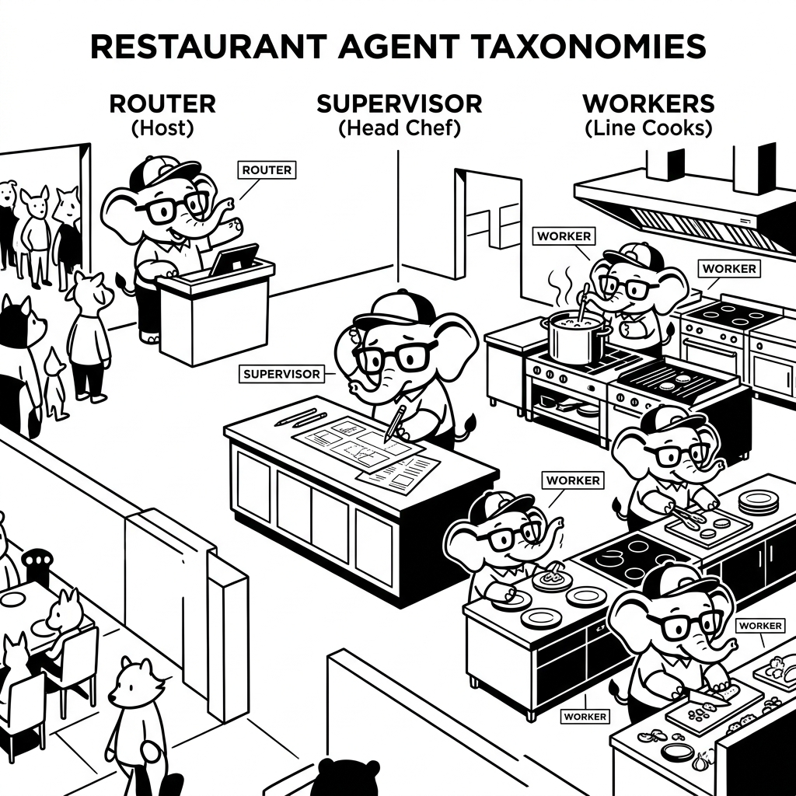

import LearningFlow from '@site/src/components/LearningFlow';

# Agent Types & Taxonomies

## 1. Quick Summary

| Area | Details |
|---|---|
| Topic | Agent Classifications |
| Difficulty | Beginner / Intermediate |
| Used For | Categorizing agent architectures to choose the right pattern for your use case |
| Common Mistake | Using a complex multi-agent system when a single routing agent is enough |
| Performance | Scales with complexity: Single agents are fast, Multi-agent swarms are extremely slow |

## 2. Engineering Story

A team of engineers recently faced a critical challenge related to this concept. Their existing processes were failing under the load of thousands of concurrent users, and manual workarounds were causing major delays in deployment. By deeply understanding and correctly implementing this concept, the lead engineer was able to architect a solution that not only resolved the immediate bottleneck but also paved the way for massive scalability. This transformation turned a chaotic, error-prone system into a resilient, automated powerhouse.

## 3. Real-World Analogy



| Human World (Corporate Structure) | Agent Taxonomy Equivalent |
|---|---|
| A solo freelancer doing everything | **Single Autonomous Agent** |
| A receptionist directing calls to the right department | **Routing Agent** |
| A manager who plans a project and delegates to workers | **Plan-and-Execute (Supervisor) Agents** |
| A dedicated QA team checking the developers' work | **Evaluator / Reflection Agents** |
| A boardroom of experts debating a solution | **Multi-Agent Swarm / Group Chat** |

Bro, don't overcomplicate it. If you run a tiny tea stall, you do everything yourself (Single Agent). If you run a massive restaurant, you need a host (Router), a head chef (Planner), line cooks (Workers), and a health inspector (Evaluator). Your agent architecture should match the complexity of the business problem.

## 4. Concept Explanation

Not all agents are built the same. As the industry matures, we've classified agents into specific taxonomies based on their autonomy, communication style, and structural layout.

1. **Single-Agent Systems:** One LLM prompt with a set of tools. Good for narrow, specific tasks.
   - *Reactive Agents:* "If X happens, do Y."
   - *Reasoning Agents:* Uses ReAct (Reason + Act) to solve problems step-by-step.
2. **Multi-Agent Systems (MAS):** Multiple agents, each with a distinct persona and toolset, working together.
   - *Hierarchical / Supervisor:* One boss agent delegates tasks to worker agents.
   - *Sequential:* An assembly line where Agent A passes output to Agent B.
   - *Network / Swarm:* Agents chat with each other freely until consensus is reached.

Understanding these types prevents you from building a 5-agent swarm to do a task that a simple Python `if/else` statement could have routed.

## 5. Syntax Table

*High-level architectural patterns using common terminology.*

| Taxonomy | Core Logic | Best For |
|---|---|---|
| **Router** | `if task_type == X: send_to_agent_A()` | Triage, customer support fronts |
| **Worker (Single)** | `while not done: use_tools()` | Specific API integrations |
| **Supervisor** | `plan = make_plan(); for step in plan: delegate_to_worker()` | Complex, multi-step workflows |
| **Evaluator** | `if result_is_good(): return else: send_back()` | Code generation, high-stakes data |

## 6. Beginner Example

Here is a conceptual example of a **Supervisor / Worker** taxonomy using pseudo-code.

```python
# Worker 1: The Researcher
research_agent = Agent(
    role="Researcher",
    tools=[web_search],
    instructions="Find raw facts and summarize them."
)

# Worker 2: The Writer
writer_agent = Agent(
    role="Writer",
    tools=[grammar_checker],
    instructions="Take facts and write a professional email."
)

# Supervisor: The Boss
def supervisor_loop(task):
    print("Supervisor: Planning the work...")
    facts = research_agent.run(task)

    print("Supervisor: Handoff to Writer...")
    draft = writer_agent.run(facts)

    return draft

supervisor_loop("Write an email about the latest AI news.")
```

## 7. Real-World Engineering Example

Bro, in production, we often use a **Router Agent** combined with specialized **Worker Agents**. This is highly deterministic and cheaper than a free-flowing swarm. Here is how you might structure it using LangGraph.

```python
from langgraph.graph import StateGraph, END
from typing import TypedDict

class RouterState(TypedDict):
    user_query: str
    route: str
    response: str

def routing_node(state: RouterState):
    """The Router Agent: classifies the intent."""
    intent = llm_classify(state["user_query"]) # Returns 'billing' or 'tech_support'
    return {"route": intent}

def billing_agent_node(state: RouterState):
    """Worker Agent 1"""
    response = run_billing_agent(state["user_query"])
    return {"response": response}

def tech_support_agent_node(state: RouterState):
    """Worker Agent 2"""
    response = run_tech_agent(state["user_query"])
    return {"response": response}

def route_condition(state: RouterState):
    return state["route"] # Directs the graph edge

workflow = StateGraph(RouterState)
workflow.add_node("router", routing_node)
workflow.add_node("billing", billing_agent_node)
workflow.add_node("tech_support", tech_support_agent_node)

# Architecture: Router -> Conditional Edge -> Worker -> End
workflow.add_conditional_edges(
    "router",
    route_condition,
    {"billing": "billing", "tech_support": "tech_support"}
)
workflow.add_edge("billing", END)
workflow.add_edge("tech_support", END)

app = workflow.compile()
```

## 8. Internal Working

This diagram visualizes the three most common taxonomies: Single, Supervisor (Hierarchical), and Swarm (Network).

<LearningFlow
  elements={[
    // Single Agent
    { id: 't1', type: 'core', data: { label: 'Single Agent' }, position: { x: 100, y: 50 } },
    { id: 't1_tool', type: 'tool', data: { label: 'Tools' }, position: { x: 100, y: 150 } },
    { id: 'e_t1', source: 't1', target: 't1_tool', animated: true },

    // Supervisor Agent
    { id: 't2', type: 'core', data: { label: 'Supervisor' }, position: { x: 350, y: 50 } },
    { id: 't2_w1', type: 'process', data: { label: 'Worker A' }, position: { x: 280, y: 150 } },
    { id: 't2_w2', type: 'process', data: { label: 'Worker B' }, position: { x: 420, y: 150 } },
    { id: 'e_t2_1', source: 't2', target: 't2_w1', animated: true },
    { id: 'e_t2_2', source: 't2', target: 't2_w2', animated: true },

    // Swarm / Network
    { id: 't3_1', type: 'process', data: { label: 'Agent X' }, position: { x: 600, y: 50 } },
    { id: 't3_2', type: 'process', data: { label: 'Agent Y' }, position: { x: 700, y: 150 } },
    { id: 't3_3', type: 'process', data: { label: 'Agent Z' }, position: { x: 500, y: 150 } },
    { id: 'e_t3_1', source: 't3_1', target: 't3_2', animated: true },
    { id: 'e_t3_2', source: 't3_2', target: 't3_3', animated: true },
    { id: 'e_t3_3', source: 't3_3', target: 't3_1', animated: true },
  ]}
/>

## 9. Performance Table

| Taxonomy | Latency | Token Cost | Predictability / Control |
|---|---|---|---|
| **Single / Router** | Low | Low | Very High |
| **Sequential Pipeline** | Medium | Medium | High |
| **Supervisor / Hierarchical** | High | High | Medium |
| **Swarm / Group Chat** | Very High | Very High | Low (Prone to infinite loops) |

## 10. Top Interview Questions

| Question | Answer |
|---|---|
| When would you choose a Multi-Agent system over a Single Agent? | When the task requires distinct personas, separate system prompts, or mutually exclusive toolsets (e.g., a "Coder" agent shouldn't have access to "HR" database tools). |
| What is the danger of a Swarm taxonomy? | Non-determinism. Agents chatting with each other can get stuck in agreement loops ("Great job!" "Thanks, you too!") or hallucination spirals without human intervention. |
| Explain the "Evaluator" pattern. | It's a two-agent setup. Agent A generates a result. Agent B (the Evaluator) checks it against rules. If it fails, B sends feedback to A to try again. |
| Why is the Router taxonomy popular in production? | It saves money and latency. By routing a query to a small, specialized agent (or even a hardcoded script), you avoid running a massive, expensive generalized agent loop. |

## 11. Tricky Questions & Edge Cases

Bro, how do agents in a Supervisor architecture share memory?
If Worker A finds a bug, how does Worker B know about it? If you don't implement a shared "Scratchpad" or global state, Worker B starts from scratch. The edge case here is **context fragmentation**. You must pass the outputs of Worker A explicitly into the inputs of Worker B, or maintain a centralized graph state (like in LangGraph).

## 12. Real-World Usage

- **Routing:** Customer support bots on Zendesk. (Intent -> Tech Support Agent vs Billing Agent).
- **Plan and Execute:** Devin, the AI software engineer. (Plan the feature -> write tests -> write code -> evaluate).
- **Swarm:** Mostly research, experimental game development (like the famous Stanford AI town), and complex data synthesis where multiple perspectives are needed.

## 13. Best Practices

| DO | DON'T |
|---|---|
| Start with a Single Agent. Only split it into multiple agents if the system prompt becomes too massive or confusing. | Don't build a 4-agent CrewAI setup for a task that a single prompt can solve. |
| Use clear handoff protocols (like OpenAI's handoff functions) to pass state between agents. | Don't let agents talk to each other indefinitely without a strict `max_turns` limit. |

## 14. Production Notes

:::caution Production Warning
Bro, the more autonomous agents you string together, the harder it is to debug. In a Swarm or Supervisor setup, if the final output is wrong, tracing *which* agent made the logical error is a nightmare. You absolutely must use tracing tools like LangSmith or Braintrust if you use advanced taxonomies.
:::

## 15. Common Mistakes

| Mistake | Why it's bad | The Fix |
|---|---|---|
| Overloading a Single Agent with 50 tools and 5 personas. | The LLM gets confused, hallucinates, or picks the wrong tool. | Split it into a Supervisor with 5 specialized Worker agents (5 tools each). |
| Using Swarm architecture for transactional tasks. | Swarms are slow and conversational. A checkout process needs deterministic steps. | Use a state machine or Sequential pipeline for transactions. |

## 16. Related Topics
- Anatomy of an Agent
- Multi-Agent Systems Overview
- Choosing a Framework

## 16. Top GitHub Repos

| Repository | Stars | Description | Why It Matters |
|---|---|---|---|
| [microsoft/autogen](https://github.com/microsoft/autogen) | ⭐ 25k+ | Multi-agent framework | The absolute king of the "Swarm / Group Chat" taxonomy. |
| [joaomdmoura/crewAI](https://github.com/joaomdmoura/crewAI) | ⭐ 15k+ | Role-based agents | Perfect for building the Sequential and Supervisor taxonomies quickly. |
| [langchain-ai/langgraph](https://github.com/langchain-ai/langgraph) | ⭐ 6k+ | Graph-based agents | Best for defining strict Routers and highly controlled Supervisor taxonomies. |
| [openai/swarm](https://github.com/openai/swarm) | ⭐ 8k+ | OpenAI's educational multi-agent framework | Demonstrates the "Handoff" and "Routine" taxonomy clearly and cleanly. |
| [agiresearch/AIOS](https://github.com/agiresearch/AIOS) | ⭐ 4k+ | LLM Agent Operating System | Explores theoretical taxonomies of how agents share OS-level resources. |
