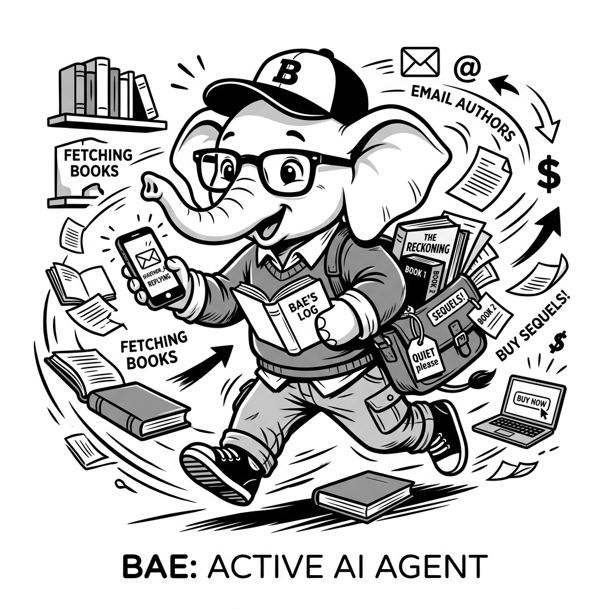

import LearningFlow from '@site/src/components/LearningFlow';

# Agent vs Chatbot vs RAG

## 1. Quick Summary

| Area | Details |
|---|---|
| Topic | Architecture Comparison |
| Difficulty | Beginner |
| Used For | Deciding which AI pattern to use for your specific product requirements |
| Common Mistake | Overengineering a simple search problem by building a complex agent |
| Performance | Chatbot (fastest) < RAG (medium latency) < Agent (slowest) |

## 2. Real-World Analogy



| Human World (Library) | AI Architecture Equivalent |
|---|---|
| Chatting with a friend about books based on what they remember | **Chatbot** (Relies entirely on internal model weights) |
| Asking the librarian to go fetch a specific book and read you a paragraph | **RAG** (Retrieval-Augmented Generation) |
| Asking the librarian to find a book, summarize it, email the author, and buy the sequel | **Agent** (Reasoning, multiple steps, acting on the world) |

Bro, it’s simple. A chatbot just talks to you. RAG talks to you *after* reading a document you gave it. An agent goes out into the world, does things, and *then* talks to you about what it did.

## 3. Concept Explanation

Let's break down the evolution of LLM applications:

**1. Chatbots (Stateless / Basic Memory):**
This is just an LLM wrapped in a UI (like vanilla ChatGPT). It takes your prompt, passes it to the model, and streams back text. It relies entirely on the knowledge baked into its weights during pre-training.

**2. RAG (Retrieval-Augmented Generation):**
You realize the chatbot doesn't know your private company data. So, you build RAG. When a user asks a question, you first search a vector database for relevant text chunks, inject them into the prompt, and say: *"Answer the user based ONLY on this text."* It’s read-only.

**3. AI Agents:**
You realize reading isn't enough; you need the AI to *do* things. Agents have tools (APIs, calculators, code execution). They don't just answer; they execute a loop of reasoning and action until a complex goal is met.

## 4. Syntax Table

| Architecture | Core Code Pattern | Focus |
|---|---|---|
| **Chatbot** | `llm.generate(prompt + history)` | Conversation |
| **RAG** | `docs = db.search(query); llm.generate(docs + query)` | Information Retrieval |
| **Agent** | `while not done: action = llm.think(); result = tool(action)` | Task Execution |

## 5. Beginner Example

Let's look at how the prompt differs for each architecture.

```python
# 1. Chatbot Prompt
"Explain quantum physics to a 5-year-old."

# 2. RAG Prompt
"""
Given this internal company document: {retrieved_doc}
Answer the user's question: "What is our Q3 revenue?"
"""

# 3. Agent Prompt
"""
You are a financial agent. You have access to these tools: [query_sql_db, send_slack_msg].
User request: "Find Q3 revenue and slack it to the finance channel."
Decide your first tool to use.
"""
```

## 6. Real-World Engineering Example

Bro, imagine you are building a customer support system for an e-commerce site. Here is how you decide what to build:

```python
def handle_customer_request(user_message: str):
    intent = classify_intent(user_message)

    # 1. Chatbot: Simple chit-chat or general policy questions
    if intent == "general_greeting":
        return standard_llm_chat(user_message)

    # 2. RAG: User asks about a specific product's manual
    elif intent == "product_specs":
        context = vector_db.similarity_search(user_message)
        return llm_generate_with_context(user_message, context)

    # 3. Agent: User wants to cancel an order and get a refund
    elif intent == "cancel_order":
        # The agent must check order status API, call Stripe refund API,
        # and update the DB. This requires reasoning and action.
        tools = [check_order_api, process_refund, send_email]
        agent = initialize_agent(tools)
        return agent.run(user_message)
```

## 7. Internal Working

Let's visualize how the complexity scales from RAG to a full Agent. Notice how RAG is a straight line, while the Agent is a loop.

<LearningFlow
  elements={[
    { id: '1', type: 'core', data: { label: 'User Query' }, position: { x: 100, y: 50 } },

    // RAG Path
    { id: 'r1', type: 'process', data: { label: 'Embed Query' }, position: { x: 250, y: 0 } },
    { id: 'r2', type: 'data', data: { label: 'Vector DB' }, position: { x: 450, y: 0 } },
    { id: 'r3', type: 'output', data: { label: 'LLM Response' }, position: { x: 650, y: 0 } },

    // Agent Path
    { id: 'a1', type: 'process', data: { label: 'LLM Reasoning Loop' }, position: { x: 250, y: 150 } },
    { id: 'a2', type: 'tool', data: { label: 'Execute Tool API' }, position: { x: 450, y: 150 } },
    { id: 'a3', type: 'output', data: { label: 'Final Action / Result' }, position: { x: 650, y: 150 } },

    { id: 'e-rag', source: '1', target: 'r1', animated: true, label: 'RAG Flow' },
    { id: 'er1', source: 'r1', target: 'r2', animated: true },
    { id: 'er2', source: 'r2', target: 'r3', animated: true },

    { id: 'e-agent', source: '1', target: 'a1', animated: true, label: 'Agent Flow' },
    { id: 'ea1', source: 'a1', target: 'a2', animated: true },
    { id: 'ea2', source: 'a2', target: 'a1', animated: true, type: 'smoothstep', label: 'Observe Result' },
    { id: 'ea3', source: 'a1', target: 'a3', animated: true, label: 'Task Complete' },
  ]}
/>

## 8. Performance Table

| Architecture | Latency | Cost (Tokens) | Failure Mode |
|---|---|---|---|
| **Chatbot** | Very Fast | Low | Hallucinations, outdated info |
| **RAG** | Fast | Medium | Retrieving the wrong chunks, poor context |
| **Agent** | Slow | High (multiple loops) | Infinite loops, wrong tool usage, API errors |

## 9. Top Interview Questions

| Question | Answer |
|---|---|
| When should I use RAG instead of an Agent? | When the task is purely informational (read-only) and you need fast, deterministic answers based on proprietary documents. Don't build an agent if you just need to search a PDF. |
| Can an Agent use RAG? | Yes! RAG is often just another *tool* given to an Agent. An agent might decide: "I need to search the knowledge base" and call a RAG tool. |
| Why are Agents more expensive to run than chatbots? | Because agents execute in a loop. A single user request might require 5 LLM calls (think, act, observe, think again) before returning the final answer. |
| What is the biggest risk in deploying an Agent vs RAG? | RAG only reads data. Agents take action (write data). If an agent hallucinates, it might delete an active database record or send a wrong email. |

## 10. Tricky Questions & Edge Cases

Bro, what if the user says: "Summarize my last 10 emails and reply to the urgent ones."
A RAG system will just summarize them. It can't reply.
An Agent *can* do it, but what if it misinterprets "urgent" and replies to your CEO with a hallucinated commitment? The edge case with agents is **blast radius**. You must implement Human-in-the-Loop (HITL) for any destructive or external-facing action.

## 11. Real-World Usage

- **RAG in Prod:** Notion AI, Copilot for Docs, enterprise internal wikis.
- **Agents in Prod:** Devin (autonomous coding), Multi-on (browser automation), advanced customer support bots that can issue refunds via Stripe.

## 12. Best Practices

| DO | DON'T |
|---|---|
| Start with RAG. Only upgrade to an Agent if you strictly need the system to take *actions*. | Don't build an agent if a simple vector search solves the business problem. |
| Wrap destructive agent tools (like `delete_user`) in approval workflows. | Don't let agents write to production databases unsupervised. |

## 13. Production Notes

:::caution Production Warning
Bro, never use an agent where latency is critical. If a user expects a sub-second response on a web UI, you cannot use an agent. Agents take time to think, call APIs, and parse results. For synchronous, low-latency UI, use a Chatbot or fast RAG.
:::

## 14. Common Mistakes

| Mistake | Why it's bad | The Fix |
|---|---|---|
| Forcing an agentic architecture for a Q&A app | It inflates your OpenAI bill 5x and makes responses take 10 seconds. | Use standard RAG. |
| Giving RAG an entire document without chunking | The LLM will hit context limits and forget the middle of the document. | Use proper text splitting and semantic search. |

## 15. Related Topics
- What Are AI Agents?
- Anatomy of an Agent
- Choosing a Framework

## 16. Top GitHub Repos

| Repository | Stars | Description | Why It Matters |
|---|---|---|---|
| [hwchase17/langchain](https://github.com/hwchase17/langchain) | ⭐ 90k+ | General LLM framework | The original framework that popularized the transition from Chatbots to RAG to Agents. |
| [run-llama/llama_index](https://github.com/run-llama/llama_index) | ⭐ 30k+ | Data framework for LLMs | The absolute best tool for building advanced RAG pipelines before needing full agents. |
| [langchain-ai/langgraph](https://github.com/langchain-ai/langgraph) | ⭐ 6k+ | Stateful agent framework | When your simple RAG needs to become a multi-step agent, this is the upgrade path. |
| [khoj-ai/khoj](https://github.com/khoj-ai/khoj) | ⭐ 8k+ | Open-source AI copilot | A great real-world example of blending RAG (searching your notes) with Agents. |
| [milvus-io/milvus](https://github.com/milvus-io/milvus) | ⭐ 30k+ | Vector Database | Essential infrastructure for the RAG side of the equation. |
