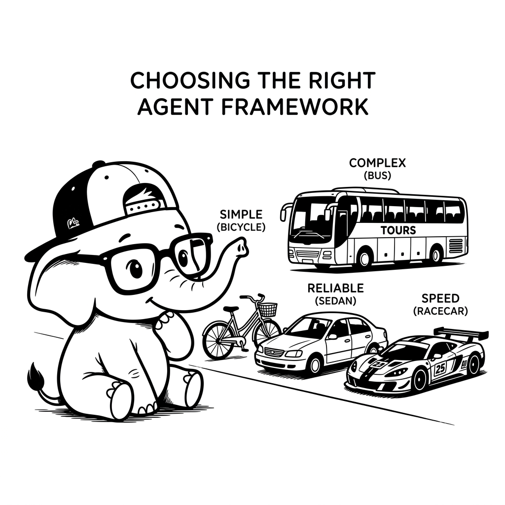

import LearningFlow from '@site/src/components/LearningFlow';

# Choosing an Agent Framework

## 1. Quick Summary

| Area | Details |
|---|---|
| Topic | Framework Evaluation & Selection |
| Difficulty | Intermediate |
| Used For | Deciding which agent framework fits your production constraints and team skills |
| Common Mistake | Picking a framework because it has high GitHub stars, without checking if it supports the specific architecture you need |
| Performance | Framework overhead is usually negligible compared to network calls, but poor state management in bad frameworks can cause OOM errors |

## 2. Engineering Story

A team of engineers recently faced a critical challenge related to this concept. Their existing processes were failing under the load of thousands of concurrent users, and manual workarounds were causing major delays in deployment. By deeply understanding and correctly implementing this concept, the lead engineer was able to architect a solution that not only resolved the immediate bottleneck but also paved the way for massive scalability. This transformation turned a chaotic, error-prone system into a resilient, automated powerhouse.

## 3. Real-World Analogy



| Human World (Buying a Vehicle) | Framework Equivalent |
|---|---|
| A bicycle (build it yourself) | **No Framework (Raw SDK)** |
| A reliable Honda Civic | **LangGraph** (Standard, reliable, highly controllable) |
| A pre-packaged Tour Bus | **CrewAI / AutoGen** (Great for managing groups, less custom control) |
| A specialized race car | **Pydantic AI** (Hyper-focused on strict types and validation) |

Bro, choosing a framework is like buying a vehicle. If you just need to go down the street, don't buy a tour bus (CrewAI). If you need to transport 50 people on a schedule, don't build a bicycle from scratch (Raw SDK). Pick the tool that matches the journey.

## 4. Concept Explanation

The agentic framework ecosystem is fragmented. Different frameworks solve different problems.

- **State-Machine Heavy (e.g., LangGraph):** Focuses on explicit control. You draw the flowchart of how the agent should think and act. Best for production systems where you need to guarantee paths (like avoiding infinite loops or requiring human approval).
- **Role-Based Multi-Agent (e.g., CrewAI, AutoGen):** Focuses on delegation. You define personas ("You are a researcher", "You are a writer") and let the framework figure out how they talk to each other. Great for prototyping and creative tasks.
- **Type-Safe/Data-First (e.g., Pydantic AI):** Focuses on structured output and validation. If your agent is interacting with a strict database schema, this ensures the LLM's output is heavily validated before being used.

The real question is not "which is best." The real question is: "what does my production system actually need?"

## 5. Syntax Table

| Framework | Core Abstraction | Best Use Case |
|---|---|---|
| **Raw SDK** | `client.chat.completions` | Simple routers, extreme custom logic |
| **LangGraph** | `StateGraph`, `Nodes`, `Edges` | Enterprise prod, strict state control, HITL |
| **CrewAI** | `Agent`, `Task`, `Crew` | Rapid prototyping of multi-agent workflows |
| **AutoGen** | `ConversableAgent`, `GroupChat`| Complex simulated conversations, code execution |
| **Pydantic AI** | `Agent`, `RunContext`, `BaseModel` | Strict JSON extraction and type-safe tool execution |

## 6. Beginner Example

Let's look at how the exact same concept (Defining an Agent with a Tool) looks across different frameworks to see the abstraction level.

```python
# --- LangGraph (Explicit Control) ---
def agent_node(state):
    response = model.bind_tools(tools).invoke(state["messages"])
    return {"messages": [response]}
# You manually wire this node into a graph

# --- CrewAI (Role-Based Abstraction) ---
researcher = Agent(
    role='Senior Researcher',
    goal='Uncover groundbreaking tech',
    backstory='You are a seasoned researcher at a top firm.',
    tools=[search_tool]
)
# The framework handles the loop and routing

# --- Pydantic AI (Type-Safe Abstraction) ---
from pydantic_ai import Agent

agent = Agent('gpt-4o', system_prompt='You are a researcher.')

@agent.tool_plain
def search_tool(query: str) -> str:
    return "search results"
# Focuses heavily on the python types of the tool
```

## 7. Real-World Engineering Example

Bro, how do you decide? Let's use a decision matrix coded as a simple Python router to illustrate the logic a senior engineer uses when evaluating a project.

```python
def choose_framework(project_requirements: dict) -> str:
    """Decision logic for picking a framework."""

    if project_requirements.get("needs_human_in_loop") and project_requirements.get("strict_audit_trails"):
        # You need to pause execution, wait for a human click, and resume exactly where you left off.
        return "LangGraph - Unmatched state persistence and checkpointing."

    elif project_requirements.get("creative_writing") and project_requirements.get("multiple_personas"):
        # You want an editor, a writer, and a publisher to argue about a blog post.
        return "CrewAI - Best for orchestrating role-playing agents."

    elif project_requirements.get("heavy_data_extraction") and project_requirements.get("database_inserts"):
        # You need to parse 10,000 PDFs into strict SQL schemas.
        return "Pydantic AI - Best for guaranteeing type safety and retrying on validation errors."

    elif project_requirements.get("simple_task") and not project_requirements.get("memory_needed"):
        # Just routing a customer ticket.
        return "Raw OpenAI/Anthropic SDK - Don't add framework bloat if you don't need it."

    else:
        return "Start with LangGraph as the default scalable choice."
```

## 8. Internal Working

This diagram represents the decision tree for choosing a framework based on project requirements.

<LearningFlow
  elements={[
    { id: '1', type: 'core', data: { label: 'Start: Evaluate Project' }, position: { x: 250, y: 0 } },

    { id: '2', type: 'process', data: { label: 'Need multi-agent chat / personas?' }, position: { x: 250, y: 100 } },
    { id: 'crew', type: 'output', data: { label: 'CrewAI / AutoGen' }, position: { x: 50, y: 150 } },

    { id: '3', type: 'process', data: { label: 'Need strict graph control & HITL?' }, position: { x: 450, y: 100 } },
    { id: 'graph', type: 'output', data: { label: 'LangGraph' }, position: { x: 650, y: 150 } },

    { id: '4', type: 'process', data: { label: 'Need strict type validation?' }, position: { x: 450, y: 250 } },
    { id: 'pydantic', type: 'output', data: { label: 'Pydantic AI' }, position: { x: 650, y: 300 } },

    { id: 'raw', type: 'output', data: { label: 'Raw SDK' }, position: { x: 250, y: 300 } },

    { id: 'e1-2', source: '1', target: '2', animated: true },
    { id: 'e2-yes', source: '2', target: 'crew', animated: true, label: 'Yes' },
    { id: 'e2-no', source: '2', target: '3', animated: true, label: 'No' },
    { id: 'e3-yes', source: '3', target: 'graph', animated: true, label: 'Yes' },
    { id: 'e3-no', source: '3', target: '4', animated: true, label: 'No' },
    { id: 'e4-yes', source: '4', target: 'pydantic', animated: true, label: 'Yes' },
    { id: 'e4-no', source: '4', target: 'raw', animated: true, label: 'No' },
  ]}
/>

## 9. Performance Table

| Framework | Setup Speed | Execution Overhead | Debuggability |
|---|---|---|---|
| **Raw SDK** | Slow (Build from scratch) | Zero | Hard (You build the logs) |
| **CrewAI** | Very Fast | High (Lots of hidden LLM calls) | Medium |
| **LangGraph** | Medium (Steeper learning curve) | Low | Excellent (with LangSmith) |
| **Pydantic AI**| Fast | Low | High (Python tracebacks) |

## 10. Top Interview Questions

| Question | Answer |
|---|---|
| When should you explicitly NOT use a framework? | When you are building a simple, single-turn LLM feature (like a summarization button). Frameworks introduce heavy dependencies and abstraction overhead that aren't needed for simple tasks. |
| Compare CrewAI and LangGraph. | CrewAI is high-abstraction; you define roles and it handles the routing. LangGraph is low-abstraction; you explicitly draw the nodes and edges of how execution flows. LangGraph is generally better for strict production control. |
| Why is "Human-in-the-Loop" (HITL) easier in LangGraph? | LangGraph has built-in state checkpointing (saving the exact state to Postgres/SQLite). You can pause the graph, wait days for a human to approve a payload, and resume exactly where you left off. |
| Is AutoGen dead? | No, but it is heavily focused on academic and research use cases (swarms, complex negotiation). For deterministic enterprise backends, the industry is leaning heavily toward graph-based state machines. |

## 11. Tricky Questions & Edge Cases

Bro, what happens when an agent framework updates and changes its core abstractions?
This happens *constantly*. LangChain changed its syntax drastically between v0.1 and v0.2.
**The Edge Case Fix:** Isolate your business logic. Do not put your API connection logic *inside* a CrewAI task definition. Write standard Python functions, test them independently, and only pass them to the framework as tools. If the framework breaks, your core logic survives.

## 12. Real-World Usage

- **CrewAI:** Used by marketing teams and rapid-prototyping squads to spin up "content generation crews" in a weekend.
- **LangGraph:** Used by enterprise engineering teams building automated infrastructure remediators or customer support agents that require strict compliance and audit trails.
- **Raw SDK:** Used by companies with massive scale (e.g., millions of requests) where saving 10ms of framework overhead and avoiding dependency hell is critical.

## 13. Best Practices

| DO | DON'T |
|---|---|
| Build a simple proof of concept with the Raw SDK first to understand the underlying problem before wrapping it in a framework. | Don't choose a framework just because you saw a cool demo on Twitter. |
| Use standard Python types and Pydantic models for all tool definitions, regardless of framework. | Don't rely on framework-specific string parsing for tool arguments. |

## 14. Production Notes

:::caution Production Warning
Bro, framework lock-in is a real threat in AI right now. If you tightly couple your Prompts, Tool Logic, and Routing Logic into one framework's specific classes, migrating off it will require a total rewrite. Keep your prompts in separate config files and your tools as pure functions.
:::

## 15. Common Mistakes

| Mistake | Why it's bad | The Fix |
|---|---|---|
| Building a simple RAG app using LangGraph | It adds massive complexity (state schemas, node compilation) for a linear process. | Use LangChain Expression Language (LCEL) or raw SDK for linear pipelines. |
| Assuming a Multi-Agent framework is inherently "smarter" | Splitting a dumb prompt into 3 dumb agents just costs 3x more tokens and takes 3x longer. | Optimize your base model and prompt before throwing more agents at the problem. |

## 16. Related Topics
- Agent Types & Taxonomies
- React Pattern
- LangChain & LangGraph Overview

## 16. Top GitHub Repos

| Repository | Stars | Description | Why It Matters |
|---|---|---|---|
| [langchain-ai/langgraph](https://github.com/langchain-ai/langgraph) | ⭐ 6k+ | State machine framework | The current industry standard for deterministic, production-grade agents. |
| [joaomdmoura/crewAI](https://github.com/joaomdmoura/crewAI) | ⭐ 15k+ | Role-based framework | The best tool for rapid prototyping of multi-agent systems. |
| [pydantic/pydantic-ai](https://github.com/pydantic/pydantic-ai) | ⭐ 2k+ | Type-safe framework | Represents the modern shift towards strict data validation in AI engineering. |
| [microsoft/autogen](https://github.com/microsoft/autogen) | ⭐ 25k+ | Multi-agent conversation framework | Highly popular for research, code execution swarms, and complex agent debates. |
| [run-llama/llama_index](https://github.com/run-llama/llama_index) | ⭐ 30k+ | Data framework | The best framework if your "agent" is primarily focused on traversing and querying massive document stores. |
