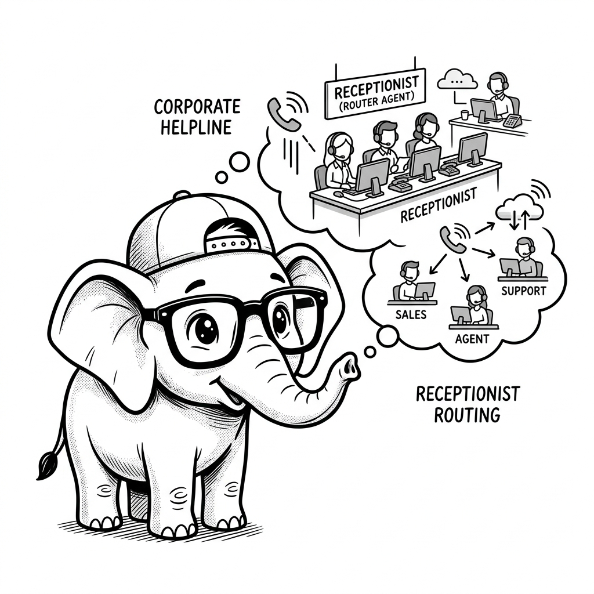

# Agent Handoffs in OpenAI SDK

## 1. Quick Summary
| Area | Details |
|---|---|
| Topic | Agent Handoffs (OpenAI SDK) |
| Difficulty | Intermediate |
| Used For | Transferring the conversation from a generalist router agent to a specialized expert agent. |
| Common Mistake | Losing context or variables during the handoff process. |
| Performance | Fast, but requires an extra function call loop. |

## 2. Engineering Story

A team of engineers recently faced a critical challenge related to this concept. Their existing processes were failing under the load of thousands of concurrent users, and manual workarounds were causing major delays in deployment. By deeply understanding and correctly implementing this concept, the lead engineer was able to architect a solution that not only resolved the immediate bottleneck but also paved the way for massive scalability. This transformation turned a chaotic, error-prone system into a resilient, automated powerhouse.

## 3. Real-World Analogy


Bro, think of a corporate call center. You call the helpline and get the Receptionist (Router Agent). You say, "I need help with my refund." The Receptionist doesn't have the tools to process refunds, so they transfer your call to the Billing Department (Billing Agent). The Receptionist is out of the loop, and you are now talking directly to Billing. That is exactly what an Agent Handoff is.

| Call Center | Agentic Workflow |
|---|---|
| Receptionist | Triage / Router Agent |
| Transferring the call | Handoff Function |
| Billing Expert | Specialized Agent |

## 4. Concept Explanation
In the OpenAI SDK (and Swarm pattern), handoffs are implemented simply by having a tool function return another `Agent` object instead of returning a string.

When the orchestrator sees that a function returned an `Agent`, it updates the active agent in its loop. The new agent takes over the conversation, bringing its own specific system instructions and its own specific tools. This prevents you from building one massive "God Agent" with 50 tools that gets confused.

## 5. Syntax Table
| Concept | Code | Description |
|---|---|---|
| Handoff Function | `def transfer_to_billing(): return billing_agent` | The function that triggers the switch. |
| Router Setup | `triage_agent = Agent(functions=[transfer_to_billing])` | Giving the router the ability to transfer. |

## 6. Beginner Example
Here is a minimal example of a triage agent transferring to a specialist.

```python
from swarm import Swarm, Agent

client = Swarm()

# Define the specialist first
spanish_agent = Agent(
    name="SpanishBot",
    instructions="You only speak Spanish.",
)

# Define the handoff function
def transfer_to_spanish_agent():
    """Call this if the user wants to speak Spanish."""
    return spanish_agent

# Define the router
english_agent = Agent(
    name="EnglishBot",
    instructions="You are the greeter. If they want Spanish, transfer them.",
    functions=[transfer_to_spanish_agent]
)

response = client.run(
    agent=english_agent,
    messages=[{"role": "user", "content": "Hola, quiero hablar en español."}]
)

print(response.agent.name) # Will be "SpanishBot"
print(response.messages[-1]["content"]) # Will reply in Spanish
```

## 7. Real-World Engineering Example
Bro, let's look at a customer support scenario where we pass context during the handoff.

```python
from swarm import Swarm, Agent

# The specialist
refund_agent = Agent(
    name="Refund Specialist",
    instructions="Help the user process a refund. Ask for their order ID if you don't have it."
)

technical_support_agent = Agent(
    name="Tech Support",
    instructions="Help the user with technical bugs."
)

def transfer_to_refunds():
    """Transfer the user to the refund department."""
    # We return the Agent object
    return refund_agent

def transfer_to_tech():
    """Transfer the user to tech support."""
    return technical_support_agent

triage_agent = Agent(
    name="Triage",
    instructions="Determine if the user needs Refunds or Tech Support and transfer them.",
    functions=[transfer_to_refunds, transfer_to_tech]
)

client = Swarm()

response = client.run(
    agent=triage_agent,
    messages=[{"role": "user", "content": "My screen is totally black when I launch the app!"}]
)

print(f"Ended up with agent: {response.agent.name}")
# Output: Ended up with agent: Tech Support
```

## 8. Internal Working
The Swarm orchestrator checks the type of the result returned by a tool function. If `isinstance(result, Agent)`, it updates `current_agent = result` and continues the loop without asking the user for input.

import LearningFlow from '@site/src/components/LearningFlow';

<LearningFlow
  elements={[
    { id: '1', type: 'core', data: { label: 'User Input' }, position: { x: 50, y: 100 } },
    { id: '2', type: 'process', data: { label: 'Triage Agent' }, position: { x: 250, y: 100 } },
    { id: '3', type: 'tool', data: { label: 'transfer_to_billing()' }, position: { x: 450, y: 100 } },
    { id: '4', type: 'core', data: { label: 'Billing Agent' }, position: { x: 650, y: 100 } },
    { id: '5', type: 'output', data: { label: 'Final Reply' }, position: { x: 650, y: 250 } },
    { id: 'e1', source: '1', target: '2', label: 'Message' },
    { id: 'e2', source: '2', target: '3', label: 'Executes Tool' },
    { id: 'e3', source: '3', target: '4', label: 'Returns new Agent' },
    { id: 'e4', source: '4', target: '5', label: 'Generates' }
  ]}
/>

## 9. Performance Table
| Aspect | Detail |
|---|---|
| Latency | Adds 1 LLM roundtrip (the routing decision). |
| Token Usage | The whole conversation history is usually passed to the new agent. |
| Scalability | Excellent. You can add infinite specialized agents. |

## 10. Top Interview Questions
| Question | Answer |
|---|---|
| How do you implement a handoff in the OpenAI SDK? | By creating a Python tool function that returns an `Agent` instance instead of a string. |
| Does the conversation history transfer during a handoff? | Yes, the `messages` array is maintained in the orchestrator loop, so the new agent sees the past context. |
| Can an agent hand off to multiple different agents? | Yes, you can give the router agent multiple transfer tools (e.g., `transfer_to_sales`, `transfer_to_support`). |
| How do you prevent endless bouncing between agents? | Write strict system instructions ("Do not transfer back to Triage") or implement a hop-limit in your custom orchestrator loop. |
| Why use handoffs instead of one big agent? | To isolate tools and instructions. A God Agent with 50 tools will hallucinate which tool to use. Specialists are more reliable. |

## 11. Tricky Questions & Edge Cases
Bro, what happens if the user says "I need a refund and also my app is crashing"?
**The Fix:** Standard handoffs are linear. The Triage agent will likely pick one to transfer to. To handle this, the Triage agent must be instructed to handle one issue at a time, or the specialist agents must have a tool to transfer to *each other* once they finish their part.

## 12. Real-World Usage
Top-tier AI customer support bots (like Klarna's) use massive handoff networks. A router catches the intent, passes it to the "Order Tracking Agent," which can then pass it to the "Human Escalation Agent" if the user gets angry.

## 13. Best Practices
| DO | DON'T |
|---|---|
| Keep the Router agent's tools limited ONLY to handoff functions. | Give the Router agent real tools (like database access). |
| Use clear docstrings on handoff functions (e.g., "Use this for billing"). | Have overlapping domains between specialized agents. |
| Let the specialist agents transfer back to the router if needed. | Trap the user in a specialist agent they didn't want. |

## 14. Production Notes
:::warning
Beware of the "Hot Potato" problem. If Agent A transfers to Agent B, and Agent B decides it's actually Agent A's job and transfers back, your system is in an infinite loop. Always monitor and log agent transitions in production.
:::

## 15. Common Mistakes
| Mistake | Fix |
|---|---|
| Forgetting to return the agent | Your tool must explicitly `return specialist_agent`. |
| Unclear transfer instructions | If the docstring for `transfer_to_tech` is vague, the LLM won't know when to use it. |
| Passing state poorly | If you rely on context variables, ensure they are updated before the handoff. |

## 16. Related Topics
- Orchestrator Worker Pattern
- Multi-Agent Systems
- Routing Pattern

## 16. Top GitHub Repos
| Repository | Stars | Description | Why It Matters |
|---|---|---|---|
| [openai/swarm](https://github.com/openai/swarm) | ⭐ 15k+ | OpenAI's Swarm. | The reference architecture for the handoff pattern. |
| [langchain-ai/langgraph](https://github.com/langchain-ai/langgraph) | ⭐ 12k+ | LangGraph multi-agent. | Shows how handoffs are done using strict state machine edges instead of dynamic tools. |
| [microsoft/autogen](https://github.com/microsoft/autogen) | ⭐ 30k+ | AutoGen group chats. | A different approach to multi-agent communication (group chat vs direct handoff). |
| [BerriAI/litellm](https://github.com/BerriAI/litellm) | ⭐ 10k+ | LiteLLM | Useful for routing requests to different models during a handoff. |
| [joaomdmoura/crewAI](https://github.com/joaomdmoura/crewAI) | ⭐ 18k+ | CrewAI. | Uses sequential tasks rather than dynamic runtime handoffs. |
