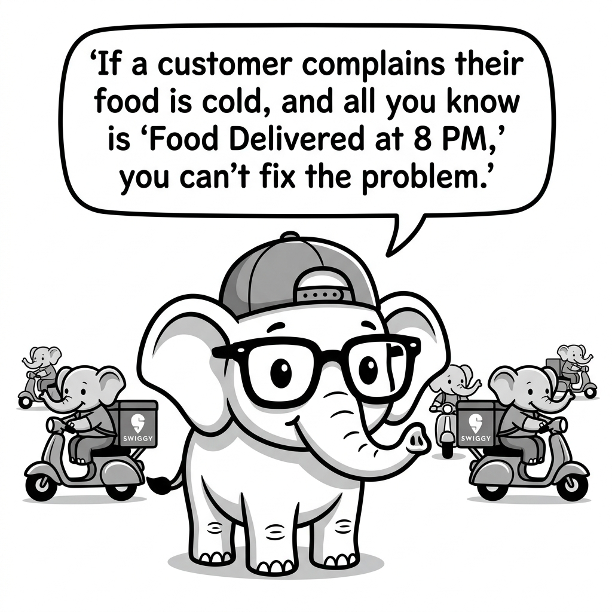

# Observability and Tracing in OpenAI SDK

## 1. Quick Summary
| Area | Details |
|---|---|
| Topic | Observability and Tracing |
| Difficulty | Intermediate |
| Used For | Seeing exactly what your agents are doing, what tools they called, and how many tokens they burned. |
| Common Mistake | Only logging the final response and ignoring the intermediate tool calls. |
| Performance | Minimal overhead when using async loggers. |

## 2. Engineering Story

A team of engineers recently faced a critical challenge related to this concept. Their existing processes were failing under the load of thousands of concurrent users, and manual workarounds were causing major delays in deployment. By deeply understanding and correctly implementing this concept, the lead engineer was able to architect a solution that not only resolved the immediate bottleneck but also paved the way for massive scalability. This transformation turned a chaotic, error-prone system into a resilient, automated powerhouse.

## 3. Real-World Analogy


Bro, imagine managing a Swiggy delivery fleet. If a customer complains their food is cold, and all you know is "Food Delivered at 8 PM," you can't fix the problem. You need tracing. You need to see exactly when the restaurant started cooking, when the driver arrived, the exact route the driver took, and how long they sat at a traffic light. Tracing an LLM agent is exactly the same—it shows you every thought, tool call, and latency spike in the pipeline.

| Swiggy Tracking | Agent Tracing |
|---|---|
| Driver GPS Location | Intermediate LLM thought process |
| Restaurant preparation time | Tool execution latency |
| Total delivery time | Total token and latency metrics |

## 4. Concept Explanation
Tracing is the practice of recording the exact execution path of your agent. Because agents use tools dynamically, a single user prompt might trigger 5 different LLM calls and 3 database queries under the hood. If the agent hallucinates or takes 30 seconds to reply, you need a trace to figure out which specific step failed.

With the OpenAI SDK, you typically integrate an observability tool like LangSmith, Helicone, or generic OpenTelemetry to capture the inputs, outputs, tokens, and latency of every single `client.chat.completions.create` call.

## 5. Syntax Table
| Concept | Pattern | Description |
|---|---|---|
| Basic Python Logging | `logging.info(f"Tool {name} called with {args}")` | Manual tracing via standard logs. |
| LangSmith Wrapper | `from langsmith import traceable` | Decorator to auto-log Python functions. |
| Helicone Proxy | `client = OpenAI(base_url="https://oai.hconeai.com/v1")` | Routing calls through an observability proxy. |

## 6. Beginner Example
Here is the manual way to trace an agent loop using standard Python logging. Bro, this is clunky, but you must understand the concept.

```python
import logging
from swarm import Swarm, Agent

logging.basicConfig(level=logging.INFO)

def fetch_data(query: str):
    logging.info(f"TRACE: Executing fetch_data tool with query='{query}'")
    return "Data: 42"

agent = Agent(
    name="Researcher",
    functions=[fetch_data]
)

client = Swarm()
logging.info("TRACE: Starting agent run.")
response = client.run(agent=agent, messages=[{"role": "user", "content": "Get data for X"}])
logging.info(f"TRACE: Agent finished. Final response: {response.messages[-1]['content']}")
```

## 7. Real-World Engineering Example
In production, nobody uses basic `print` statements. We use LangSmith or Helicone. Here is how you use the LangSmith `@traceable` decorator with OpenAI.

```python
import os
from openai import OpenAI
from langsmith import traceable

os.environ["LANGCHAIN_TRACING_V2"] = "true"
os.environ["LANGCHAIN_API_KEY"] = "your-langsmith-key"

client = OpenAI()

@traceable(run_type="tool", name="Fetch Database Record")
def db_lookup(user_id: str):
    # This entire function's inputs, outputs, and time will be logged to LangSmith
    return f"User {user_id} is active."

@traceable(run_type="chain", name="Main Agent Loop")
def run_agent(prompt: str):
    # The parent trace
    messages = [{"role": "user", "content": prompt}]

    # Let's pretend the LLM decided to call the tool
    tool_result = db_lookup("123")
    messages.append({"role": "function", "name": "db_lookup", "content": tool_result})

    response = client.chat.completions.create(
        model="gpt-4o",
        messages=messages
    )
    return response.choices[0].message.content

# Run it. You can now log into LangSmith and see the exact nested tree of calls.
final_text = run_agent("Is user 123 active?")
```

## 8. Internal Working
Tracing works by creating a "Parent Run" (the overall user request) and "Child Runs" (the specific LLM calls and tool executions). These are linked via trace IDs.

import LearningFlow from '@site/src/components/LearningFlow';

<LearningFlow
  elements={[
    { id: '1', type: 'core', data: { label: 'Parent Trace: run_agent' }, position: { x: 250, y: 50 } },
    { id: '2', type: 'process', data: { label: 'Child: LLM Call 1' }, position: { x: 50, y: 150 } },
    { id: '3', type: 'tool', data: { label: 'Child: Tool Exec' }, position: { x: 250, y: 150 } },
    { id: '4', type: 'process', data: { label: 'Child: LLM Call 2' }, position: { x: 450, y: 150 } },
    { id: '5', type: 'data', data: { label: 'LangSmith Dashboard' }, position: { x: 250, y: 300 } },
    { id: 'e1', source: '1', target: '2', label: 'Starts' },
    { id: 'e2', source: '1', target: '3', label: 'Starts' },
    { id: 'e3', source: '1', target: '4', label: 'Starts' },
    { id: 'e4', source: '2', target: '5', label: 'Sends Logs', style: { strokeDasharray: '5,5' } },
    { id: 'e5', source: '3', target: '5', label: 'Sends Logs', style: { strokeDasharray: '5,5' } },
    { id: 'e6', source: '4', target: '5', label: 'Sends Logs', style: { strokeDasharray: '5,5' } }
  ]}
/>

## 9. Performance Table
| Tracing Method | Latency Overhead | Integration Effort |
|---|---|---|
| Proxy (Helicone) | ~20-50ms | Very Low (change base_url) |
| SDK Hooks (LangSmith) | ~5ms (async logging) | Medium (add decorators) |
| Manual Logging | ~0ms | High (clutters codebase) |

## 10. Top Interview Questions
| Question | Answer |
|---|---|
| Why is tracing important for agents? | Agents execute loops autonomously. If an agent loops 10 times and fails, you need a trace to see which specific tool or prompt caused the loop. |
| How do you track token costs per user? | By adding tags or metadata (like `user_id`) to your traces using tools like LangSmith or Helicone. |
| What is the difference between logging and tracing? | Logging is flat text. Tracing connects spans hierarchically (Parent -> Child), showing the exact timeline and relationship of executions. |
| Does tracing impact performance? | Professional tools do network calls asynchronously, so the impact on user latency is negligible. |

## 11. Tricky Questions & Edge Cases
Bro, what happens if your tool processes highly sensitive PII (like credit card numbers)? If you trace everything, you are sending raw PII to LangSmith's servers!
**The Fix:** You must implement data scrubbing. Most SDKs allow you to mask specific keys or use decorators that exclude inputs/outputs from the payload sent to the observability platform.

## 12. Real-World Usage
Top teams review their LangSmith traces daily. They filter for traces where latency > 10s or where the user left a negative feedback score, dig into the specific tool call that failed, and update the system prompt to fix the bug.

## 13. Best Practices
| DO | DON'T |
|---|---|
| Trace every LLM call and every tool execution. | Only log the final text sent to the user. |
| Attach `session_id` and `user_id` tags to your traces. | Send raw PII to external tracing dashboards. |
| Monitor the total token count of the whole chain. | Assume one user request equals one LLM token charge. |

## 14. Production Notes
:::warning
Without tracing, debugging an AI agent in production is literally impossible. You will get bug reports saying "The bot gave me the wrong answer," and you will have absolutely no idea why. Implement observability *before* you launch.
:::

## 15. Common Mistakes
| Mistake | Fix |
|---|---|
| Not tagging traces | You must tag traces with the environment (`prod`, `dev`) and feature name so you can filter them later. |
| Ignoring tool execution times | An agent might seem slow, but it's actually your database query taking 5 seconds. Trace the tools, not just the LLM. |
| Forgetting to monitor costs | A bad prompt can cause an agent to loop infinitely. Set up alerts for high-token traces. |

## 16. Related Topics
- Agent Evaluation Frameworks
- Production Deployment
- LangSmith Observability

## 16. Top GitHub Repos
| Repository | Stars | Description | Why It Matters |
|---|---|---|---|
| [langchain-ai/langsmith-sdk](https://github.com/langchain-ai/langsmith-sdk) | ⭐ 1k+ | Python SDK for LangSmith. | The industry standard for tracing LLM and agent execution. |
| [Helicone/helicone](https://github.com/Helicone/helicone) | ⭐ 3k+ | Open-source LLM observability platform. | Easiest proxy-based setup. Just change your API base URL. |
| [open-telemetry/opentelemetry-python](https://github.com/open-telemetry/opentelemetry-python) | ⭐ 4k+ | Standard OTel tracing. | Use this if your company already uses Datadog/NewRelic for standard microservices. |
| [Arize-ai/phoenix](https://github.com/Arize-ai/phoenix) | ⭐ 3k+ | Open-source AI observability. | Great for running traces locally without sending data to a cloud. |
| [openai/openai-python](https://github.com/openai/openai-python) | ⭐ 20k+ | OpenAI SDK. | The base layer that emits the data. |
