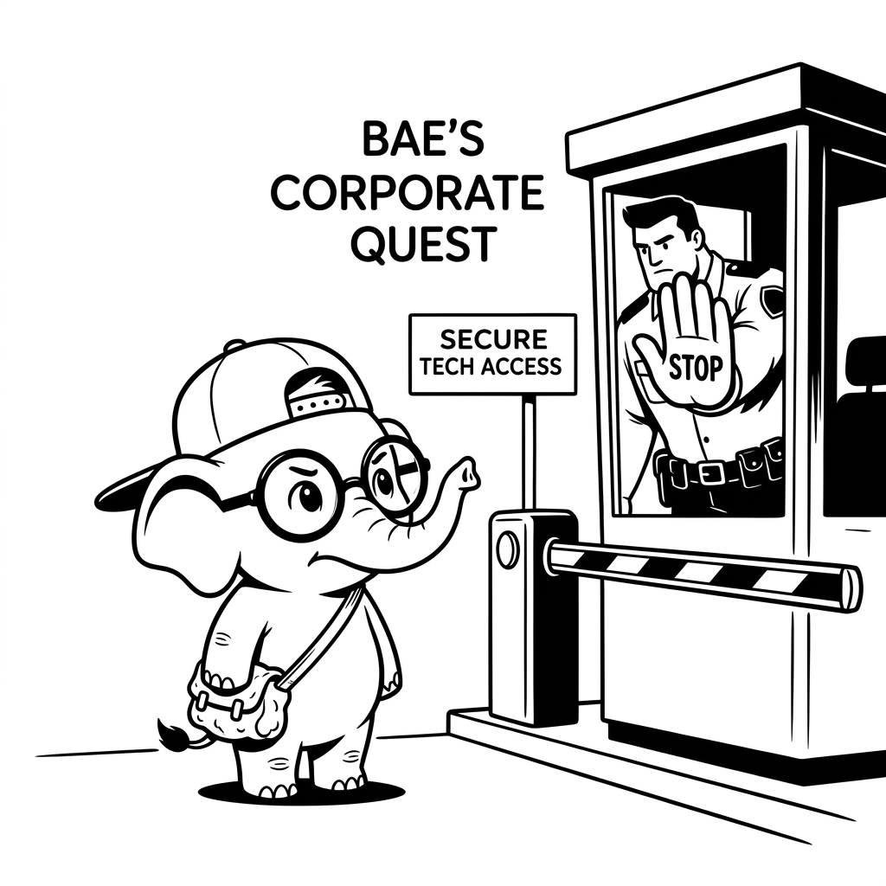

import LearningFlow from '@site/src/components/LearningFlow';

# Authentication Deep Dive

## 1. Quick Summary

| Area | Details |
|---|---|
| Topic | Authentication (AuthN) |
| Difficulty | Intermediate |
| Used For | Verifying the identity of a user or system ("Who are you?") |
| Common Mistake | Storing plaintext passwords or building custom cryptography |
| Performance | Medium; requires secure hashing algorithms and network calls |

## 2. Engineering Story

It was Black Friday, and the e-commerce startup "ShopFast" was hitting record sales. Suddenly, customer support lines blew up. Users were complaining that when they logged in, they were seeing other people's order histories and saved credit cards. Total chaos.

The engineering team scrambled and found the root cause: a critical vulnerability in their authentication flow. They were using JSON Web Tokens (JWT) for authentication, but their backend library had a flaw where it accepted tokens signed with the `none` algorithm. 

An attacker realized this and wrote a simple script that stripped the signature from their JWT and modified the `userId` payload to iterate through user IDs sequentially. The backend, seeing the `none` algorithm, happily accepted the forged tokens without validating any cryptographic signature. 

They effectively bypassed authentication entirely, gaining access to any account on the platform. The system didn't verify *who* the user was; it just blindly trusted the badge they printed themselves. This disaster cost the company thousands in refunds and a massive hit to their reputation. It proved a hard lesson: you cannot authorize actions if you haven't strictly authenticated the identity first. Let’s break down how to actually lock the front door.

## 3. Real-World Analogy



| Physical World | Software Equivalent |
|---|---|
| Showing your Aadhar Card at an airport | Providing a Username and Password |
| The CISF officer checking the card's validity | The backend validating credentials against a database |
| Entering an OTP sent to your phone | Multi-Factor Authentication (MFA) |
| Getting a stamped boarding pass | Receiving a JWT (JSON Web Token) |

Bro, think about trying to board a flight at the Mumbai airport. You don't just walk onto the plane. At the very first gate, the CISF security guard stops you and asks, "Who are you?" You show your Aadhar card and your ticket. The guard looks at your photo, looks at your face, and checks if the ID is valid. That process of proving your identity is Authentication. Once you are inside, which terminal or lounge you are allowed to visit is Authorization—but Authentication always comes first.

## 4. Concept Explanation

Authentication (AuthN) is the mathematical and systemic process of verifying that an entity (a user, a device, or another microservice) is exactly who they claim to be. 

It is the front door to any protected system. Without strict authentication, your application cannot differentiate between a legitimate user, a malicious bot, or an internal admin. 

You must implement authentication anytime your system exposes sensitive data, performs state-changing operations (like creating, updating, or deleting resources), or sits on a public network. Never rely on security by obscurity or hidden URLs; if an endpoint can be reached, it must verify the caller's identity.

## 5. Syntax Table

Authentication patterns vary based on the architecture of your system. Here are the standard approaches:

| Auth Type | How it Works | Best Used For |
|---|---|---|
| **Basic Auth** | Client sends `Authorization: Basic base64(user:pass)` | Legacy systems, internal server-to-server APIs over TLS. |
| **Session-Based** | Server creates a session in DB, returns a Cookie ID | Traditional server-rendered web apps (Django, Rails). |
| **Token-Based (JWT)** | Server signs a JSON token containing user identity | Modern Single Page Apps (React/Vue) and stateless APIs. |
| **OAuth 2.0 / OIDC** | Delegated auth via a 3rd party ("Login with Google") | Avoiding building your own identity provider and passwords. |
| **MFA / 2FA** | Requiring a second factor (SMS, Authenticator App) | High-security applications (banking, crypto exchanges). |

## 6. Beginner Example

The absolute most critical rule of authentication is hashing passwords before storing them. Never store plaintext passwords.

```javascript
const bcrypt = require('bcrypt');

// DON'T do this!
async function registerInsecure(username, password) {
  // Storing the password in plaintext. If the DB is hacked, all passwords are stolen!
  await db.query('INSERT INTO users (username, password) VALUES (?, ?)', [username, password]);
}

// DO this instead!
async function registerSecure(username, plaintextPassword) {
  const saltRounds = 12; // Define how complex the hashing should be
  
  // Hash the password with a salt. It's now computationally safe to store.
  const hashedPassword = await bcrypt.hash(plaintextPassword, saltRounds);

  await db.query('INSERT INTO users (username, password) VALUES (?, ?)', [username, hashedPassword]);
}
```

## 7. Real-World Engineering Example

In modern distributed systems, you often use JSON Web Tokens (JWT) for stateless authentication. Let's look at how a production-grade login route verifies a password, protects against timing attacks, and issues a secure token.

```javascript
const express = require('express');
const bcrypt = require('bcrypt');
const jwt = require('jsonwebtoken');

const app = express();
app.use(express.json());

// Load this from a secure environment variable, NOT source code!
const JWT_SECRET = process.env.JWT_SECRET;

app.post('/api/login', async (req, res) => {
  const { email, password } = req.body;

  // 1. Find the user
  const user = await db.User.findOne({ where: { email } });

  if (!user) {
    // Fail securely: Don't tell the attacker if the email exists or not.
    // Use generic error messages to prevent user enumeration attacks.
    return res.status(401).json({ error: 'Invalid email or password' });
  }

  // 2. Verify the password against the stored hash
  const isValidPassword = await bcrypt.compare(password, user.hashedPassword);

  if (!isValidPassword) {
    return res.status(401).json({ error: 'Invalid email or password' });
  }

  // 3. User is authenticated! Issue a JWT.
  // We only put non-sensitive identifier info in the payload.
  const tokenPayload = {
    userId: user.id,
    role: user.role
  };

  // Sign the token using HMAC SHA256. It expires in 15 minutes.
  const token = jwt.sign(tokenPayload, JWT_SECRET, { 
    expiresIn: '15m',
    algorithm: 'HS256'
  });

  // 4. Return the token in an HttpOnly cookie to prevent XSS theft
  res.cookie('auth_token', token, {
    httpOnly: true,
    secure: process.env.NODE_ENV === 'production',
    sameSite: 'strict',
    maxAge: 15 * 60 * 1000 // 15 mins
  });

  res.json({ message: 'Authentication successful' });
});
```

## 8. Internal Working

How does a Token-Based authentication flow actually travel across the network? Let's trace the exact request lifecycle.

<LearningFlow
  nodes={[
    { id: '1', type: 'tool', data: { label: 'Client / Web Browser' }, position: { x: 50, y: 50 } },
    { id: '2', type: 'process', data: { label: 'POST /login (Credentials)' }, position: { x: 250, y: 50 } },
    { id: '3', type: 'core', data: { label: 'Auth Service (bcrypt.compare)' }, position: { x: 450, y: 50 } },
    { id: '4', type: 'warning', data: { label: 'Invalid: 401 Unauthorized' }, position: { x: 450, y: -50 } },
    { id: '5', type: 'process', data: { label: 'Generate JWT Payload' }, position: { x: 450, y: 150 } },
    { id: '6', type: 'core', data: { label: 'Sign JWT (HMAC-SHA256)' }, position: { x: 450, y: 250 } },
    { id: '7', type: 'data', data: { label: 'Signed JWT Token' }, position: { x: 250, y: 250 } },
    { id: '8', type: 'output', data: { label: 'Set-Cookie (HttpOnly)' }, position: { x: 50, y: 250 } }
  ]}
  edges={[
    { id: 'e1-2', source: '1', target: '2', animated: true, label: 'Submit' },
    { id: 'e2-3', source: '2', target: '3', animated: true, label: 'Validate' },
    { id: 'e3-4', source: '3', target: '4', animated: true, label: 'Fail' },
    { id: 'e3-5', source: '3', target: '5', animated: true, label: 'Success' },
    { id: 'e5-6', source: '5', target: '6', animated: true, label: 'Sign' },
    { id: 'e6-7', source: '6', target: '7', animated: true, label: 'Output' },
    { id: 'e7-8', source: '7', target: '8', animated: true, label: 'Return' },
  ]}
/>

## 9. Performance Table

| Authentication Step | Performance Cost | Why? |
|---|---|---|
| Hashing a password (`bcrypt`) | High (~100-300ms) | Designed to be computationally expensive to thwart brute-forcing. |
| Verifying a JWT signature | Low (Under 1ms) | Fast cryptographic math (HMAC/RSA). No database lookup required. |
| Session lookup (Redis) | Very Low (Under 1ms) | In-memory key-value read over local network. |
| Session lookup (RDBMS) | Low (2-10ms) | Requires disk I/O, network latency, or index traversal. |

## 10. Top Interview Questions

| Difficulty | Question | Answer |
|---|---|---|
| Intermediate | Why should you use `bcrypt` instead of `SHA-256` for passwords? | SHA-256 is too fast. Attackers can compute billions of hashes per second using GPUs. `bcrypt` has a configurable "work factor" making it intentionally slow. |
| Intermediate | What is a "salt" in password hashing? | A random string added to the password before hashing. It ensures two users with the exact same password have entirely different hashes, preventing Rainbow Table attacks. |
| Intermediate | How does a JWT differ from a Session Cookie? | A session cookie requires the server to look up the session ID in a database to verify identity. A JWT is stateless; the server verifies its signature mathematically without a DB lookup. |
| Intermediate | Can you easily revoke a standard JWT? | No, because it's stateless. You have to wait for it to expire, or implement a "blacklist" in a fast store like Redis, which defeats the purpose of being stateless. |
| Intermediate | What is OIDC (OpenID Connect)? | An identity layer built on top of the OAuth 2.0 protocol, allowing clients to verify the identity of an end-user based on authentication performed by a central Authorization Server (like Google or Okta). |

## 11. Tricky Questions & Edge Cases

**Question:** If a JWT contains the user ID in plaintext, can an attacker decode it and change the user ID to become an admin?
**Answer:** They can decode it, yes (JWT payloads are just base64 encoded). But they cannot *change* it. If they alter the payload, the cryptographic signature (the third part of the JWT) will not match the new payload. The server will compute a different signature, realize it was tampered with, and reject the token.

**Question:** We use JWTs and store them in `localStorage`. Is this secure?
**Answer:** It's a huge risk, bro. Anything in `localStorage` can be read by JavaScript. If your app suffers an XSS (Cross-Site Scripting) attack, the attacker's script can steal the JWT instantly. Storing tokens in `HttpOnly` cookies is generally safer as they cannot be accessed by client-side JS.

## 12. Real-World Usage

Tech giants and high-growth startups rarely build their own complex authentication systems from scratch anymore. Companies like Auth0, Okta, and AWS Cognito have built massive businesses by handling Authentication as a Service (IDaaS). 

Instead of building robust password reset flows, MFA SMS integration, and OAuth federation manually, modern engineering teams offload user registration to these providers. They receive a standard JWT back to use in their own internal microservices APIs, vastly reducing the surface area for security vulnerabilities in their own codebases.

## 13. Best Practices

| DO | DON'T |
|---|---|
| Hash passwords using `bcrypt`, `Argon2`, or `PBKDF2`. | Try to invent your own cryptography or use fast hashing algorithms like MD5 or SHA-1. |
| Use generic error messages on login (e.g., "Invalid credentials"). | Tell the user "Password incorrect", which confirms to an attacker that the username exists. |
| Implement rate limiting on login and password reset routes. | Allow unlimited login attempts, enabling credential stuffing and brute-force attacks. |
| Keep JWT expiration times very short (e.g., 15-60 mins). | Issue long-lived JWTs that never expire, leaving a massive window for session hijacking. |

## 14. Production Notes

> ⚠️ **Warning on JWT Secrets & Algorithmic Confusion**
> If your JWT signing secret (the string used to generate the HMAC signature) is weak or leaked, an attacker can sign their own tokens and impersonate *any* user in the system. Never commit this secret to version control. Generate a strong, random, 256-bit string and inject it via secure environment variables. Furthermore, always hardcode the expected `algorithm` (e.g., `HS256`) when verifying tokens to prevent "none" algorithm attacks or asymmetric confusion.

## 15. Common Mistakes

| Mistake | Why it's bad | How to fix it |
|---|---|---|
| Putting sensitive data in JWTs | JWT payloads are readable by anyone who gets the token. | Never put passwords, SSNs, or PII in a JWT payload. Only put generic identifiers (like user UUID). |
| Not enforcing HTTPS | If authentication happens over HTTP, the password (or token) is sent in plaintext over the network and can be sniffed using packet capture. | Terminate TLS at your load balancer. Reject or redirect all HTTP traffic on auth routes. |
| Forgetting to hash passwords on update | Developers remember to hash on registration, but forget to hash when the user resets their password in a different route. | Centralize hashing logic in a model hook (like Mongoose `.pre('save')`) or a specific auth service layer. |

## 16. Related Topics

- [Security Mindset](./security-mindset.mdx)
- [Authorization & RBAC](./authorization-rbac-abac.mdx)
- [Secrets Management](./secrets-management.mdx)

## 17. Top GitHub Repositories

| Repository | Stars | Description | Why It Matters |
|---|---|---|---|
| [nextauthjs/next-auth](https://github.com/nextauthjs/next-auth) | ⭐ 20k+ | Authentication for Next.js. | The industry standard for handling OIDC, JWTs, and sessions securely in modern React applications. |
| [kelektiv/node.bcrypt.js](https://github.com/kelektiv/node.bcrypt.js) | ⭐ 7k+ | bcrypt for Node.js. | The core library you will use to hash and verify passwords securely on the server side. |
| [auth0/node-jsonwebtoken](https://github.com/auth0/node-jsonwebtoken) | ⭐ 21k+ | JSON Web Token implementation for Node.js. | The standard, heavily audited library for creating and verifying JWT signatures. |
| [ory/kratos](https://github.com/ory/kratos) | ⭐ 10k+ | Cloud Native Identity and User Management. | A robust, open-source, API-first alternative to commercial identity providers like Okta. |
| [dexidp/dex](https://github.com/dexidp/dex) | ⭐ 9k+ | OIDC Identity Provider with Pluggable Connectors. | Great for federating authentication across multiple different systems and legacy Active Directories. |
