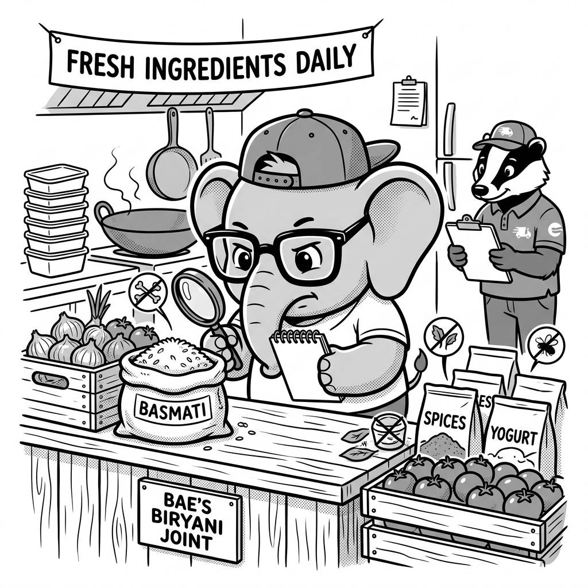

import LearningFlow from '@site/src/components/LearningFlow';

# Dependency Security

## 1. Quick Summary

| Area | Details |
|---|---|
| Topic | Dependency / Supply Chain Security |
| Difficulty | Beginner / Intermediate |
| Used For | Ensuring third-party libraries (npm, PyPI, Maven) don't introduce vulnerabilities or malicious code. |
| Common Mistake | Assuming open-source packages are safe by default and ignoring deep transitive dependencies. |
| Performance | Zero runtime performance impact; primarily a build-time and CI/CD operation. |

## 2. Engineering Story

A rapidly growing fintech startup was preparing for a massive product launch. To generate user tax documents, a developer quickly pulled in a popular open-source PDF generation library via `npm`. It worked flawlessly in local testing. However, unbeknownst to the team, the library’s original maintainer had handed over the project rights to an unknown third party a month prior. 

The new maintainer had stealthily injected an obfuscated script into a deeply nested sub-dependency (a utility for formatting strings). When the startup’s deployment pipeline executed `npm install`, it pulled down this poisoned version. The CI pipeline built the artifact and shipped it. 

Once running in the production environment, the malicious script woke up. It began silently reading the application's process environment variables, capturing the AWS database credentials, and exfiltrating them over HTTPS to an external server. Within 48 hours, attackers dumped the customer database. The startup's code was perfect, but their supply chain was compromised. They had unknowingly imported the enemy.

## 3. Real-World Analogy



Imagine you are running a high-end Biryani restaurant. You strictly control the recipe, the cooking process, and your kitchen staff (your code). However, you buy your chicken, spices, and rice from various external suppliers (your dependencies). 

| Physical World | Software Equivalent |
|---|---|
| A chef verifying the quality of meat from a new vendor | Scanning a new npm package for known vulnerabilities |
| Finding out the flour you bought last month was recalled by the FDA | Receiving an alert about a CVE in an older version of a library |
| Buying cheap spices from a shady, unverified supplier off a truck | Installing a package with 2 stars, no maintainer, and an obscure name |
| Writing down exactly which ingredients and batch numbers you used | Generating a Software Bill of Materials (SBOM) |
| A supplier outsourcing their delivery to a malicious third party | A trusted package pulling in a compromised transitive dependency |

If your spice vendor delivers tainted saffron, your customers get sick. They won't blame the spice vendor; they will blame your restaurant. In software, if you run `npm install` and pull in malicious or flawed code, your application is the one that gets compromised. Securing your dependencies is about constantly verifying the safety of the "ingredients" you bring into your kitchen.

## 4. Concept Explanation

Dependency Security, a critical pillar of Software Supply Chain Security, is the practice of continuously monitoring, scanning, and managing third-party open-source libraries used within an application. 

**Why does it exist?** Modern applications are composed of up to 80% open-source code and only 20% custom business logic. This creates a massive attack surface. Hackers realize that compromising one heavily utilized library (like Log4j or an npm networking utility) allows them to simultaneously breach thousands of companies that depend on it.

**When to use it:** Always. Dependency scanning should be a non-negotiable step integrated into your CI/CD pipeline. No code should ever be merged or deployed if it introduces critical or high-severity vulnerabilities from third-party code.

**When NOT to use it:** There is no scenario where ignoring dependency security is acceptable in production. However, strictly failing local builds on minor or low-level vulnerabilities during early prototyping can hinder developer velocity. Treat severity levels contextually.

## 5. Syntax Table

Here is how you trigger dependency audits across different modern language ecosystems:

| Ecosystem | Audit Command | Lockfile | Security Tooling |
|---|---|---|---|
| **Node.js (npm)** | `npm audit` | `package-lock.json` | Snyk, Dependabot |
| **Python** | `pip-audit` | `requirements.txt` / `poetry.lock` | Safety, pip-audit |
| **Java (Maven)** | `mvn dependency-check:check` | `pom.xml` | OWASP Dependency-Check |
| **Go** | `govulncheck ./...` | `go.sum` | govulncheck |
| **Rust (Cargo)** | `cargo audit` | `Cargo.lock` | cargo-audit |
| **Ruby** | `bundle audit` | `Gemfile.lock` | bundler-audit |

## 6. Beginner Example

The simplest way to interact with dependency security is checking for known vulnerabilities locally before committing code.

```bash
# BAD: Blindly installing packages without verification
npm install some-random-library

# GOOD: Checking the vulnerability status of your project
npm audit

# Output:
# found 2 vulnerabilities (1 moderate, 1 critical) in 1432 scanned packages
# run `npm audit fix` to fix them, or `npm audit fix --force` for breaking changes

# GOOD: Automatically applying safe, non-breaking patch updates
npm audit fix
```

## 7. Real-World Engineering Example

In enterprise environments, security cannot rely on developers remembering to run commands locally. It is enforced programmatically in the CI/CD pipeline using GitHub Actions, blocking malicious PRs from being merged.

```yaml
# .github/workflows/security-scan.yml
name: Dependency Security Scan

on:
  pull_request:
    branches: [ main ]

jobs:
  audit:
    runs-on: ubuntu-latest
    steps:
      - uses: actions/checkout@v3

      - name: Setup Node.js
        uses: actions/setup-node@v3
        with:
          node-version: '18'

      # DO: Use 'ci' to respect the lockfile exactly as committed.
      - name: Install exact dependencies
        run: npm ci 

      # DO: Use a dedicated SCA scanner (like Snyk, Trivy, or OSV-Scanner)
      # rather than just `npm audit`, which often creates false positives.
      - name: Run Snyk SCA Scan
        uses: snyk/actions/node@master
        env:
          SNYK_TOKEN: ${{ secrets.SNYK_TOKEN }}
        with:
          # Automatically fail the CI job if High/Critical issues are found
          args: --severity-threshold=high --fail-on=all
          
      # If this fails, the PR cannot be merged until the developer 
      # updates the vulnerable package or adds a resolution override.
```

## 8. Internal Working

How does a Software Composition Analysis (SCA) tool actually detect a vulnerability? Let's visualize the internal engine of tools like Trivy or Snyk during a build process.

<LearningFlow
  nodes={[
    { id: '1', type: 'data', data: { label: 'App Source\n(package.json)' }, position: { x: 50, y: 50 } },
    { id: '2', type: 'data', data: { label: 'Lockfile\n(package-lock.json)' }, position: { x: 300, y: 50 } },
    { id: '3', type: 'tool', data: { label: 'SCA Scanner\n(e.g., Trivy, Snyk)' }, position: { x: 300, y: 150 } },
    { id: '4', type: 'data', data: { label: 'Global CVE Database\n(NVD, OSV)' }, position: { x: 600, y: 150 } },
    { id: '5', type: 'process', data: { label: 'Dependency Graph\nResolution' }, position: { x: 300, y: 250 } },
    { id: '6', type: 'core', data: { label: 'Vulnerability\nMatching Engine' }, position: { x: 300, y: 350 } },
    { id: '7', type: 'warning', data: { label: 'Critical Match\n(CVSS 9.8)' }, position: { x: 150, y: 450 } },
    { id: '8', type: 'output', data: { label: 'Generate Clean SBOM\n(CycloneDX/SPDX)' }, position: { x: 450, y: 450 } },
    { id: '9', type: 'output', data: { label: 'CI Build Failed\n(Merge Blocked)' }, position: { x: 150, y: 550 } },
  ]}
  edges={[
    { id: 'e1-3', source: '1', target: '3', animated: true },
    { id: 'e2-3', source: '2', target: '3', animated: true, label: 'reads versions' },
    { id: 'e3-5', source: '3', target: '5', animated: true, label: 'builds tree' },
    { id: 'e5-6', source: '5', target: '6', animated: true },
    { id: 'e4-6', source: '4', target: '6', animated: true, label: 'streams signatures' },
    { id: 'e6-7', source: '6', target: '7', animated: true, label: 'exploit found' },
    { id: 'e6-8', source: '6', target: '8', animated: true, label: 'clean' },
    { id: 'e7-9', source: '7', target: '9', animated: true, style: { stroke: 'red' }, label: 'enforce policy' },
  ]}
/>

1. **Resolution:** The scanner reads your manifest (package.json) and lockfile to build a massive graph of all direct and transitive dependencies.
2. **Database Query:** It downloads the latest vulnerability signatures from databases like NVD (National Vulnerability Database) or OSV.
3. **Pattern Matching:** The engine checks your specific package versions against the known flawed versions.
4. **Policy Enforcement:** If a match exceeds the allowed severity threshold (e.g., CVSS score > 7.0), it terminates the build.

## 9. Performance Table

| Operation | Time / Complexity | Location / Impact |
|---|---|---|
| **Local Audit (`npm audit`)** | `O(N)` network calls (Low latency) | Developer Laptop. Takes 1–3 seconds. |
| **Dependency Tree Resolution** | `O(N * M)` tree traversal | CI/CD Pipeline. CPU intensive for large monorepos. |
| **SCA Cloud Scan** | ~10–30 seconds | CI/CD Pipeline. Requires sending dependency tree hashes to security vendor API. |
| **Malicious Library Execution** | **Zero runtime overhead** | Production. The code runs at normal speed while actively exfiltrating data. |

## 10. Top Interview Questions

| Difficulty | Question | Answer |
|---|---|---|
| Intermediate | **What is a CVE and CVSS?** | **CVE** (Common Vulnerabilities and Exposures) is a standard identifier (e.g., CVE-2021-44228) assigned to known vulnerabilities. **CVSS** (Common Vulnerability Scoring System) is the 0-10 numerical score indicating the severity of that CVE. |
| Intermediate | **Why is committing the lockfile (`package-lock.json`) a security requirement?** | The lockfile cryptographically hashes and pins the exact versions of every dependency and sub-dependency. Without it, your CI pipeline might resolve to a newer, compromised version of a library during the build. |
| Intermediate | **What is Typosquatting in package management?** | An attack where a malicious actor registers packages with names similar to popular ones (e.g., `react-don` instead of `react-dom` or `lodsh` instead of `lodash`). Developers making a typo during installation accidentally download malware. |
| Intermediate | **What is an SBOM?** | A Software Bill of Materials. It acts as a comprehensive, machine-readable inventory of all software components, dependencies, transitive dependencies, and licenses used in an application. Essential for enterprise compliance and auditing. |
| Intermediate | **How do you handle a zero-day vulnerability in a dependency when no patch exists?** | You must employ compensating controls: deploy a Web Application Firewall (WAF) rule to block exploit payloads, disable the affected feature temporarily, or manually fork the repository and apply a custom hotfix. |

## 11. Tricky Questions & Edge Cases

- **Question:** A security scan flags a "Critical" Remote Code Execution (RCE) vulnerability in a testing library (`jest` or `mocha`) located entirely in `devDependencies`. Does this require an immediate, midnight patch?
  **Answer:** Usually, no. If the library is strictly executed during local testing or CI builds, and is *never bundled* into the production container or client-side JavaScript artifact, the actual exploitability risk is extremely low. You should patch it during regular working hours to keep the CI environment safe, but it's not a production emergency.
- **Question:** We use a private npm registry (like JFrog Artifactory or AWS CodeArtifact) inside a VPC. Are we safe from supply chain attacks?
  **Answer:** No. Private registries often act as pass-through proxies to the public registry. If a developer requests `lodash@4.17.21`, the private registry pulls it from the public internet and caches it. If they request a typosquatted package, the registry will still pull it. You must configure your private registry to block known vulnerable packages and prevent "Dependency Confusion" attacks.

## 12. Real-World Usage

The most catastrophic dependency security event in modern history was the **Log4j vulnerability (Log4Shell, CVE-2021-44228)** in late 2021. Log4j was an ubiquitous Java logging library embedded in millions of applications. A flaw allowed attackers to pass a specially crafted string into a server's logs, forcing the server to download and execute malicious code remotely (RCE). Companies like Apple, Cloudflare, Amazon, and Tesla had to scramble for weeks to find every instance of Log4j across thousands of microservices and update it. This single event fundamentally shifted the industry toward mandating automated dependency scanning and SBOM generation.

## 13. Best Practices

| DO | DON'T |
|---|---|
| **DO** use automated tools like Dependabot or Renovate to continuously open PRs keeping dependencies up to date weekly. | **DON'T** let dependencies stagnate for years and then attempt a massive, breaking "big bang" upgrade. |
| **DO** enforce branch protection rules that fail the CI pipeline if a PR introduces High or Critical vulnerabilities. | **DON'T** ignore automated security alerts in the console because "it still compiles." |
| **DO** check the popularity, recent commits, and maintainer reputation of an open-source library before adopting it. | **DON'T** install a random library with 3 stars and no GitHub repo just to save yourself from writing 20 lines of code. |
| **DO** always commit your lockfiles (`package-lock.json`, `yarn.lock`, `go.sum`). | **DON'T** delete the lockfile as a debugging step to "fix" installation conflicts. |

## 14. Production Notes

> ⚠️ **Warning on Transitive Dependencies**
> A typical application manifest may only list 30 direct dependencies. However, resolving the dependency tree often pulls in over 1,500 packages (transitive dependencies). A vulnerability deep in this tree is still an immediate threat to your application. If a transitive dependency is vulnerable and the direct parent hasn't released a patch, you must use dependency resolution overrides (e.g., `npm overrides` or `yarn resolutions` in package.json) to forcefully enforce a patched version of the sub-dependency across the entire graph.

## 15. Common Mistakes

| Mistake | Why it's bad | How to fix it |
|---|---|---|
| **Blindly running `npm audit fix --force`** | The `--force` flag applies major, breaking version upgrades automatically. It will often crash your application by altering API signatures without warning. | **Review changes manually:** Apply non-breaking updates first. For major version bumps, read the changelog, update manually, and run your full test suite. |
| **Running `npm install` as root** | Commands like `sudo npm install -g <pkg>` grant post-install scripts (which execute automatically) full root access to your machine, allowing trivial system compromise. | **Use Version Managers:** Use Node Version Manager (nvm) or Volta so global packages are installed cleanly in your local user directory without needing `sudo`. |
| **Unverified Docker Base Images** | Using a container image like `FROM randomguy/node-app` means your application inherits any malware baked into that OS. | **Use Official Verified Images:** Always use official, signed Docker images (e.g., `FROM node:18-alpine` or `cgr.dev/chainguard/node`). |

## 16. Related Topics

- [Security in CI/CD](./security-in-cicd.mdx)
- [Security Mindset](./security-mindset.mdx)
- [Threat Modeling](./threat-modeling.mdx)
- Docker Security

## 17. Top GitHub Repositories

| Repository | Stars | Description | Why It Matters |
|---|---|---|---|
| [renovatebot/renovate](https://github.com/renovatebot/renovate) | ⭐ 16k+ | Universal dependency update tool. | The industry standard for automatically generating PRs that update dependencies while grouping them logically. |
| [google/osv-scanner](https://github.com/google/osv-scanner) | ⭐ 8k+ | Vulnerability scanner written in Go. | A blazingly fast scanner that utilizes the Open Source Vulnerability (OSV) database to find flaws in your project. |
| [aquasecurity/trivy](https://github.com/aquasecurity/trivy) | ⭐ 22k+ | Comprehensive security scanner. | Can scan your dependencies, IaC, and Docker container images for vulnerabilities all at once. |
| [anchore/syft](https://github.com/anchore/syft) | ⭐ 6k+ | CLI tool for generating an SBOM. | Crucial for enterprise compliance. Scans your repositories or images and outputs a complete list of software components. |
| [CycloneDX/specification](https://github.com/CycloneDX/specification) | ⭐ 1k+ | The CycloneDX SBOM standard. | The foundational schema used by enterprises globally to represent their Software Supply Chain. |