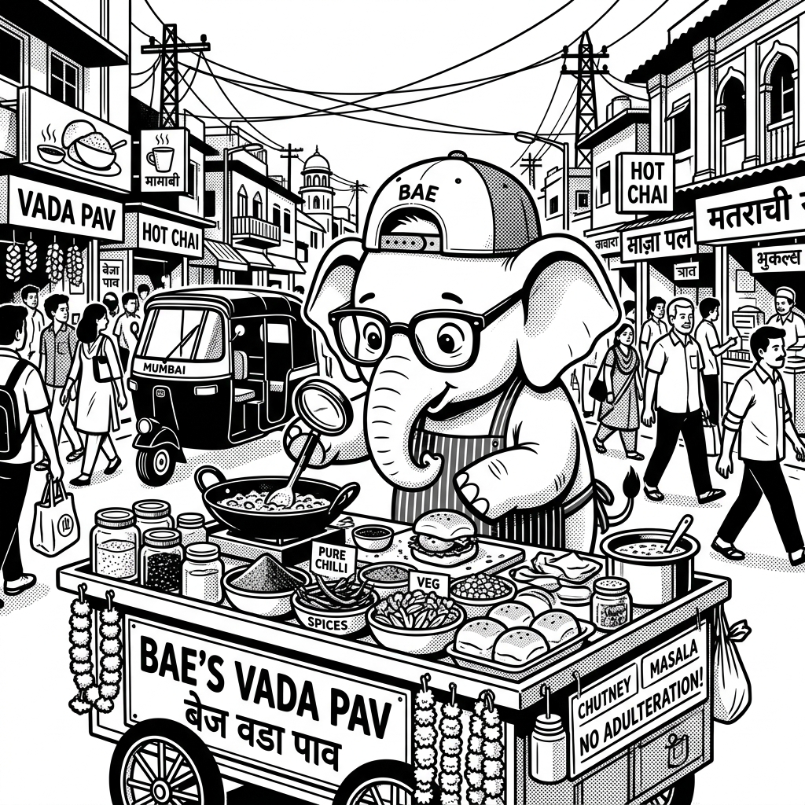

import LearningFlow from '@site/src/components/LearningFlow';

# OWASP Top 10 Vulnerabilities

## 1. Quick Summary

| Area | Details |
|---|---|
| Topic | OWASP Top 10 Vulnerabilities |
| Difficulty | Intermediate |
| Used For | Securing web applications, identifying systemic risks, and establishing a baseline for AppSec programs. |
| Common Mistake | Assuming a Web Application Firewall (WAF) magically fixes these design flaws without fixing the underlying code. |
| Performance | Fixing these issues generally adds minimal overhead (like bounds checking or using parameterized queries), but prevents catastrophic system failure. |

## 2. Engineering Story

In late 2018, a rapidly growing fintech startup prepared for its Series B funding. Their core product, a peer-to-peer lending app, had just crossed one million active users. On a Friday evening, the lead engineer received a critical alert: the database CPU was spiking, and massive outbound data transfers were detected. 

A user had registered an account and realized the API endpoint to download PDF loan statements looked like `api.fintech.com/v1/statements/10045`. Out of curiosity, they changed the ID to `10046`. The server happily returned a PDF containing the name, address, and social security number of another customer. There was no authorization check to verify if the requesting user actually owned that specific statement ID. 

Within minutes, the attacker wrote a Python script to iterate through IDs from `1` to `1000000`, systematically downloading the entire platform's financial history. This flaw—Broken Access Control—resulted in a catastrophic data breach, a massive regulatory fine, and the collapse of their funding round. A simple identity check at the data layer could have prevented it entirely.

## 3. Real-World Analogy



| Physical World | Software Equivalent |
|---|---|
| Serving adulterated street food without checking ingredients | Injection Flaws (SQLi, XSS) |
| Leaving the master key on the reception desk | Broken Access Control |
| Using an easily guessable locker password | Identification and Authentication Failures |
| Using expired medicines from the cabinet | Vulnerable and Outdated Components |
| Building a bank vault with a glass door | Insecure Design |

Bro, think about a busy street food vendor in Mumbai. If the vendor doesn't check where their ingredients come from or what the supplier puts in them, they might end up serving adulterated food, poisoning the customers (Injection). If they leave the cash box wide open while cooking, anyone can walk up and take the money (Broken Access Control). The OWASP Top 10 is basically the mandatory health and safety checklist for your web applications. It highlights the 10 most common ways applications get compromised on the internet so you don't repeat the same disastrous mistakes.

## 4. Concept Explanation

The Open Worldwide Application Security Project (OWASP) Top 10 is a globally recognized awareness document for developers and web application security professionals. It represents a broad consensus about the most critical security risks to web applications, updated periodically based on data from thousands of organizations and security researchers.

**Why does it exist?** 
Historically, developers kept making the exact same security mistakes—concatenating strings into SQL queries, forgetting to check permissions, or using outdated libraries with known CVEs (Common Vulnerabilities and Exposures). The OWASP Top 10 categorizes these recurring mistakes so engineering teams can focus their security testing, code reviews, and threat modeling on the highest-impact areas.

**When to use it?** 
The OWASP Top 10 should serve as the absolute minimum baseline for your secure coding standards. It must be integrated into your automated security scanning (SAST/DAST) in CI/CD pipelines and should be the primary checklist for penetration testing requirements before major releases.

**When NOT to use it?**
Do not use it as an exhaustive, complete list of all possible security flaws. It is just the "Top 10." Emerging threats, zero-days, or highly specific business logic flaws may not fit neatly into these ten categories.

## 5. Syntax Table

Here is a quick look at some key OWASP categories and their primary mitigations in standard web frameworks:

| OWASP Category | Example Vulnerability | Primary Mitigation Code Pattern |
|---|---|---|
| **A01: Broken Access Control** | User A viewing User B's profile via ID tampering in URL | Implement strict server-side RBAC/ABAC checking resource ownership |
| **A02: Cryptographic Failures** | Storing passwords in plaintext or MD5 | Use Argon2 or bcrypt `await bcrypt.hash(pwd, 12)` |
| **A03: Injection** | SQL Injection via a login form | Parameterized Queries (Prepared Statements) `db.query('... WHERE id=$1', [id])` |
| **A04: Insecure Design** | Lacking business logic rate limiting (e.g., infinite coupon usage) | Threat modeling and secure architecture reviews, adding strict rate limiters |
| **A05: Security Misconfiguration** | Leaving debug traces enabled in production | `app.set('env', 'production');` to disable stack traces |
| **A06: Vulnerable Components** | Using an old, vulnerable version of Log4j | Automated dependency scanning (Dependabot/Snyk) |

## 6. Beginner Example

Let's look at a classic **A03: Injection** vulnerability, one of the oldest and most dangerous flaws on the internet.

```javascript
// DON'T: Vulnerable to SQL Injection
app.post('/login', async (req, res) => {
  const { username, password } = req.body;
  
  // ❌ An attacker sends username: "admin' --"
  // The query becomes: SELECT * FROM users WHERE username='admin' --' AND password='...'
  // The comment '--' ignores the password check. Attacker logs in as admin!
  const query = `SELECT * FROM users WHERE username='${username}' AND password='${password}'`;
  const result = await db.execute(query);
  
  if (result.length > 0) res.send('Logged In');
});

// DO: Parameterized Query
app.post('/login', async (req, res) => {
  const { username, password } = req.body;
  
  // ✅ The DB driver safely escapes the inputs. It sends the query and the data separately.
  const query = `SELECT * FROM users WHERE username = ? AND password = ?`;
  const result = await db.execute(query, [username, password]);
  
  if (result.length > 0) res.send('Logged In');
});
```

## 7. Real-World Engineering Example

Let's look at **A01: Broken Access Control**, currently the #1 vulnerability on the OWASP list. Imagine a production API for a SaaS invoicing application built in Node.js with Express and Sequelize (ORM).

```javascript
const express = require('express');
const app = express();

// ❌ A VULNERABLE endpoint
app.get('/api/invoices/:id', authenticateToken, async (req, res) => {
  const invoiceId = req.params.id;

  // DON'T do this! We fetched the invoice, but we NEVER checked if the logged-in user owns it!
  // User ID 5 could pass invoice ID 999 (which belongs to User 2) and successfully read it.
  // This is called Insecure Direct Object Reference (IDOR) / Broken Object Level Authorization (BOLA).
  const invoice = await db.Invoice.findByPk(invoiceId);
  return res.json(invoice);
});

// ✅ A SECURE endpoint implementing Access Control
app.get('/api/secure/invoices/:id', authenticateToken, async (req, res) => {
  const invoiceId = req.params.id;
  
  // Extracted from the validated JWT by the `authenticateToken` middleware
  const loggedInUserId = req.user.id; 

  // DO this! Query the database ensuring the invoice ACTUALLY belongs to the requesting user.
  const invoice = await db.Invoice.findOne({
    where: {
      id: invoiceId,
      userId: loggedInUserId // Crucial authorization check at the data layer
    }
  });

  if (!invoice) {
    // Return a generic 404 to prevent attackers from knowing if the ID even exists
    return res.status(404).send('Invoice not found');
  }

  return res.json(invoice);
});
```

## 8. Internal Working

How does a Broken Access Control (BOLA/IDOR) vulnerability manifest during runtime? Let's trace the execution path of a malicious API request bypassing the business logic.

<LearningFlow
  nodes={[
    { id: '1', type: 'tool', data: { label: 'Attacker: HTTP GET /api/invoices/999' }, position: { x: 50, y: 50 } },
    { id: '2', type: 'process', data: { label: 'Express Router (AuthN checks JWT)' }, position: { x: 50, y: 150 } },
    { id: '3', type: 'core', data: { label: 'Controller Layer (Missing AuthZ)' }, position: { x: 50, y: 250 } },
    { id: '4', type: 'data', data: { label: 'DB Query: SELECT * FROM Invoices WHERE id=999' }, position: { x: 50, y: 350 } },
    { id: '5', type: 'warning', data: { label: 'No check if User(ID=5) owns Invoice(ID=999)' }, position: { x: 450, y: 350 } },
    { id: '6', type: 'output', data: { label: '200 OK: Sensitive Data Leaked' }, position: { x: 50, y: 450 } },
  ]}
  edges={[
    { id: 'e1-2', source: '1', target: '2', animated: true, label: 'Valid JWT provided' },
    { id: 'e2-3', source: '2', target: '3', animated: true },
    { id: 'e3-4', source: '3', target: '4', animated: true, label: 'Fetches by ID only' },
    { id: 'e4-5', source: '4', target: '5', type: 'straight', style: { stroke: 'orange', strokeDasharray: '5,5' } },
    { id: 'e4-6', source: '4', target: '6', animated: true, style: { stroke: 'red', strokeWidth: 2 } },
  ]}
/>

In this flow, the router successfully authenticates the user (Authentication), but the controller completely fails to verify if the authenticated user is authorized to view that specific record (Authorization), leading directly to data leakage.

## 9. Performance Table

Implementing mitigations for OWASP Top 10 involves runtime checks, but they are incredibly efficient and necessary.

| Mitigation | Performance Impact | Note |
|---|---|---|
| Parameterized Queries | Extremely Low | Actually improves DB performance via query plan caching. |
| Role/Access Checks | Low | Usually a fast DB index hit or in-memory JWT claim check. |
| Software Composition Analysis (SCA) | Zero (Runtime) | Scans run in the CI/CD pipeline, not in production. |
| Strong Cryptography | Low/Medium | Hashing (bcrypt) takes time on purpose (e.g., 200ms) to thwart brute-forcing. TLS termination is usually offloaded to Load Balancers. |
| Input Validation | Negligible | Running regex patterns or Zod/Joi validation schemas takes microseconds. |

## 10. Top Interview Questions

| Difficulty | Question | Answer |
|---|---|---|
| Intermediate | What is the difference between Authentication and Authorization? | Authentication is proving who you are (e.g., logging in with a password). Authorization is verifying what you are allowed to do (e.g., checking if you have admin rights to delete a user). |
| Intermediate | How do you prevent SQL Injection? | Always use parameterized queries (prepared statements) or a trusted ORM. Never concatenate user input directly into SQL strings. |
| Intermediate | What is Cross-Site Scripting (XSS)? | An injection attack where malicious scripts are injected into trusted websites. When a victim visits the site, their browser executes the script, which can steal session cookies or perform actions on their behalf. |
| Intermediate | How do you mitigate Vulnerable Components? | Use automated dependency scanning tools (Dependabot, Snyk), regularly update third-party libraries, and maintain an accurate Software Bill of Materials (SBOM). |
| Intermediate | What constitutes a Cryptographic Failure? | Storing passwords in plaintext, using weak, outdated hashing algorithms like MD5 or SHA1, using deprecated TLS versions, or transmitting sensitive data over unencrypted HTTP. |

## 11. Tricky Questions & Edge Cases

**Question:** We use a modern ORM (like Prisma, TypeORM, or Entity Framework). Are we completely immune to SQL Injection?
**Answer:** Mostly, but not entirely. ORMs handle standard CRUD queries safely. However, most ORMs provide a `rawQuery` or `executeRaw` escape hatch for complex queries (e.g., advanced reporting). If developers concatenate strings inside those raw queries instead of passing bindings, you are wide open to SQL injection again.

**Question:** If we sanitize all HTML input before saving it to the database, are we safe from XSS?
**Answer:** Sanitizing HTML perfectly is notoriously difficult. Attackers can use bizarre encodings, nested SVG tags, or obfuscated JavaScript to bypass simple regex filters. The safest approach is context-aware output encoding (which modern frameworks like React do automatically) and implementing a strong, restrictive Content Security Policy (CSP) header.

## 12. Real-World Usage

Every major tech company uses the OWASP Top 10 to calibrate their security posture and tooling. 
When companies like Netflix, Uber, or GitHub set up their CI/CD pipelines, they integrate Static Application Security Testing (SAST) tools (like SonarQube or Checkmarx). These tools are specifically configured to flag code patterns that lead to OWASP Top 10 vulnerabilities (e.g., detecting string concatenation in SQL queries) before the code can even be merged into the `main` branch. 

Furthermore, Bug Bounty programs (run on platforms like HackerOne or Bugcrowd) heavily classify vulnerability reports based on the OWASP Top 10 to determine the severity and payout amounts for ethical hackers.

## 13. Best Practices

| DO | DON'T |
|---|---|
| Enforce access control checks on every single API endpoint that touches data, ensuring the user owns the resource. | Assume that hiding a UI button on the frontend prevents a malicious user from calling the underlying API. |
| Use strong, salted, and intentionally slow hashes (bcrypt, Argon2, PBKDF2) for passwords. | Use fast, general-purpose hashes like MD5 or SHA-256 for anything security-related. |
| Automate dependency scanning in your CI/CD pipeline using tools like Dependabot. | Manually track library versions in a spreadsheet or ignore security alerts from npm/yarn. |
| Return generic error messages to the client (e.g., "Invalid credentials", "An error occurred"). | Return stack traces or specific database errors to the client, which helps attackers map your system. |

## 14. Production Notes

> ⚠️ **Warning on Misconfiguration and Logging**
> **A04: Insecure Design** often manifests in production as **A05: Security Misconfiguration**. A classic production failure is leaving debug modes or verbose stack traces enabled in the production environment. This provides attackers with a complete roadmap of your system architecture, framework versions, and database schema. Always ensure environment variables like `NODE_ENV=production` are set, and configure your global error handlers to swallow stack traces before returning a response to the user. Additionally, ensure you never log sensitive PII (Passwords, Social Security Numbers, Credit Card details) to your centralized logging systems (Datadog, Splunk), as this creates a secondary attack vector.

## 15. Common Mistakes

| Mistake | Why it's bad | How to fix it |
|---|---|---|
| Trusting Client-Side State | Attackers can easily modify cookies, JWT payloads (if you don't verify the cryptographic signature), and hidden HTML form fields using proxy tools like Burp Suite. | Never trust the client. Re-verify all business logic, pricing, and access control strictly on the backend server. |
| Default Passwords | Leaving admin interfaces (like database admin tools, routers, or internal dashboards) with default credentials (admin/admin) is an instant, unrecoverable breach. | Enforce mandatory forced password changes on first login and proactively disable default system accounts. |
| Missing Rate Limiting | Allows attackers to brute-force login screens, perform credential stuffing attacks, or cause Application-Layer Denial of Service (DoS). | Implement IP-based and User-based rate limiting on sensitive endpoints (Login, Password Reset, API keys) using Redis or API Gateways. |

## 16. Related Topics
- [Security Mindset](./security-mindset.mdx)
- [Authentication Deep Dive](./authentication-deep-dive.mdx)
- [Authorization & RBAC](./authorization-rbac-abac.mdx)
- Content Security Policy (CSP)

## 17. Top GitHub Repositories

| Repository | Stars | Description | Why It Matters |
|---|---|---|---|
| [OWASP/Top10](https://github.com/OWASP/Top10) | ⭐ 4k+ | The official OWASP Top 10 repository. | The ultimate source of truth for the list, including the research methodology and data sets. |
| [OWASP/NodeGoat](https://github.com/OWASP/NodeGoat) | ⭐ 3.5k+ | A deliberately insecure Node.js application. | Great for hands-on learning. It contains examples of all the Top 10 vulnerabilities for you to exploit locally and fix. |
| [bkimminich/juice-shop](https://github.com/bkimminich/juice-shop) | ⭐ 10k+ | The most modern and sophisticated insecure web application. | Another fantastic training ground for finding and exploiting OWASP vulnerabilities in a modern SPA architecture. |
| [sqlmapproject/sqlmap](https://github.com/sqlmapproject/sqlmap) | ⭐ 30k+ | Automatic SQL injection and database takeover tool. | Shows how easily A03 (Injection) can be exploited using automated tools, proving why mitigations are critical. |
| [dependabot/dependabot-core](https://github.com/dependabot/dependabot-core) | ⭐ 4k+ | Automated dependency updates engine. | The core engine behind GitHub's built-in defense against A06 (Vulnerable Components). |