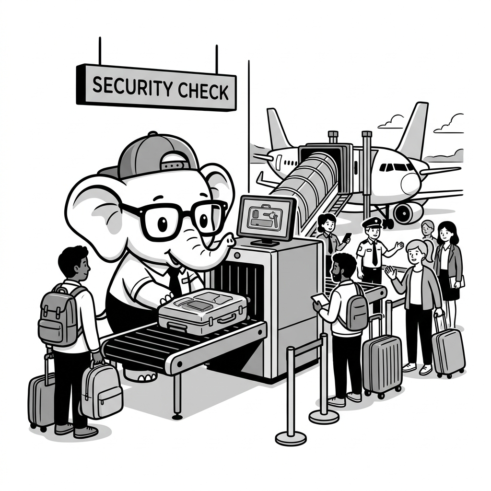

import LearningFlow from '@site/src/components/LearningFlow';

# Security in CI/CD (DevSecOps)

## 1. Quick Summary

| Area | Details |
|---|---|
| Topic | Security in CI/CD (DevSecOps / Shifting Left) |
| Difficulty | Intermediate / Advanced |
| Used For | Automating security checks into the software delivery pipeline to catch vulnerabilities early |
| Common Mistake | Running security scans only right before a major release, leading to extreme bottlenecks |
| Performance | Can significantly slow down build times if scans (especially DAST/SAST) are not optimized or cached |

## 2. Engineering Story

It was 4:00 PM on a Friday at a rapidly growing fintech startup. The engineering team was pushing a critical hotfix to resolve a payment gateway timeout issue. The fix was simple—a backend engineer hardcoded a temporary AWS access key to bypass a misconfigured IAM role, fully intending to remove it on Monday. The pull request was approved, merged, and deployed within minutes because the CI pipeline only ran a linter and unit tests.

By 2:00 AM on Saturday, automated billing alerts started triggering. Attackers had scraped the public GitHub repository, found the hardcoded AWS key, and spun up hundreds of expensive GPU instances across multiple regions to mine cryptocurrency. By the time the DevOps team woke up and revoked the key, the company had incurred a $40,000 AWS bill. 

This catastrophic failure wasn't just a developer mistake; it was a pipeline failure. If the startup had integrated a simple, 10-second Secret Scanner into their CI/CD pipeline, the PR would have been blocked automatically, the AWS key would never have been committed, and the weekend would have been saved. This is why DevSecOps exists.

## 3. Real-World Analogy



| Physical World (Airport) | Software Equivalent (DevSecOps) |
|---|---|
| ID Check at the Entrance | Secret Scanning (Checking for unauthorized keys) |
| X-Ray Machine for Carry-on Bags | SAST (Static Application Security Testing of source code) |
| Background Checks on Airport Staff | SCA (Software Composition Analysis / Dependency checks) |
| Fire Alarm Simulation & Drills | DAST (Dynamic Application Security Testing) |
| Boarding Pass Verification at the Gate | Deployment authorization and container signing |

Think about airport security. You don't let passengers walk straight onto an airplane from the street, only to inspect their bags mid-flight. You check their ID at the entrance, scan their bags at the security checkpoint, and verify their boarding pass at the gate. 

DevSecOps applies this exact model to software. Instead of relying on a massive "penetration test" at the very end of the year (checking bags mid-flight), we build metal detectors (scanners) directly into the GitHub Actions pipeline. This ensures malicious or vulnerable code cannot even "board the plane" to production.

## 4. Concept Explanation

Security in CI/CD, heavily associated with the term **DevSecOps** and the philosophy of **"Shifting Left"**, is the practice of integrating automated security testing seamlessly throughout the software development lifecycle (SDLC).

Traditionally, security was a siloed phase that happened *after* development and *before* release. Security teams would audit the finished application, find hundreds of vulnerabilities, and throw a massive report back to developers, causing weeks of delays and friction.

"Shifting Left" means moving these security checks to the "left" of the project timeline—closer to the developer. 

**Why it exists:** If a developer introduces a SQL injection vulnerability, finding it 6 months later in staging costs thousands of dollars in triage, context-switching, and remediation. Finding it 5 minutes later via an automated CI check on the Pull Request costs almost nothing. The developer fixes it immediately while the context is fresh in their mind.

**When to use it:** Every modern engineering organization must have at least basic automated security gates (secret scanning, SCA, and lightweight SAST) in their CI pipelines.

**When NOT to use it:** Never block local, rapid prototyping environments with heavy 45-minute scans. Security tools must be ergonomic; aggressive DAST scans belong in nightly runs or staging deployments, not on every PR commit.

## 5. Syntax Table

Here are the primary types of automated security scans integrated into pipelines:

| Scan Type | Stands For | What it does | When it should run |
|---|---|---|---|
| **Secret Scanning** | N/A | Greps the codebase and git history for API keys, tokens, and passwords. | Pre-commit / PR open |
| **SCA** | Software Composition Analysis | Checks package managers (npm, pip, maven) for dependencies with known CVEs. | PR open / Daily |
| **SAST** | Static Application Security Testing | Analyzes source code (AST) without executing it to find logical flaws (e.g., SQLi, XSS). | PR open |
| **DAST** | Dynamic Application Security Testing | Attacks a running, compiled application to find runtime vulnerabilities. | Staging deployment |
| **IaC Scan** | Infrastructure as Code Scanning | Validates Terraform/CloudFormation templates against security best practices. | PR open (Infra repos) |
| **Container Scan** | N/A | Checks Docker images for vulnerable OS packages and base images. | Post-build / Registry push |

## 6. Beginner Example

The easiest and highest-ROI security integration for a pipeline is preventing hardcoded secrets from being merged.

```yaml
# DON'T: A pipeline that blindly builds and deploys without checks.
name: Unsafe Pipeline
on: [push]
jobs:
  build:
    runs-on: ubuntu-latest
    steps:
      - uses: actions/checkout@v4
      - run: npm install && npm run build
      - run: ./deploy.sh

# DO: A pipeline that blocks secrets before they hit the main branch.
name: Secure Pipeline
on:
  pull_request:
    branches: [ main ]
jobs:
  secret-scan:
    runs-on: ubuntu-latest
    steps:
      # We must fetch the entire git history to ensure secrets aren't buried in older commits
      - uses: actions/checkout@v4
        with:
          fetch-depth: 0 
          
      - name: TruffleHog Secret Scanner
        uses: trufflesecurity/trufflehog@main
        with:
          path: ./
          base: ${{ github.event.repository.default_branch }}
          head: HEAD
          extra_args: --debug --only-verified
```

If a developer accidentally leaves `AWS_SECRET_KEY="AKIA..."` in any file or commit within the PR, this pipeline fails immediately, blocks the merge, and notifies the developer.

## 7. Real-World Engineering Example

In production, DevSecOps pipelines are comprehensive. Let's examine a robust pipeline for a Dockerized Node.js application that runs SCA, SAST, builds the container, and scans the image layers before pushing to a registry.

```yaml
name: Production DevSecOps Pipeline
on: 
  pull_request:
    branches: [ main ]

jobs:
  security-gates:
    runs-on: ubuntu-latest
    steps:
      - uses: actions/checkout@v4

      # 1. SCA: Dependency Scanning for Node.js
      # We use npm audit and fail the build only for HIGH or CRITICAL severity.
      - name: Run npm audit (SCA)
        run: npm audit --audit-level=high

      # 2. SAST: Static Analysis using Semgrep
      # Semgrep parses the code into an AST and checks against the OWASP Top 10 rules.
      - name: Run Semgrep SAST
        uses: returntocorp/semgrep-action@v1
        with:
          config: "p/owasp-top-ten"
          generateSarif: "1" # Outputs standard SARIF format for GitHub Security Center

      # 3. IaC Scan: Check Dockerfile for bad practices (e.g., running as root)
      - name: Run Checkov (IaC Scanner)
        uses: bridgecrewio/checkov-action@master
        with:
          directory: .
          framework: dockerfile

      # 4. Build the Docker Image
      - name: Build Image
        run: docker build -t my-app:${{ github.sha }} .

      # 5. Container Scan using Trivy
      # Scans the compiled image for OS-level vulnerabilities (e.g., outdated OpenSSL)
      - name: Run Trivy vulnerability scanner
        uses: aquasecurity/trivy-action@master
        with:
          image-ref: 'my-app:${{ github.sha }}'
          format: 'table'
          exit-code: '1' # Fails the build if vulnerabilities are found
          ignore-unfixed: true # Don't block if there is no patch available yet
          vuln-type: 'os,library'
          severity: 'CRITICAL,HIGH'
```

Code cannot reach production unless it is completely free of severe known vulnerabilities at the code, dependency, infrastructure, and OS levels.

## 8. Internal Working

How does a CI/CD pipeline technically enforce security rules? Under the hood, security scanners don't just "read text." They parse code into Abstract Syntax Trees (ASTs), cross-reference lockfiles against massive CVE databases, and execute regex engines against git histories.

<LearningFlow
  nodes={[
    { id: '1', type: 'tool', data: { label: 'Developer (git push)' }, position: { x: 50, y: 50 } },
    { id: '2', type: 'process', data: { label: 'VCS Webhook Triggered' }, position: { x: 50, y: 150 } },
    { id: '3', type: 'core', data: { label: 'CI Controller / Orchestrator' }, position: { x: 300, y: 150 } },
    { id: '4', type: 'process', data: { label: 'Spawn Ephemeral Runner (Docker)' }, position: { x: 300, y: 250 } },
    { id: '5', type: 'data', data: { label: 'Clone Source Code & History' }, position: { x: 50, y: 350 } },
    { id: '6', type: 'tool', data: { label: 'SAST / SCA / Secret Engines' }, position: { x: 300, y: 350 } },
    { id: '7', type: 'warning', data: { label: 'Signature Match / CVE Found' }, position: { x: 600, y: 350 } },
    { id: '8', type: 'output', data: { label: 'Block Merge (Exit Code 1)' }, position: { x: 600, y: 450 } },
    { id: '9', type: 'output', data: { label: 'Build Image (Exit Code 0)' }, position: { x: 300, y: 450 } },
  ]}
  edges={[
    { id: 'e1-2', source: '1', target: '2', animated: true, label: 'Push event' },
    { id: 'e2-3', source: '2', target: '3', animated: true, label: 'JSON Payload' },
    { id: 'e3-4', source: '3', target: '4', animated: true, label: 'Allocate resources' },
    { id: 'e4-5', source: '4', target: '5', animated: true, label: 'git fetch' },
    { id: 'e5-6', source: '5', target: '6', animated: true, label: 'Parse AST / Lockfiles' },
    { id: 'e6-7', source: '6', target: '7', animated: true, label: 'Match against rules' },
    { id: 'e7-8', source: '7', target: '8', animated: true, label: 'Fail Pipeline' },
    { id: 'e6-9', source: '6', target: '9', animated: true, label: 'If Clean (Pass)' },
  ]}
/>

1. **VCS Hook:** A developer pushes code, triggering a webhook to the CI orchestrator.
2. **Ephemeral Environment:** The CI controller spins up an isolated runner (often a container) to ensure a clean slate.
3. **AST Parsing & Signatures:** Tools like Semgrep parse the raw source code into an AST and traverse it looking for dangerous execution paths (e.g., untrusted user input flowing into a database query).
4. **Vulnerability DB Lookup:** SCA tools hash the lockfile dependencies and ping external databases (like the National Vulnerability Database or GitHub Advisory Database) for matching CVEs.
5. **Exit Codes:** If a vulnerability is confirmed, the tool exits with a non-zero code (e.g., `exit 1`), which signals the CI controller to fail the job and block the Pull Request.

## 9. Performance Table

Integrating security heavily impacts pipeline duration. Engineers must optimize these scans to maintain development velocity.

| Scan Type | Average Time | Resource Impact | Optimization Strategy |
|---|---|---|---|
| **Secret Scanning** | ~5-30s | Low CPU | Exceptionally fast via regex optimizations. Run on every single commit. |
| **SCA** (Deps) | ~10-60s | Low CPU, High I/O | Cache package managers (e.g., `node_modules` or `.m2`) on the CI runner. |
| **SAST** (Code) | ~2-15 mins | High CPU & Memory | Use "Differential Scanning" to only scan files changed in the PR, not the whole monorepo. |
| **Container Scan** | ~1-3 mins | Medium CPU | Cache the vulnerability signature database locally within the CI infrastructure. |
| **DAST** (Runtime) | ~15-90 mins | High Network | Far too slow for PRs. Run asynchronously on nightly builds or against staging environments. |

## 10. Top Interview Questions

| Question | Answer |
|---|---|
| What does "Shift Left" mean in DevSecOps? | It means moving security testing earlier in the Software Development Life Cycle (towards the "left" side of the timeline, near developers) rather than waiting until post-development deployment phases. |
| What is the core difference between SAST and DAST? | SAST (White-box) analyzes static source code without running it, finding logical flaws. DAST (Black-box) attacks a running, compiled application from the outside to find exploitable runtime flaws. |
| Why is Secret Scanning necessary if the repository is already private? | Private repositories are cloned to dozens of developer laptops. If even one developer's laptop is compromised, the attacker gains access to the repository and all hardcoded secrets within it. |
| What is a "False Positive" in SAST, and why is it dangerous? | A false positive is when a tool flags safe code as vulnerable. If tools generate too many false positives, developers get "alert fatigue" and start blindly ignoring or bypassing security gates, leaving real vulnerabilities undetected. |
| How do you securely provide deployment credentials (like AWS keys) to a CI pipeline? | Never hardcode them. Use the CI provider's secure encrypted Secrets manager, or better yet, use OIDC (OpenID Connect) to assume short-lived, ephemeral cloud roles without storing any long-lived keys. |

## 11. Tricky Questions & Edge Cases

**Question:** We run a comprehensive SAST tool on every Pull Request, but it takes 45 minutes to finish. Developers are complaining and creating workarounds to bypass the pipeline. What is the engineering solution?
**Answer:** Security must be ergonomic. A 45-minute PR gate destroys developer velocity. The solution is to configure the SAST tool to run in **"differential mode"** (scanning *only* the specific files modified in the PR) to provide feedback in seconds. Then, schedule the full 45-minute deep scan to run asynchronously on the `main` branch every night.

**Question:** We package our Node.js app into a Docker container and run a container scanner (like Trivy) on the image in CI. Do we still need to run an SCA tool (like `npm audit`) on our source code?
**Answer:** Yes. Container scanners are excellent at finding vulnerabilities in OS-level packages (like a vulnerable `apt-get install curl`), but they can sometimes miss application-level dependencies (like deeply nested `npm` packages) buried within container layers or abstracted away. You must use both to ensure defense in depth.

**Question:** A critical vulnerability (CVSS 9.8) is found in a dependency, and the pipeline fails. However, there is no patch available from the maintainer yet. How do we deploy our hotfix?
**Answer:** You configure the scanner to "ignore unfixed" vulnerabilities (so the build doesn't block permanently). Then, you implement compensating controls in your infrastructure, such as deploying a Web Application Firewall (WAF) rule to block exploit attempts until the dependency maintainer releases a patch.

## 12. Real-World Usage

At massive scale, companies like **GitHub, Netflix, and GitLab** completely automate security remediation. When a developer pushes code, asynchronous serverless functions process SAST, SCA, and Secret Scanning in parallel to maintain sub-minute pipeline times. 

If a secret (like a Stripe API key) is detected, the system doesn't just fail the build. It automatically triggers an API call directly to Stripe to **revoke the key within seconds** of the commit, effectively nullifying the vulnerability before a human even reads the alert. 

## 13. Best Practices

| DO | DON'T |
|---|---|
| **DO** configure pipelines to automatically fail on Critical/High severity vulnerabilities. | **DON'T** fail the pipeline for Low/Informational findings; this will infuriate developers and slow down delivery. |
| **DO** utilize pre-commit hooks (like `git-secrets` or `talon`) to catch secrets *before* they are even pushed to remote servers. | **DON'T** wait until code is merged into the `main` branch to run security scans. Catch flaws on the PR. |
| **DO** use OIDC (OpenID Connect) to authenticate your CI runners to AWS/GCP/Azure dynamically. | **DON'T** store long-lived static AWS IAM Access Keys inside CI variables if it can be avoided. |
| **DO** allocate dedicated sprint time (Tech Debt) to resolve medium-severity findings generated by the pipeline. | **DON'T** permanently ignore the scanner output using `# nosemgrep` comments without security team approval. |

## 14. Production Notes

> ⚠️ **Warning on CI/CD Platform Compromise**
> 
> Your CI/CD platform (GitHub Actions, Jenkins, GitLab CI) is often the most privileged entity in your entire architecture. It usually has "god-level" access to deploy to your production environments. Attackers know this. 
>
> The infamous **SolarWinds supply-chain hack** occurred because the build system itself was compromised. You must secure the CI/CD pipeline as strictly as production: enforce MFA for all developers, restrict who can modify pipeline `.yml` files, ensure CI runners operate in isolated, ephemeral environments, and strictly limit the blast radius of CI IAM roles.

## 15. Common Mistakes

| Mistake | Why it's bad | Exact Fix / Code |
|---|---|---|
| **Ignoring False Positives** | If a SAST tool generates 90% false positives, developers experience alert fatigue and ignore real threats. | Actively tune SAST rules. Explicitly suppress false positives in code: <br/> `// nosemgrep: sql-injection` |
| **Over-privileged CI Runners** | If a pipeline only needs to deploy to S3, but the CI runner has `AdministratorAccess`, a compromised pipeline can delete your entire AWS account. | Apply the Principle of Least Privilege to CI roles. Use specific policies: <br/> `"Action": ["s3:PutObject"]` |
| **Testing in Production** | Running aggressive DAST scans against a production database can pollute it with garbage test data or accidentally trigger destructive actions (e.g., automated DELETE testing). | Point DAST tools explicitly at ephemeral or staging environments. <br/> `zap-cli quick-scan https://staging.app.com` |
| **Not Fetching Git History** | A secret scanner looking only at the latest commit will miss passwords pushed 3 commits ago in the same PR. | Ensure checkout actions pull history: <br/> `fetch-depth: 0` |

## 16. Related Topics
- [Dependency Security](./dependency-security.mdx)
- [Secrets Management](./secrets-management.mdx)
- [Threat Modeling](./threat-modeling.mdx)
- OIDC in CI/CD

### Top GitHub Repositories

| Repository | Stars | Description | Why It Matters |
|---|---|---|---|
| [trufflesecurity/trufflehog](https://github.com/trufflesecurity/trufflehog) | ⭐ 13k+ | Find and verify credentials in git, files, and more. | The gold standard for integrating secret scanning into your CI pipeline; natively verifies if keys are active. |
| [returntocorp/semgrep](https://github.com/returntocorp/semgrep) | ⭐ 9k+ | Lightweight static analysis for many languages. | An incredibly fast, open-source SAST tool that uses simple patterns instead of complex AST traversals. |
| [aquasecurity/trivy](https://github.com/aquasecurity/trivy) | ⭐ 19k+ | Comprehensive vulnerability scanner for containers. | Essential for scanning Docker images in CI before pushing them to your production registry. |
| [zaproxy/zaproxy](https://github.com/zaproxy/zaproxy) | ⭐ 12k+ | The OWASP ZAP core project. | The most popular open-source DAST tool for automating attacks against your staging environment. |
| [bridgecrewio/checkov](https://github.com/bridgecrewio/checkov) | ⭐ 6k+ | Static code analysis tool for infrastructure-as-code. | Ensures your Terraform, CloudFormation, or Dockerfiles don't deploy inherently insecure infrastructure. |
