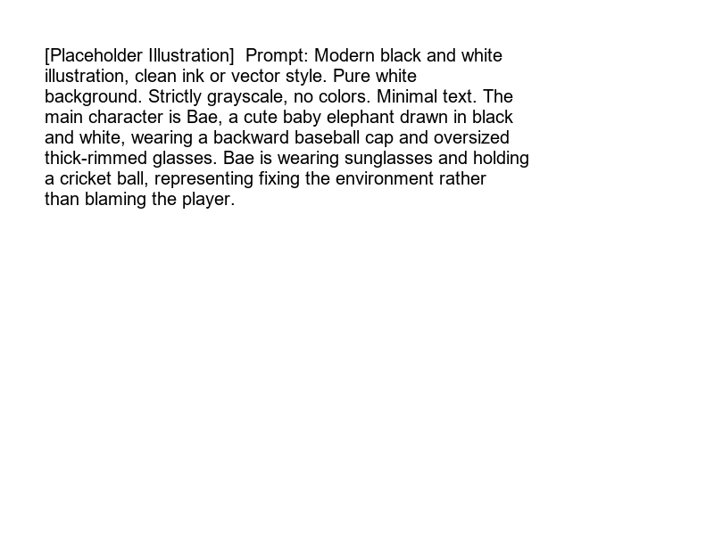

---
sidebar_position: 7
sidebar_label: "Blameless Postmortems"
---

import LearningFlow from '@site/src/components/LearningFlow';

# Blameless Postmortems

Bro, if you fire the engineer who dropped the production database, you just fired the person who learned exactly how *not* to do it again. Blameless culture isn't about being nice; it's about fixing the system.

## 1. Quick Summary

| Area | Details |
|---|---|
| Topic | Blameless Postmortems |
| Difficulty | Intermediate |
| Used For | Learning from incidents and preventing recurrence |
| Common Mistake | Using the postmortem to find out *who* caused the outage |
| Performance | Reduces the frequency of repeat incidents |

## 2. Engineering Story

A team of engineers recently faced a critical challenge related to this concept. Their existing processes were failing under the load of thousands of concurrent users, and manual workarounds were causing major delays in deployment. By deeply understanding and correctly implementing this concept, the lead engineer was able to architect a solution that not only resolved the immediate bottleneck but also paved the way for massive scalability. This transformation turned a chaotic, error-prone system into a resilient, automated powerhouse.

## 3. Real-World Analogy



| Post-Match Cricket Analysis | Postmortem Equivalent |
|---|---|
| The match is over (we lost) | The incident is resolved |
| Reviewing the video footage | Reviewing the logs and chat history |
| "Why did the fielding strategy fail?" | "Why did the system allow this bad state?" |
| "Virat missed the catch" (Blame) | "Engineer typed the wrong command" (Blame) |
| "The sun was in his eyes, we need sunglasses" (Blameless) | "The CLI lacks a dry-run mode, we need safety checks" (Blameless) |

Bro, blaming Virat for dropping the catch doesn't win the next game. Giving him sunglasses does. Fix the environment, not the human.

## 4. Concept Explanation

A blameless postmortem is a written record of an incident, its impact, the actions taken to mitigate it, its root cause, and the follow-up actions needed to prevent it from happening again.

"Blameless" means we assume everyone involved had good intentions and made the best decisions they could with the information they had at the time. If an engineer typed a command that broke the system, we don't ask "Why were you so careless?" We ask, "Why did the system allow a single typo to break production without warning?"

## 5. Syntax Table

| Postmortem Section | Description |
|---|---|
| **Incident Summary** | High-level overview of what happened and business impact. |
| **Timeline** | Minute-by-minute breakdown of the incident (using UTC). |
| **Root Cause(s)** | The underlying technical or systemic reason for the failure. |
| **Resolution/Mitigation** | How the bleeding was stopped. |
| **Action Items** | Concrete Jira tickets assigned to people to prevent recurrence. |

## 6. Beginner Example

A snippet from a blameless root cause analysis using the "5 Whys" technique:

```markdown
### Root Cause Analysis (5 Whys)
1. **Why did the site go down?** The database connection pool was exhausted.
2. **Why was it exhausted?** The new reporting service opened 5,000 connections simultaneously.
3. **Why did it open so many?** It lacked a connection limit in its config file.
4. **Why was the config missing?** There is no default limit in our internal database library.
5. **Why is there no default?** We never built a centralized config validator for the library.

**Root Cause**: The internal DB library defaults to unlimited connections, allowing any new service to easily overwhelm the database.
```

## 7. Real-World Engineering Example

The output of a postmortem must be actionable code changes. If your action item is "Engineers must be more careful," you have failed.

```python
# The bad code that caused the incident
def delete_user(user_id):
    # Incident: Engineer accidentally passed None, dropping all users
    db.execute(f"DELETE FROM users WHERE id = {user_id}")

# The Action Item fix generated from the postmortem
def delete_user(user_id):
    if not user_id:
        raise ValueError("user_id is required to prevent mass deletion")
    db.execute("DELETE FROM users WHERE id = ?", (user_id,))
```

## 8. Internal Working

Here is the lifecycle of how an incident becomes systemic improvement through a postmortem.

<LearningFlow
  elements={[
    { id: '1', type: 'warning', position: { x: 250, y: 0 }, data: { label: 'Incident Resolved' } },
    { id: '2', type: 'process', position: { x: 250, y: 100 }, data: { label: 'Gather Timeline & Logs' } },
    { id: '3', type: 'core', position: { x: 250, y: 200 }, data: { label: 'Draft Blameless Doc' } },
    { id: '4', type: 'tool', position: { x: 250, y: 300 }, data: { label: 'Postmortem Review Meeting' } },
    { id: '5', type: 'data', position: { x: 100, y: 400 }, data: { label: 'Create Jira: Add CLI Safety' } },
    { id: '6', type: 'data', position: { x: 400, y: 400 }, data: { label: 'Create Jira: Add Auto-Rollback' } },
    { id: '7', type: 'output', position: { x: 250, y: 500 }, data: { label: 'System is Resilient to that failure' } },
    { id: 'e1-2', source: '1', target: '2' },
    { id: 'e2-3', source: '2', target: '3' },
    { id: 'e3-4', source: '3', target: '4' },
    { id: 'e4-5', source: '4', target: '5', animated: true },
    { id: 'e4-6', source: '4', target: '6', animated: true },
    { id: 'e5-7', source: '5', target: '7' },
    { id: 'e6-7', source: '6', target: '7' }
  ]}
/>

## 9. Performance Table

| Activity | Recommended Timing |
|---|---|
| Drafting the document | Within 48 hours of resolution (while memory is fresh) |
| Postmortem Review Meeting | Within 1 week of resolution |
| Completing P0 Action Items | Within the current sprint |
| Completing P1 Action Items | Within the next 2 sprints |

## 10. Top Interview Questions

| Question | Answer |
|---|---|
| What does "blameless" mean? | Investigating the failure of the *system* rather than the failure of the *human*. Assuming good intent. |
| If someone repeatedly deletes the database, is it still blameless? | Yes. The question is why the system still allows a junior engineer to delete the database after the first time. |
| What is a "Root Cause"? | The fundamental systemic flaw that allowed the incident to occur. |
| What makes a good Action Item? | It must be specific, assigned to a person, trackable in Jira, and focused on systemic prevention. |
| What is the "5 Whys" method? | Asking "Why?" repeatedly until you arrive at the systemic root cause, rather than stopping at the surface symptom. |

## 11. Tricky Questions & Edge Cases

- **"Human Error" as a Root Cause**: If your postmortem concludes the root cause was "Human Error", you didn't dig deep enough. Human error is the *start* of the investigation, not the end. Why was the human allowed to make the error?
- **Action Item Backlog Rot**: Creating 20 action items and putting them in the backlog to die. Solution: The IC must assign exactly 2 or 3 high-priority action items and ensure product managers prioritize them immediately.

## 12. Real-World Usage

Google SRE pioneered the formal Blameless Postmortem. At Google, an incident is seen as an unplanned investment. The outage cost the company $100,000 in lost revenue. The postmortem is the ROI (Return on Investment) ensuring they don't lose that $100,000 the same way twice.

## 13. Best Practices

| DO | DON'T |
|---|---|
| Use "we" and passive voice ("The database was dropped") to avoid targeting individuals. | Name names ("Alice dropped the database"). |
| Focus on the timeline of what was known *at the time*. | Use hindsight bias ("We should have known it was DNS"). |
| Invite everyone involved to the review meeting. | Write the document in isolation and hide it away. |

## 14. Production Notes

> **Warning**: A blameless culture must be enforced from the top down. If a VP joins the postmortem review and asks "Who pushed this code?", the IC must immediately redirect the conversation to "What lack of testing allowed this code to reach production?"

## 15. Common Mistakes

| Mistake | Correction |
|---|---|
| Action Item: "Be more careful." | Action Item: "Implement pre-commit linting to catch syntax errors." |
| Writing the postmortem 3 weeks later. | Write it within 48 hours while Slack logs and memories are fresh. |
| Punishing the person who caused the outage. | Praise them for helping uncover a hidden systemic flaw. |

## 16. Related Topics
- Incident Response Process
- Incident Commander Role
- Severity Levels

## 17. Top GitHub Repos

| Repository | Stars | Description | Why It Matters |
|---|---|---|---|
| [google/sre-book](https://github.com/google/sre-book) | ⭐ 8k+ | The Google SRE book. | Contains the foundational philosophy of blameless culture. |
| [etsy/morgue](https://github.com/etsy/morgue) | ⭐ 1.5k+ | A tool for managing postmortems. | Built by Etsy, another pioneer in blameless engineering culture. |
| [PagerDuty/incident-response-docs](https://github.com/PagerDuty/incident-response-docs) | ⭐ 5k+ | PagerDuty's incident docs. | Includes excellent templates for writing postmortems. |
| [dastergon/awesome-sre](https://github.com/dastergon/awesome-sre) | ⭐ 10k+ | Curated list of SRE resources. | Links to hundreds of public postmortems (like Cloudflare and GitHub outages) to learn from. |
| [danluu/post-mortems](https://github.com/danluu/post-mortems) | ⭐ 9k+ | A collection of public postmortems. | Read these to see how top companies write blameless reports. |
