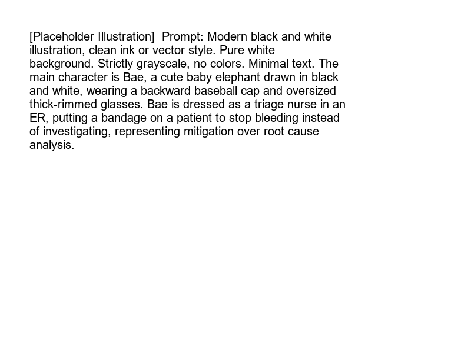

---
sidebar_position: 4
sidebar_label: "Incident Response Process"
---

import LearningFlow from '@site/src/components/LearningFlow';

# Incident Response Process

Bro, when the systems are down, you can't have everyone running around screaming. You need a calm, structured process. It's not about being a hero; it's about following the playbook.

## 1. Quick Summary

| Area | Details |
|---|---|
| Topic | Incident Response Process |
| Difficulty | Intermediate |
| Used For | Structuring the chaos of a production outage |
| Common Mistake | Trying to fix the root cause before mitigating the user impact |
| Performance | Decreases Time to Mitigate (TTM) |

## 2. Engineering Story

A team of engineers recently faced a critical challenge related to this concept. Their existing processes were failing under the load of thousands of concurrent users, and manual workarounds were causing major delays in deployment. By deeply understanding and correctly implementing this concept, the lead engineer was able to architect a solution that not only resolved the immediate bottleneck but also paved the way for massive scalability. This transformation turned a chaotic, error-prone system into a resilient, automated powerhouse.

## 3. Real-World Analogy



| Emergency Room (ER) | Incident Response Equivalent |
|---|---|
| Paramedic brings patient in | Alert fires, incident is declared |
| Triage nurse assesses severity | Assigning a SEV level |
| Stop the bleeding immediately | Mitigating the issue (e.g., rolling back) |
| Surgery to fix the internal damage | Fixing the root cause later |

Bro, in the ER, if a patient is bleeding, you don't stop to ask *why* they got cut. You stop the bleeding first. That's mitigation over root cause analysis.

## 4. Concept Explanation

The incident response process is the sequence of steps a team follows from the moment an alert fires until the system is fully recovered and the postmortem is written.

The most critical rule in incident response is **Mitigate First, Fix Later**. Your goal during an incident is to stop the bleeding—get the system back to a working state for the users. Finding the deep, underlying root cause is done *after* the incident is over.

## 5. Syntax Table

| Phase | Description |
|---|---|
| **1. Triage** | Acknowledge the alert, declare the incident, and assign a SEV level. |
| **2. Coordinate** | Assemble the war room, assign the Incident Commander. |
| **3. Mitigate** | Stop the bleeding (rollback, scale up, block bad traffic). |
| **4. Resolve** | Confirm metrics have recovered to normal levels. |
| **5. Review** | Write the blameless postmortem. |

## 6. Beginner Example

A simple incident response checklist for a junior engineer on call:

```markdown
# SEV-2 Checklist
- [ ] Acknowledge the PagerDuty alert.
- [ ] Open the "War Room" Slack channel.
- [ ] Post a status update: "Investigating High Latency".
- [ ] Check recent deployments.
- [ ] If a recent deploy matches the timeline, initiate a rollback.
- [ ] Update status in Slack.
```

## 7. Real-World Engineering Example

In production, automation often assists the mitigation phase. If a canary deployment starts throwing 500 errors, the CI/CD pipeline should automatically roll it back, turning a potential SEV-1 into a minor blip.

```bash
# Example manual mitigation: Rolling back a Kubernetes deployment
kubectl rollout undo deployment/payment-service

# Or shedding load by dropping non-critical traffic at the proxy
# HAProxy config snippet
acl is_high_load fe_sess_rate gt 5000
http-request deny if is_high_load
```

## 8. Internal Working

Here is the lifecycle of an incident from start to finish.

<LearningFlow
  elements={[
    { id: '1', type: 'warning', position: { x: 250, y: 0 }, data: { label: 'Alert Fired' } },
    { id: '2', type: 'process', position: { x: 250, y: 100 }, data: { label: 'Triage & Declare SEV' } },
    { id: '3', type: 'core', position: { x: 250, y: 200 }, data: { label: 'Mitigation (Stop the Bleeding)' } },
    { id: '4', type: 'process', position: { x: 100, y: 300 }, data: { label: 'Rollback Deploy' } },
    { id: '5', type: 'process', position: { x: 400, y: 300 }, data: { label: 'Scale Up DB' } },
    { id: '6', type: 'data', position: { x: 250, y: 400 }, data: { label: 'Metrics Recover (Resolved)' } },
    { id: '7', type: 'output', position: { x: 250, y: 500 }, data: { label: 'Postmortem & Root Cause Analysis' } },
    { id: 'e1-2', source: '1', target: '2', animated: true },
    { id: 'e2-3', source: '2', target: '3' },
    { id: 'e3-4', source: '3', target: '4' },
    { id: 'e3-5', source: '3', target: '5' },
    { id: 'e4-6', source: '4', target: '6', animated: true },
    { id: 'e5-6', source: '5', target: '6', animated: true },
    { id: 'e6-7', source: '6', target: '7' }
  ]}
/>

## 9. Performance Table

| Phase | Metric | Target |
|---|---|---|
| Triage | Time to Acknowledge (TTA) | < 5 mins |
| Coordinate | Time to Assemble | < 10 mins |
| Mitigate | Time to Mitigate (TTM) | Variable, but focus is speed |
| Resolve | Time to Resolve (TTR) | Dependent on SEV |

## 10. Top Interview Questions

| Question | Answer |
|---|---|
| What is the difference between mitigation and resolution? | Mitigation stops the user impact (e.g., rolling back). Resolution fixes the underlying bug so it can't happen again. |
| What is the first thing you should do when paged? | Acknowledge the page so it doesn't escalate, then log into your machine. |
| Why is communication so important during an incident? | Because other teams might be waiting on you, or executives might be fielding angry calls from customers. Silence causes panic. |
| When should you escalate an incident? | When you are out of ideas, when the impact is growing beyond your control, or when you need cross-team help. |
| What is a "war room"? | A dedicated communication channel (Zoom/Slack) where all responders coordinate. Keep the noise out. |

## 11. Tricky Questions & Edge Cases

- **The Zombie Incident**: You mitigate an issue, the metrics go green, and you resolve the incident. Two hours later, it happens again. Solution: If you don't know *why* the mitigation worked, keep the incident open and monitor it closely.
- **Multiple Simultaneous Incidents**: What if two different services go down at the exact same time? They might be related (a shared network switch died). Have the Incident Commanders communicate before treating them as isolated events.

## 12. Real-World Usage

Companies use platforms like PagerDuty, Opsgenie, or custom Slack bots (like GitHub's `hubot`) to automate the "Coordinate" phase. Type `/incident declare` in Slack, and the bot creates the war room, pages the right people, and sets up a Zoom link instantly.

## 13. Best Practices

| DO | DON'T |
|---|---|
| Prioritize mitigation (rollback) over root cause investigation. | Spend 2 hours debugging code while the site is down. |
| Over-communicate your status in the war room. | Go dark and debug in silence. |
| Bring in help early if you are stuck. | Try to be a hero and solve it all yourself. |

## 14. Production Notes

> **Warning**: The most dangerous action during an incident is running an untested script or database query to "quickly fix" the data. You are stressed and tired. You will make a typo and drop a production table. Use tested runbooks.

## 15. Common Mistakes

| Mistake | Correction |
|---|---|
| Debugging the root cause while users are seeing 500 errors. | Roll back the deploy immediately. Debug the code locally tomorrow. |
| Having 50 people talking over each other in the war room. | The Incident Commander must enforce discipline and silence non-essential chatter. |
| Closing the incident before the metrics prove it is fixed. | Wait for the monitoring dashboards to confirm stability. |

## 16. Related Topics
- Incident Commander Role
- Severity Levels
- Runbooks

## 17. Top GitHub Repos

| Repository | Stars | Description | Why It Matters |
|---|---|---|---|
| [PagerDuty/incident-response-docs](https://github.com/PagerDuty/incident-response-docs) | ⭐ 5k+ | PagerDuty's incident response documentation. | The definitive guide on how to structure an incident response process. |
| [dispatchrun/dispatch](https://github.com/dispatchrun/dispatch) | ⭐ 4k+ | Netflix's open-source crisis management orchestration framework. | A real-world tool for managing the lifecycle of an incident. |
| [grafana/grafana](https://github.com/grafana/grafana) | ⭐ 60k+ | The open and composable observability and data visualization platform. | Crucial for the "Resolve" phase to confirm metrics are healthy. |
| [dastergon/awesome-sre](https://github.com/dastergon/awesome-sre) | ⭐ 10k+ | Curated list of SRE resources. | Includes links to many companies' public incident response playbooks. |
| [slok/grafterm](https://github.com/slok/grafterm) | ⭐ 2k+ | Metrics dashboard in terminal. | Used by engineers during incidents when web UIs are too slow. |
