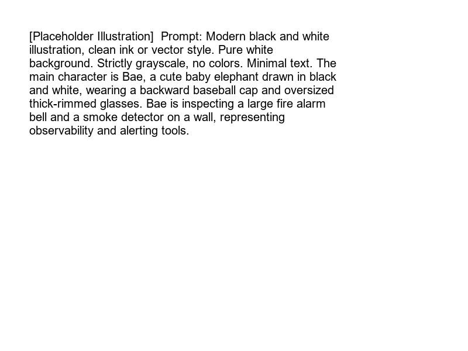

import LearningFlow from '@site/src/components/LearningFlow';

# Incident Tools

Bro, you can't put out a fire with your bare hands. You need hoses, axes, and ladders. In engineering, you need a robust toolchain to detect, coordinate, and mitigate incidents.

## 1. Quick Summary

| Area | Details |
|---|---|
| Topic | Incident Tools |
| Difficulty | Beginner |
| Used For | Detecting, alerting, and managing production incidents |
| Common Mistake | Buying expensive tools but failing to configure them properly |
| Performance | Tools dictate the speed of detection and coordination |

## 2. Engineering Story

During a P1 database incident, an SRE team was drowning in tools. The alert came from PagerDuty. The war room was in Zoom. The timeline was being updated in a shared Google Doc. Status updates were going to Slack. Grafana was open in one tab, Datadog in another, the Kubernetes dashboard in a third. Engineers were copy-pasting log snippets between windows. At one point, the critical error message was in someone's private Zoom chat and no one else saw it for 20 minutes.

Post-incident, they standardized their incident toolchain. PagerDuty stayed for alerting. Slack became the single source of truth — all commands, log snippets, and decisions went there, timestamped. They configured a Datadog dashboard as the canonical metric view, shared via link. They built a Slack bot that automatically created an incident channel, posted a pinned incident timeline template, and linked the relevant Grafana dashboard when a P1 fired. One tap → full incident workspace. The toolchain is not about the tools themselves — it's about eliminating the friction of context-switching when seconds matter.

## 3. Real-World Analogy



| Fire Department Tools | Incident Tool Equivalent |
|---|---|
| Smoke Detector | **Observability / Metrics Platform** (e.g., Datadog) |
| Fire Alarm Bell | **Alerting & Paging System** (e.g., PagerDuty) |
| Walkie Talkies | **War Room Comms** (e.g., Slack / Zoom) |
| Incident Report Form | **Postmortem Tracker** (e.g., Jira / Confluence) |

Bro, if the smoke detector works but the alarm bell is broken, the building still burns down. The tools must integrate perfectly.

## 4. Concept Explanation

The modern incident management stack is a chain of specialized tools.
First, an **Observability** tool watches the system. When a threshold is crossed, it sends a webhook to an **Alerting** tool. The Alerting tool looks up the on-call schedule and pages the human. The human then uses a **Communication** tool to coordinate, and eventually logs the learnings in a **Documentation** tool.

You don't need the most expensive tools, but you absolutely need the integration between them to be seamless.

## 5. Syntax Table

| Tool Category | Purpose | Popular Examples |
|---|---|---|
| **Observability & Logging** | Store logs, metrics, and traces to detect anomalies. | Datadog, Prometheus, Splunk, Grafana |
| **Alerting & On-Call** | Maintain schedules and route pages via SMS/Phone. | PagerDuty, Opsgenie, VictorOps |
| **Communication** | Real-time chat and video coordination. | Slack, Microsoft Teams, Zoom |
| **Status Pages** | Communicate externally with customers. | Atlassian Statuspage, Instatus |
| **Runbook Automation** | Execute predefined mitigation scripts. | AWS Systems Manager, Rundeck, Ansible |

## 6. Beginner Example

Connecting an observability tool (Prometheus) to a paging tool (PagerDuty) via a YAML config snippet:

```yaml
# prometheus-alertmanager.yml
receivers:
- name: 'pagerduty-primary'
  pagerduty_configs:
  - service_key: '<your-pagerduty-integration-key>'
    description: '{{ .CommonAnnotations.summary }}'
    severity: '{{ .CommonLabels.severity }}'

route:
  receiver: 'pagerduty-primary'
  group_wait: 30s
  group_interval: 5m
```

## 7. Real-World Engineering Example

Many engineering teams build custom Slack bots to act as the "glue" between these tools. This is known as ChatOps.

```python
# A simple ChatOps bot command handler (Conceptual)
@bot.command("/incident declare")
def declare_incident(user, text):
    # 1. Create a dedicated Slack channel
    channel = slack.create_channel(f"incident-{date.today()}")

    # 2. Page the Incident Commander via PagerDuty
    pagerduty.trigger_page(policy="IC_Rotation", title=f"Incident declared by {user}")

    # 3. Create a Jira ticket for tracking
    ticket = jira.create_issue(summary=text, type="Incident")

    # 4. Post the links back to the user
    return f"War room created: #{channel}. Ticket: {ticket}. IC has been paged."
```

## 8. Internal Working

Here is the flow of data through the incident toolchain.

<LearningFlow
  elements={[
    { id: '1', type: 'core', position: { x: 50, y: 150 }, data: { label: 'Application Logs/Metrics' } },
    { id: '2', type: 'process', position: { x: 250, y: 150 }, data: { label: 'Datadog (Observability)' } },
    { id: '3', type: 'warning', position: { x: 450, y: 150 }, data: { label: 'PagerDuty (Alerting)' } },
    { id: '4', type: 'tool', position: { x: 450, y: 300 }, data: { label: 'Slack (War Room)' } },
    { id: '5', type: 'data', position: { x: 250, y: 300 }, data: { label: 'Statuspage.io' } },
    { id: '6', type: 'output', position: { x: 50, y: 300 }, data: { label: 'Confluence (Postmortem)' } },
    { id: 'e1-2', source: '1', target: '2', animated: true },
    { id: 'e2-3', source: '2', target: '3', label: 'Webhook', animated: true },
    { id: 'e3-4', source: '3', target: '4', label: 'Bot posts link' },
    { id: 'e4-5', source: '4', target: '5', label: 'IC updates status' },
    { id: 'e4-6', source: '4', target: '6', label: 'Export chat to doc' }
  ]}
/>

## 9. Performance Table

| Tooling Setup | Time to Detect (TTD) | Time to Assemble |
|---|---|---|
| No Tools (Wait for customer emails) | Hours | 30+ minutes |
| Basic (Email alerts) | 15 - 30 mins | 15 - 30 mins |
| Mature (Prometheus -> PagerDuty -> Slack Bot) | < 2 mins | < 5 mins |

## 10. Top Interview Questions

| Question | Answer |
|---|---|
| What is the difference between Observability and Alerting tools? | Observability tools (Datadog) analyze the data to spot the issue. Alerting tools (PagerDuty) wake up the human. |
| What is ChatOps? | Executing operational tasks (like declaring incidents or deploying code) directly from a chat platform like Slack. |
| Why not just send alerts to a Slack channel instead of using PagerDuty? | Because Slack won't bypass your phone's "Do Not Disturb" mode at 3 AM. PagerDuty will. |
| What is a Status Page? | A public-facing website hosted independently of your main infrastructure to communicate outages to users. |
| What happens if Datadog goes down? | You need a secondary, simple external monitor (like Pingdom) that just checks if your homepage returns a 200 OK. |

## 11. Tricky Questions & Edge Cases

- **The Circular Dependency**: Your company uses the internal SSO (Single Sign-On) to log into the incident management tools. But the SSO goes down. Now you can't log into PagerDuty to page the SSO team. Solution: Core incident tools must bypass internal SSO (using generic break-glass accounts) or be hosted externally.
- **The Flood of Webhooks**: Datadog detects 1,000 errors a second and sends 1,000 webhooks to PagerDuty. PagerDuty rate-limits you and drops the alerts. Solution: Observability tools must aggregate and debounce alerts before sending them to the paging system.

## 12. Real-World Usage

Almost every unicorn tech company uses some variation of the "Holy Trinity": Datadog (or Prometheus/Grafana) for metrics, PagerDuty (or Opsgenie) for routing, and Slack for communication. The companies with the best incident response times are the ones that have invested heavily in connecting these three tools seamlessly.

## 13. Best Practices

| DO | DON'T |
|---|---|
| Host your status page on a completely different infrastructure provider than your app. | Host your status page on the same AWS account that just went down. |
| Use PagerDuty schedules to ensure someone is always on call. | Rely on someone checking their email at night. |
| Automate the creation of the war room and Jira tickets. | Force the IC to spend 10 minutes doing administrative clicking. |

## 14. Production Notes

> **Warning**: Tools are useless if they are misconfigured. If an engineer leaves the company but is still the primary on-call in PagerDuty, the alerts will go to a dead phone. Automate the syncing of your HR directory with your on-call scheduling tool.

## 15. Common Mistakes

| Mistake | Correction |
|---|---|
| Buying PagerDuty but routing all alerts to a low-priority email. | Configure high-severity alerts to actually trigger a phone call. |
| Using WhatsApp or personal iMessage for incident comms. | Use an enterprise chat tool where logs can be audited for the postmortem. |
| Ignoring tool fatigue (too many dashboards). | Consolidate dashboards. The IC should only need to look at 1 or 2 screens. |

## 16. Related Topics
- Incident Response Process
- Incident Communication
- Runbooks

## 17. Top GitHub Repos

| Repository | Stars | Description | Why It Matters |
|---|---|---|---|
| [prometheus/prometheus](https://github.com/prometheus/prometheus) | ⭐ 52k+ | The standard open-source monitoring system. | The engine that detects the incident and fires the initial alert. |
| [grafana/grafana](https://github.com/grafana/grafana) | ⭐ 60k+ | Open observability platform. | The dashboard where engineers investigate the incident. |
| [dispatchrun/dispatch](https://github.com/dispatchrun/dispatch) | ⭐ 4k+ | Netflix's crisis management orchestration. | An open-source tool that glues together Slack, Jira, and PagerDuty. |
| [slackapi/bolt-python](https://github.com/slackapi/bolt-python) | ⭐ 2k+ | A framework to build Slack apps in Python. | Used to build custom ChatOps bots for incident management. |
| [PagerDuty/incident-response-docs](https://github.com/PagerDuty/incident-response-docs) | ⭐ 5k+ | PagerDuty's incident response documentation. | Best practices on how to configure these tools effectively. |
