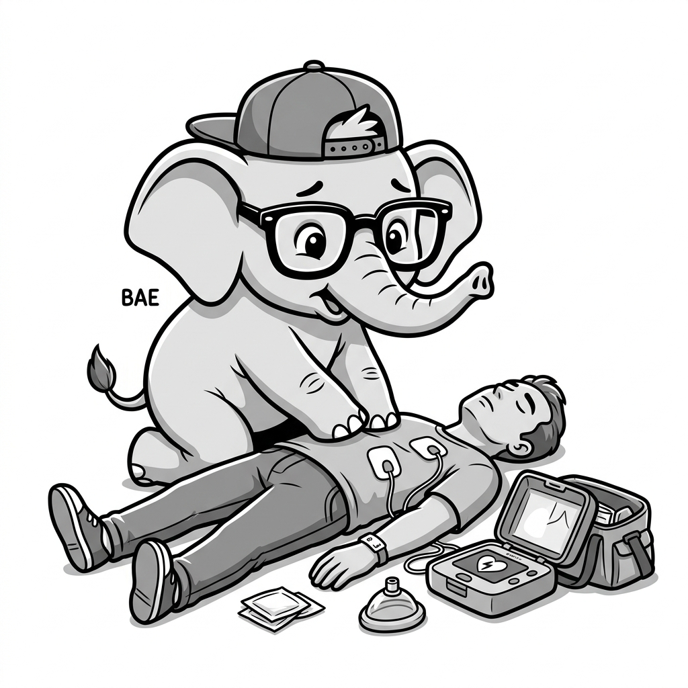

import LearningFlow from '@site/src/components/LearningFlow';

# Severity Levels

Bro, not all fires are the same. A candle falling over in the living room is bad, but the whole house being on fire is worse. We use Severity Levels (SEVs) to tell everyone exactly how bad the fire is.

## 1. Quick Summary

| Area | Details |
|---|---|
| Topic | Severity Levels |
| Difficulty | Beginner |
| Used For | Categorizing incident urgency and impact |
| Common Mistake | Inflating SEV levels to get faster attention on a minor bug |
| Performance | Dictates the expected response and resolution time |

## 2. Engineering Story

Bro, imagine it's 8:00 PM on a Friday. The customer support channel in Slack starts lighting up because a typo in the footer of your website says "Copywrite 2023" instead of 2024. The support lead panics and hits the big red "Declare Incident" button. Suddenly, PagerDuty wakes up the Director of Engineering, the lead DevOps engineer, and the Database Admin, pulling them out of dinner with their families. They log on, expecting the database to be on fire, only to find a typo. They fix it in two seconds, but the trust in the incident system is broken. The next time a real database crash happens, people might ignore the page, assuming it's another typo. This is why strict Severity Levels (Sev-1, Sev-2, Sev-3) exist. They provide a universally understood triage system so that a typo (Sev-3) is handled on Monday morning, while a total payment failure (Sev-1) justifies waking up the entire team.

## 3. Real-World Analogy


**FDE Scenario:** As an FDE, correctly identifying severity levels is critical when working with clients. A SEV-1 means waking up their entire executive team, while a SEV-4 can wait until Monday. Misclassifying incidents destroys your credibility and causes alert fatigue across the client's engineering organization.

| Medical Triage | Tech SEV Equivalent |
|---|---|
| Cardiac Arrest (Immediate life threat) | **SEV-1**: Core systems down, massive revenue loss |
| Broken Leg (Urgent, needs attention now) | **SEV-2**: Major feature broken for many users |
| Sprained Ankle (Painful, but can wait a bit) | **SEV-3**: Minor feature broken, workarounds exist |
| Paper Cut (Annoying, fix it eventually) | **SEV-4**: Cosmetic bug or tiny edge case |

Bro, just like a doctor won't drop a heart surgery to look at your paper cut, we don't wake up the whole engineering org for a SEV-4.



## 4. Concept Explanation

Severity levels (often abbreviated as SEV or P for Priority) are a standardized way to communicate the impact of an incident. They dictate who gets paged, how quickly they need to respond, and what the communication strategy should be.

Most companies use a scale from 1 (most severe) to 4 or 5 (least severe). When an incident is declared, assigning the correct SEV is the first critical decision the Incident Commander makes.

## 5. Syntax Table

| Level | Name | Description | Response Expectation |
|---|---|---|---|
| **SEV-1** | Critical Outage | Core business flow is completely broken for all/most users. | Immediate page, all-hands-on-deck, executive visibility. |
| **SEV-2** | Major Issue | Significant degradation or a major feature is broken. | Immediate page to specific teams, fix within hours. |
| **SEV-3** | Minor Issue | Non-critical feature broken or partial degradation. | Handled during business hours, next day fix. |
| **SEV-4** | Cosmetic/Trivial | Typo, minor UI glitch, no functional impact. | Added to backlog, fixed in a future sprint. |

## 6. Beginner Example

Defining SEV levels in an incident response runbook or tooling configuration:

```json
{
  "incident_severities": {
    "SEV-1": {
      "description": "Platform completely down.",
      "page_policy": "page_all_primary_oncalls",
      "SLA_response": "5 minutes"
    },
    "SEV-2": {
      "description": "Payments failing for > 10% of users.",
      "page_policy": "page_service_owner",
      "SLA_response": "15 minutes"
    }
  }
}
```

## 7. Real-World Engineering Example

In a production environment, alerting rules are often tied directly to SEV levels based on the magnitude of the metric violation.

```yaml
# Prometheus Alert Rule for dynamic severity
groups:
- name: Payment_Alerts
  rules:
  - alert: HighPaymentFailureRate
    expr: rate(payment_failures_total[5m]) > 50
    labels:
      severity: SEV-1
    annotations:
      summary: "CRITICAL: Mass payment failures detected"

  - alert: ElevatedPaymentLatency
    expr: histogram_quantile(0.99, rate(payment_latency_bucket[5m])) > 2.0
    labels:
      severity: SEV-3
    annotations:
      summary: "WARNING: Payments are slow, but completing"
```

## 8. Internal Working

Here is how an incident's severity level dictates the routing and escalation process within an organization.

<LearningFlow
  elements={[
    { id: '1', type: 'core', position: { x: 250, y: 0 }, data: { label: 'Incident Declared' } },
    { id: '2', type: 'process', position: { x: 250, y: 100 }, data: { label: 'Severity Assigned' } },
    { id: '3', type: 'warning', position: { x: 50, y: 200 }, data: { label: 'SEV-1 / SEV-2' } },
    { id: '4', type: 'data', position: { x: 450, y: 200 }, data: { label: 'SEV-3 / SEV-4' } },
    { id: '5', type: 'output', position: { x: 50, y: 300 }, data: { label: 'Page On-Call Immediately (SMS/Call)' } },
    { id: '6', type: 'output', position: { x: 450, y: 300 }, data: { label: 'Create Jira/Slack notification (Async)' } },
    { id: '7', type: 'tool', position: { x: 50, y: 400 }, data: { label: 'Assemble War Room' } },
    { id: 'e1-2', source: '1', target: '2' },
    { id: 'e2-3', source: '2', target: '3' },
    { id: 'e2-4', source: '2', target: '4' },
    { id: 'e3-5', source: '3', target: '5', animated: true },
    { id: 'e4-6', source: '4', target: '6' },
    { id: 'e5-7', source: '5', target: '7', animated: true }
  ]}
/>

## 9. Performance Table

| Severity | Target Response Time (Acknowledge) | Target Resolution Time |
|---|---|---|
| SEV-1 | < 5 mins (24/7) | As fast as humanly possible |
| SEV-2 | < 15 mins (24/7) | Same day |
| SEV-3 | Next business day | Next sprint |
| SEV-4 | N/A | Backlog |

## 10. Top Interview Questions

| Question | Answer |
|---|---|
| Who decides the severity level of an incident? | The person who declares it makes the initial assessment, but the Incident Commander can upgrade or downgrade it as they learn more. |
| What happens if a SEV-3 isn't fixed quickly? | If the impact grows, it can be upgraded to a SEV-2. Otherwise, it waits. |
| Is a single customer failing to log in a SEV-1? | Generally no, unless that customer is your biggest enterprise client and it violates a specific SLA. |
| Why shouldn't we treat every issue as a SEV-1 to get it fixed faster? | Because you will burn out your engineers, cause alert fatigue, and when a real SEV-1 happens, people will ignore it. |
| How do you handle a SEV-1 at 3 AM? | The on-call is paged. They wake up, join a bridge/war room, assess the situation, and mitigate the impact. |

## 11. Tricky Questions & Edge Cases

- **The Downgrade Dilemma**: You declare a SEV-1 because the site looked down, but 5 minutes later you realize it's just a caching issue affecting 1% of users. Do you keep it SEV-1? No, bro. Downgrade it to SEV-3 immediately to release the emergency resources.
- **The Boiling Frog**: A memory leak slowly degrading performance over a week might start as a SEV-4, become a SEV-3, and suddenly cause a massive crash (SEV-1). Trend analysis is needed to catch these before they explode.

## 12. Real-World Usage

Companies like Stripe and Shopify have incredibly strict definitions for SEV levels. For Stripe, a SEV-1 means API requests are failing, directly impacting global commerce. For a video game company, a SEV-1 might mean the matchmaking servers are down on launch day. The definition depends entirely on your business.

## 13. Best Practices

| DO | DON'T |
|---|---|
| Document clear examples of what each SEV level looks like for your specific system. | Leave SEV definitions ambiguous or open to interpretation. |
| Allow the Incident Commander to change the SEV level at any time. | Argue about the SEV level while the system is burning down. Fix it first. |
| Review SEV assignments during the postmortem to ensure they were accurate. | Use SEV-1 to get around standard product management prioritization. |

## 14. Production Notes

> **Warning**: Never argue about whether something is a SEV-1 or a SEV-2 during the heat of the moment. If it feels like a SEV-1, treat it like a SEV-1, mitigate the issue, and argue about the classification later during the postmortem.

## 15. Common Mistakes

| Mistake | Correction |
|---|---|
| The "Boy Who Cried Wolf" pattern (everything is SEV-1). | Enforce strict definitions. Leadership must push back on inflated severities. |
| Delaying incident declaration because you aren't sure of the SEV. | Declare it as SEV-2 or SEV-3; you can always change it later. |
| Using SEV levels to measure developer performance. | SEVs measure *system impact*, not *developer competence*. |

## 16. Related Topics
- What is an Incident?
- Incident Commander Role
- Alert Fatigue

## 17. Top GitHub Repositories

| Repository | Stars | Description | Why It Matters |
|---|---|---|---|
| [PagerDuty/incident-response-docs](https://github.com/PagerDuty/incident-response-docs) | ⭐ 5k+ | PagerDuty's incident response documentation. | Defines industry standards for severity levels. |
| [google/sre-book](https://github.com/google/sre-book) | ⭐ 8k+ | The Google Site Reliability Engineering book (online version). | The foundational text on how Google categorizes and handles outages. |
| [linkedin/oncall-handbook](https://github.com/linkedin/oncall-handbook) | ⭐ 2k+ | A guide to surviving on-call. | Practical advice on handling different severities of pages. |
| [dastergon/awesome-sre](https://github.com/dastergon/awesome-sre) | ⭐ 10k+ | A curated list of Site Reliability resources. | Contains links to many companies' public incident management frameworks. |
| [etsy/morgue](https://github.com/etsy/morgue) | ⭐ 1.5k+ | A tool for managing postmortems. | Postmortems are heavily dictated by the severity of the incident they review. |


## 18. AI Agent Instructions

*This section provides machine-readable directives for AI coding agents (Jules, Claude, Cursor, etc.) that read this topic as context for code generation or repository tasks.*

| Directive | Instruction | Rationale |
|---|---|---|
| Severity Mapping | Ensure all generated alerts and error logs include an explicit severity level that maps to business impact. | Inconsistent severity tagging leads to delayed responses for critical client issues. |
| Escalation Logic | Generate automated routing rules that strictly differentiate between critical pages (SEV-1/2) and low-priority tickets (SEV-3/4). | Prevents off-hours paging for non-urgent issues, preserving on-call health. |
