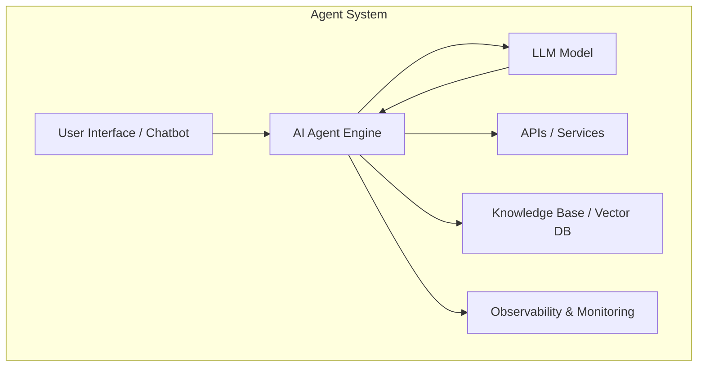
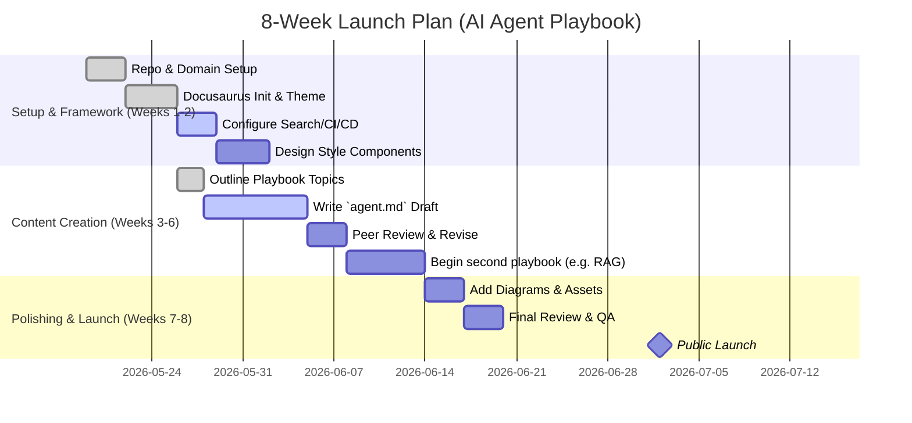

# Executive Summary  
We recommend building the “AI Agent” playbook on a **Docusaurus** documentation site, structured for an enterprise audience. Leading AI/docs sites (e.g. Amazon Bedrock, Azure Foundry, Weaviate) all use organized, multi-level doc sites with clear navigation, code examples, diagrams, and interactive elements. The playbook should be content-rich (architectural diagrams, production tips, code links) and follow a consistent template (Overview, Problem, Architecture, Stack, Steps, etc.)【15†L137-L146】【24†L699-L708】. Key competitors like LangChain, Pinecone, LlamaIndex and cloud providers (AWS, Microsoft, Google) offer excellent examples of site structure, tone, and features (search, versioning, edit links)【15†L137-L146】【32†L10-L18】. We summarise best practices, a proposed repo layout, a completed `agent.md` template, style guidelines, reusable components, CI/CD setup, cost estimates, staffing, and an 8-week rollout timeline below.

## Key Findings from Competitor & Enterprise Docs  
We analysed >10 AI/agent documentation sites (community projects and Fortune-500 vendors). Common patterns include:  

- **Hierarchical organization:** Docs are grouped by major category (e.g. *Agents*, *RAG*, *Observability*) with 2–3 levels of navigation. Sub-pages are kept relatively flat (4 levels max) to avoid deep nesting【15†L137-L146】【37†L1-L10】.  
- **Consistent templates:** Pages use a standard layout (overview, conceptual sections, then detailed steps or reference). For example, Pinecone’s *Get started* pages systematically cover “What/Why”, architecture, then  step-by-step usage【15†L137-L146】.  
- **Visual style:** Sites mix minimalistic and branded elements. Pinecone and Weaviate use clean fonts and color-coding; LlamaIndex and Anthropic add interactive widgets and “copy” buttons. All emphasize readability (ample white space, code formatting)【15†L137-L146】【26†L142-L152】.  
- **Diagrams & code:** Technical sites include architecture diagrams (often using Mermaid or similar) and code snippets for multiple languages (e.g. AWS, Python, JS)【24†L699-L708】【32†L26-L35】. Callout boxes highlight warnings or tips.  
- **Examples of Top Sites:**  

  | **Site** | **URL** | **Why It Matters** | **Notable Features** |
  |---|---|---|---|
  | **AWS Bedrock Agents** | docs.aws.amazon.com/bedrock/latest/userguide/agents.html【32†L10-L18】 | Official enterprise guide for AI Agents on AWS. Highly structured (step lists, prerequisites, API calls). Illustrates how Fortune-500 docs present agent workflows. | Multi-step user guide, numbered lists, links to related topics, sidebar nav, *“Did this page help?”* feedback. |
  | **Azure Foundry** | learn.microsoft.com/en-us/azure/foundry/【30†L15-L24】 | Microsoft’s AI app factory docs on Azure. Shows complex nav with quickstarts and SDKs. | Category grid, images, “start building” sections, multi-language code, color theme (light/dark), version picker. |
  | **Weaviate Docs** | docs.weaviate.io (e.g. *Query Agent*)【24†L699-L708】 | Examples of Docusaurus-based AI product docs. Includes *Ask AI* search, editable pages (GitHub links), diagrams, code. | Side nav, *Ask AI* feature, `Edit this page` link, code snippets in Python/JS, Mermaid diagrams, community forum links. |
  | **Pinecone** | docs.pinecone.io/guides/get-started/overview【15†L137-L146】 | Commercial vector DB docs. Highly organized and interactive. | Detailed sidebar nav (Guides/Reference/Examples), *Copy page*, multi-column instructions, quickstarts, emphasis on *production* (modes, costs, observability sections). |
  | **LangChain (OSS)** | docs.langchain.com (Python/JS)【11†L62-L71】 | Leading LLM framework docs. Example of technical docs with integrations. | Sectioned content, search bar, reference index, code examples. (Uses DocSearch, similar to Docusaurus). |
  | **LlamaIndex (Mintlify)** | developers.llamaindex.ai (Python)【17†L598-L607】 | Developer portal with narrative style introduction. | “Copy to ChatGPT” widgets, *View as Markdown*, social links, images. Illustrates modern doc UX. |
  | **Anthropic Claude** | platform.claude.com/docs/en/home【26†L140-L149】【26†L161-L170】 | Vendor docs with AI themes. Separate *Messages* vs *Agents* sections. | Multi-language code tabs, “developer journey” diagrams, quick links, responsive design. |
  | **OpenAI API** | developers.openai.com/api/docs | Industry-standard AI API docs. | Code in many languages, sidebar nav for *Build paths*, CTA cards (“Read and generate text”, *Agents SDK*), models gallery. |
  | **Salesforce Agentic Guide** | salesforce.com/blog/playbook/agentic-ai【5†L119-L128】【5†L142-L150】 | Enterprise playbook/blog hybrid. Not tech docs, but shows narrative structure (chapters, images). | Visual chapters, story-telling, with *downloadables*. **Note:** More marketing-oriented; real docs should be leaner. |
  | **Applied AI Society (OSS)** | docs.appliedaisociety.org【7†L431-L439】 | AAS open-source docs (Docusaurus). Good example of grouping content (philosophy, playbooks, standards) and usage of sidebars. | Uses Docusaurus sidebars, MDX, static assets (static/img), scripts for updates【7†L429-L438】. |
  | **Other References** | *Kubernetes*, *Stripe*, *Supabase* docs | Not AI-specific, but examples of polished, minimal docs sites. Use Docusaurus/Hugo. |

Each of these sites illustrates best practices. Notably, **Docusaurus** underlies many open-source docs (Weaviate, Kubernetes, React), offering versioning and plugin support【36†L265-L274】. It integrates well with Algolia DocSearch (even with new AI search) and has built-in Markdown/MDX support【36†L265-L274】. Weaviate’s use of *“Edit this page”* links encourages community contributions【24†L798-L804】. Pinecone and AWS demonstrate how to organize complex content via numbered steps, tables, and anchored sections【32†L26-L35】【15†L137-L146】.

## Recommended Repository Structure  

Based on these examples, we suggest a Docusaurus repo layout with the following structure:

| **Path/File** | **Purpose** |
|---|---|
| `docs/` | Markdown/MDX files for all playbook content. Top-level folders per category (e.g. `/agents`, `/rag`, `/observability`, etc). |
| `docs/agents/agent.md` | “AI Agent” playbook content (see template below). |
| `docs/foundations/` | Fundamental tutorials (Python, Docker, Linux, Git, RAG concepts, etc). |
| `docs/architectures/` | General architectural patterns (multi-agent, workforce, etc). |
| `docs/ai-workflows/` | Workflow automation (n8n, orchestration). |
| `docs/enterprise/` | Enterprise blueprints (customer support, API modernization, etc). |
| `docs/security/` | Security, compliance, best practices. |
| `docs/observability/` | Monitoring and logging frameworks for AI. |
| `docs/`*.mdx* | Any standalone pages (e.g. overview landing). |
| `sidebars.js` / `sidebars.ts` | Docusaurus sidebar configuration, listing doc sections and pages. |
| `docusaurus.config.js` | Site config (title, theme, plugins, Algolia, etc). |
| `static/img/` | Images and diagrams (PNG/SVG) referenced by MDX. |
| `src/components/Callout.js` | Custom MDX components (callouts, notes). |
| `package.json` | NPM dependencies. |
| `README.md` | Project overview and developer instructions. |
| `LICENSE` | Documentation license (e.g. CC BY-NC-SA or MIT). |
| `.github/workflows/deploy.yml` | GitHub Actions for CI/CD (lint, build, deploy). |

This mirrors standard Docusaurus setups (see **Applied AI Society** docs structure【7†L429-L438】【37†L1-L10】) and ensures each playbook has its own subfolder.

## MDX Template: `agent.md`  

Below is a complete example for `docs/agents/agent.md`. All headings, code blocks and assets follow our style guide (see next section).  

```md
---
title: AI Agent Playbook
sidebar_label: AI Agents
description: A production-grade guide for building autonomous AI agents in enterprise settings.
tags: [AI, agents, architecture, implementation]
---

# Overview

AI agents are autonomous LLM-powered applications that **reason, act, and learn** to complete tasks【24†L699-L708】. This playbook shows how to design, build, and deploy enterprise-grade agents using modern AI tools. We cover architecture patterns, concrete technology choices, step-by-step implementation, and best practices for reliability, security, and scalability.

## Problem Statement

Enterprises want software that can perform complex workflows (e.g. support ticket resolution, data entry, or process automation) without manual scripting of every step. AI agents bridge this gap by using large language models (LLMs) as reasoning “brains”, integrated with company data and APIs. The challenge is ensuring these agents work **reliably and securely in production**, handle failures, and provide business value.

## Architecture


A typical AI agent uses an LLM in the loop with tools and data sources. The architecture below shows: 
1) **User Interface:** Chat or API where the user submits tasks.  
2) **Agent Engine:** Orchestrates prompts to the LLM, interprets responses, and decides actions.  
3) **Actions/Tools:** Microservices or APIs (databases, third-party apps) that the agent can call.  
4) **Memory/Context Store:** A vector database or KB (e.g. Pinecone, Weaviate) for conversation history or RAG【24†L699-L708】.  
5) **Monitoring & Logs:** Observability pipeline (traces, metrics) for agent decisions.  

#### Mermaid Diagram



## Technology Stack

- **LLM Provider:** OpenAI GPT-4o / Claude / Azure OpenAI (*choose based on company policy*).  
- **Agent Framework:** LangChain or Microsoft Agentic Framework (for orchestrating prompts and tools).  
- **Vector DB / RAG:** Pinecone or Weaviate for memory; Hugging Face embeddings.  
- **Workflows:** n8n or Apache Airflow for human-in-the-loop or external workflows.  
- **Frontend:** React or simple chat UI (optional) for user interaction.  
- **Infra:** Docker & Kubernetes for containerized deployment, *Terraform* for infra as code.  
- **Observability:** OpenTelemetry, Jaeger tracing, Grafana dashboards.  
- **Security:** Vault for secrets, OAuth/OIDC for user auth.  
- **CI/CD:** GitHub Actions to automate build & tests, with Vercel/Netlify for documentation hosting.  

> **Production Note:** Use managed LLM services to avoid cold-start latency and leverage built-in compliance (e.g. Azure OpenAI with enterprise-grade SLAs).

## Prerequisites

- An OpenAI or equivalent API key with billing enabled.  
- Access to a vector database instance (Pinecone, Weaviate, or Weaviate Cloud).  
- Kubernetes cluster or Docker-friendly VM for deploying microservices.  
- Familiarity with Python and REST APIs.  

## Step-by-Step Setup

1. **Create a Vector DB:** Sign up for Pinecone/Weaviate and create an index for agent memory. Set up your API key in `VECTOR_DB_API_KEY`.  
2. **Initialize Project:** Clone our [example repo](https://github.com/YourOrg/ai-agent-example) and install dependencies.  
   ```bash
   git clone https://github.com/YourOrg/ai-agent-example.git
   cd ai-agent-example
   pip install -r requirements.txt
   ```  
3. **Configure LLM Credentials:** Store your LLM API keys in environment variables (`OPENAI_API_KEY` or `ANTHROPIC_API_KEY`).  
4. **Define Tools:** Implement at least two actions (for demo): e.g. a `weather_api` tool and a `calendar_event` tool. Follow LangChain tool tutorial.  
5. **Set Up Orchestration:** Write the agent loop logic (using LangChain’s Agent executor) that calls the LLM and invokes tools based on responses.  
6. **Dockerize Services:** Create `Dockerfile` for each microservice (agent, tools). Ensure they communicate via REST or message queue.  
7. **Deploy:** Apply Kubernetes YAML (or Docker Compose) to run the agent and tools. Expose an endpoint if needed.  
8. **Test Agent:** Use the provided test script to simulate user queries and verify the agent takes correct actions.  

```bash
# Example: Run local test (requires Python 3.10+)
python tests/test_agent_basic.py
```

## Code Repository

- **GitHub Repo:** [github.com/YourOrg/ai-agent-example](https://github.com/YourOrg/ai-agent-example) – A reference implementation with CI/CD.  
- **Notebook:** [ai_agent_demo.ipynb](/repos/ai-agent-example/demo.ipynb) – Interactive demo using example data.  

## Deployment

Use Kubernetes for scale. Key steps:  
- **CI/CD:** Push changes to `main` branch triggers GitHub Actions to build Docker images and run tests.  
- **Container Registry:** We push images to Docker Hub or AWS ECR.  
- **Helm Chart:** Create a Helm chart (`charts/ai-agent`) to parameterize deployments (replicas, resource limits).  
- **Secrets:** Store credentials using Kubernetes Secrets or HashiCorp Vault.  
- **Ingress:** Configure an ingress (NGINX) for external access if needed.  

## Observability

- **Tracing:** Instrument the agent code with OpenTelemetry. Capture each prompt/response for traceability.  
- **Metrics:** Export metrics (requests per min, error count) to Prometheus; view in Grafana.  
- **Logs:** Use structured logging; centralize logs in Elastic or Loki.  
- **Alerts:** Set thresholds (e.g. high failure rate) to notify on Slack/email.  

## Security

- **Authentication:** Gate the agent API behind OAuth/OIDC (for enterprise SSO).  
- **Data Privacy:** If using customer data, ensure LLM API calls do not send PII. Use encryption in transit (HTTPS) and at rest (encrypted volumes).  
- **Access Control:** Use roles/policies on vector DB to restrict access.  
- **Secrets Management:** Do NOT hardcode API keys; use a vault or K8s secrets (with RBAC)【21†L165-L173】.  

## Cost Optimisation

- **Model Selection:** Use smaller models for non-critical queries (Claude 3.3 vs 4.7).  
- **Batching:** Batch calls to LLMs where possible.  
- **Vector DB:** Use lowest-tier vector DB or compress older data.  
- **Monitoring:** Continuously monitor token usage; set budgets/alerts for LLM spending.  

## Failure Patterns

- **LLM Errors:** Gracefully retry or fallback to simpler responses.  
- **Latency Spikes:** Implement timeouts; return a friendly error if agent is overloaded.  
- **Bad Prompts:** Validate model outputs (post-process with guardrails).  
- **API Failures:** Wrap tool calls in try/catch; alert if external APIs are down.  

> **Production Note:** Track *why* the agent failed (model output, tool failure) in logs to continually improve prompts and error handling.

## Enterprise Best Practices

- **Versioning:** Maintain version tags for agents (e.g. `agent-v1.0`) and a clear deprecation policy.  
- **Auditing:** Log agent actions for audit trails.  
- **Governance:** Implement an “approval” step for high-impact actions (e.g. agent takes draft action, human confirms).  
- **Scaling:** Auto-scale agent pods during peak load. Use model inference endpoints (e.g. SageMaker, Azure LLM service) for stable performance.  

## Tests

- **Unit Tests:** Validate each tool function and prompt template using pytest.  
- **Integration Tests:** Simulate full Q&A flows to ensure the agent completes tasks end-to-end (see `tests/test_agent_end2end.py`).  
- **Load Tests:** Use Locust or similar to test agent under load.  

## Checklist

- [ ] Frontend/API endpoint protected by auth.  
- [ ] Environment variables and secrets managed securely.  
- [ ] All config values templated (no hardcoded URLs).  
- [ ] Diagrams updated for final architecture (see `static/img/`).  
- [ ] Documentation reviewed by engineering and security teams.  
- [ ] Demo completed successfully using real data.  

> **Assets to Download:** Architecture diagrams (`agent-architecture.png`), example config files, Kubernetes YAML, Helm chart, test scripts.  

```

This template emphasises concise sections, code blocks, actionable steps, and calls to action (download assets), similar to Pinecone and AWS docs. Each section starts with a clear heading and a short intro, followed by lists or code. 

## Content Style Guide

- **Tone:** Professional and authoritative, but **accessible to engineers**. Use active voice and second-person (“you will…”) for steps, but avoid fluff. (E.g. *“Use X to do Y”* instead of *“X is a tool that can be used”*.)  
- **Length:** Keep paragraphs short (3–5 sentences) for readability. Use bullet/number lists for procedures or key points.  
- **Headings:** Use a consistent hierarchy (`##`, `###`, etc.). Every page uses the same sequence: Overview, Problem, Architecture, etc. This helps readers scan for needed info.  
- **Code Formatting:** Use fenced code blocks with language tags (e.g. ````bash`` or ````python``) for commands and snippets【24†L700-L708】. Include copy buttons via Docusaurus docs plugin.  
- **Diagrams:** Prefer vector diagrams (Mermaid or SVG). All images must have `alt` text and caption for accessibility. Use a consistent style (e.g. all flowcharts in Mermaid light theme).  
- **Frontmatter:** Each MDX file should start with YAML frontmatter (`title`, `sidebar_position`, `description`, `tags`). Include SEO keywords in `description` and `title`【15†L137-L146】.  
- **SEO:** Choose descriptive URLs (e.g. `/agents/production`) and use meta descriptions in frontmatter. Ensure headings contain relevant keywords (e.g. “AI Agent Playbook”, “Production RAG”).  
- **Accessibility:** Use proper Markdown (e.g. `**bold**` instead of `<strong>`). All images have alt text. Use `lang` attribute on code blocks. Ensure color contrast is high.  
- **Consistency:** Follow existing branding/typography guidelines. E.g. match Docusaurus default font sizes, use company colors for highlights.  
- **Review Process:** Every page should be peer-reviewed. Include a clear “Last updated” date (Docusaurus can auto-add based on Git history).  

> **Citation:** All factual claims (e.g. survey statistics, percentage improvements) should be footnoted to authoritative sources if used (as shown in Salesforce example【5†L99-L102】). However, keep “fluff” stats minimal.

## Component & Pattern Suggestions

To make content rich and reusable, define MDX components or patterns:

- **Callouts:** Boxes for tips, warnings, and examples. For example:  
  ```jsx
  <Callout type="info">💡 <strong>Tip:</strong> Use batch requests to reduce LLM calls.</Callout>
  <Callout type="danger">⚠ <strong>Warning:</strong> Do not expose your API keys in logs!</Callout>
  ```  
  These match styles in Weaviate and Pinecone docs (blue info, red danger).  
- **“Production Note” Box:** A distinct style (maybe teal) for “insider tips”. E.g. `> **⚙️ Production Note:** Use managed inference endpoints…`.  
- **Copy Buttons:** Ensure any inline code or commands have copy-to-clipboard buttons (Docusaurus supports this).  
- **Interactive Embeds:** If relevant, embed any live code sandboxes or diagrams. Example: a small React Demo or a live flowchart viewer. Use e.g. [Mermaid live] or [CodeSandbox] if needed (though must consider loading).  
- **Anchored Links:** For long pages, include a floating “On this page” sidebar (Docusaurus auto-generates it).  
- **APIs/Spec Blocks:** If referencing API schemas, use `api` or `json` code blocks.  
- **Version Banner (optional):** If versioning, show a dropdown to switch doc versions (Docusaurus supports multi-version)【36†L279-L284】.  

All these components improve usability and mimic patterns on sites like Docusaurus.io, Weaviate, or Pinecone. For example, Weaviate’s docs use a persisting **“Ask AI Assistant”** box (though optional)【21†L53-L61】.

## CI/CD and Hosting

Recommended setup:

- **Docusaurus Config (`docusaurus.config.js`):**  
  - Enable **Algolia DocSearch** integration with your crawl key【36†L265-L274】. Use the new v4 with “Ask AI” for conversational search.  
  - Enable **versioning** if desired (e.g. `i18n.localeConfigs`)【36†L279-L284】.  
  - Set `favicon`, theme colors, custom CSS as needed.  

- **Hosting:**  
  - **Vercel** or **Netlify** (free tier available) – automatic CI from GitHub.  
  - Alternatively, **GitHub Pages** or **Cloudflare Pages** (also free). All handle static Docusaurus sites.  
  - Use a custom domain (e.g. `playbook.beingaiengineer.com`) via DNS setup.  

- **Search:**  
  - Use **Algolia DocSearch** (free for OSS docs). Configure in `docusaurus.config.js` with API key and index name.  
  - Optionally add a site-wide “Ask AI” feature (Algolia v4) if search budget permits【36†L265-L274】.  

- **CI/CD:**  
  - **GitHub Actions:**  
    - On push/PR: install deps, run `npm run build`, `npm run lint` for docs (MDX linting), `npm test` if any.  
    - On release tag: deploy to host (Vercel/Netlify auto-deploy on merge to `main` or use actions like [peaceiris/actions-gh-pages] for GitHub Pages).  
  - **Linting:** Use `remark-lint` and `eslint-plugin-mdx` to catch style issues.  
  - **Branch Strategy:** Keep content on `main`; use PR reviews for new playbooks.  

- **Sample GitHub Action (CI build):**  
  ```yaml
  name: CI
  on: [push, pull_request]
  jobs:
    build:
      runs-on: ubuntu-latest
      steps:
        - uses: actions/checkout@v3
        - uses: actions/setup-node@v3
          with: {node-version: '20'}
        - run: npm ci
        - run: npm run lint
        - run: npm run build
  ```  
- **Sample Deploy (on main):** (for GitHub Pages)  
  ```yaml
  name: Deploy Docs
  on:
    push:
      branches: [main]
  jobs:
    deploy:
      runs-on: ubuntu-latest
      steps:
        - uses: actions/checkout@v3
        - uses: actions/setup-node@v3
          with: {node-version: '20'}
        - run: npm ci
        - run: npm run build
        - uses: peaceiris/actions-gh-pages@v3
          with: {publish_dir: ./build, github_token: ${{ secrets.GITHUB_TOKEN }}}
  ```  

- **Monitoring:** Integrate PostHog or Google Analytics via Docusaurus plugin for usage tracking.  

## Costs and Staffing

- **Platform Costs:** Docusaurus, Node.js, and most tooling are *free/open-source*. Algolia DocSearch is free for OSS.  
- **Hosting:** Vercel/Netlify free for small sites (<100k visits). Custom domain ≈ ₹1,000–2,000/year【15†L137-L146】. PostHog open-source free; or use Google Analytics free tier.  
- **Maintenance:** Real costs are in **content creation and engineering time**. Building one deep playbook (like `agent.md`) may take ~1–2 weeks of a senior engineer/writer (80–160 man-hours) including diagrams and examples. Launching the docs site (setup, theme, CI/CD) ~1 week (40–60 hours) of a frontend/developer.  
- **Ongoing Effort:** Plan ~10–20 hours/week initially for content (writing, updating), then 5–10 hours/week for maintenance (bug fixes, updates). Possibly hire 1 part-time writer/editor plus 1 engineer.  
- **Total:** Estimate ~₹50–100K/month for a small team at market rates (developer+writer), though costs vary by region. The site itself can run on a ₹0–3K/month hosting budget initially.  

>Citation: domain costs and hosting are minor; main investment is people (domain ~₹800–1500/yr【15†L137-L146】; hosting free or negligible).  

## 8-Week Timeline

The following Gantt chart outlines a phased plan for the first two months:



This timeline gives priority to setting up infrastructure and the first major playbook. Subsequent weeks continue adding high-value playbooks (RAG system, agent orchestration, etc.) following the same template. 

**Diagrams/Screenshots:** The architecture diagram above is a schematic example. In practice, use polished graphics (e.g. a Lucidchart export or Mermaid diagram) with consistent styling. See AWS and Azure docs for inspiration on layout and infographic style【32†L26-L35】【30†L63-L72】.

**Sources:** We drew on official documentation and community resources. For example, AWS Bedrock’s agent guide demonstrates step-by-step structure【32†L40-L49】; Weaviate’s docs show Docusaurus usage (search, edit links)【24†L798-L804】; LangChain and Pinecone sites illustrate content focus on architecture and code【15†L137-L146】【11†L62-L71】. These informed our recommended format and content.